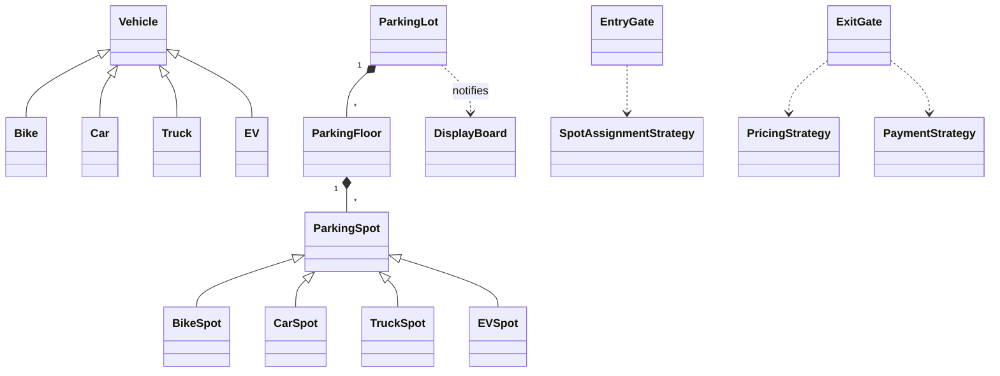

# 35 — Parking Lot System (LLD Interview Walkthrough)

> **Why this problem first?** It is the "Hello World" of LLD interviews. Almost every company (Amazon, Google, Uber, Flipkart, Atlassian, Walmart) has asked some variant. Master this one and you have a template for every other physical-world LLD problem (Library, Elevator, Cab Booking, ATM…).

---

## 1. The Setup — How the Question Will Be Asked

> Interviewer: *"Design a parking lot system."*

That is **all** you will hear. The whole game from here is:

1. **Clarify** scope (don't dive into code — most candidates fail right here).
2. **Identify** entities and their relationships.
3. **Draw** a class diagram (UML).
4. **Choose** design patterns with *reasons*.
5. **Code** the core flow in TypeScript.
6. **Discuss** extensions — concurrency, multi-floor, EV charging, monthly pass, etc.

Spend ~10 minutes clarifying. Interviewers **want** you to ask questions — silence + coding = red flag.

---

## 2. Requirements Clarification (Phase 1 — ~10 min)

Group your questions into **functional**, **non-functional**, and **scope**.

### 2.1 Functional questions to ask

| # | Question | Why it matters |
|---|---|---|
| Q1 | How many entrances and exits? | Concurrency model — single gate = serial, multi-gate = locks/queues |
| Q2 | Multiple floors? | Floor entity, search strategy |
| Q3 | Vehicle types? | (Bike, Car, Truck, EV) — affects spot types & pricing |
| Q4 | How do we charge — hourly, slab-based, daily cap? | Pricing strategy |
| Q5 | Payment methods? | Cash / Card / UPI — strategy pattern hint |
| Q6 | Pre-booking / reservation? | Adds a reservation entity |
| Q7 | How do we issue tickets — physical token, license plate scan, RFID? | Affects entry/exit flow |
| Q8 | Should we show available spots on a display board? | Observer pattern hint |
| Q9 | Monthly passes / VIP? | Adds account/subscription layer |

### 2.2 Non-functional questions

- Expected daily traffic? (1k vs 100k cars changes the design.)
- Multi-tenant (one system for many lots) or single lot?
- Offline tolerance — does it work if network drops?

### 2.3 The "scope lock" — what we'll build today

After Q&A, **say this out loud**:

> *"OK, scoping for this session: multi-floor lot, multiple gates, 4 vehicle types (Bike / Car / Truck / EV), hourly pricing with a daily cap, 3 payment methods, ticket-on-entry, display board for free spots. No reservation, no monthly pass — we'll discuss those as extensions."*

This is the single most important sentence in the interview. It pins the scope so the interviewer cannot move the goalposts later.

---

## 3. Entity Modeling (Phase 2 — ~5 min)

Pick out the **nouns** from the scoped problem:

| Entity | Role | Notes |
|---|---|---|
| `ParkingLot` | Root — owns floors, gates, etc. | **Singleton** (only one per process) |
| `ParkingFloor` | Holds spots | Has a floor number |
| `ParkingSpot` (abstract) | One physical slot | Sub-types per vehicle type |
| `BikeSpot` / `CarSpot` / `TruckSpot` / `EVSpot` | Concrete spots | EV adds a charger |
| `Vehicle` (abstract) | Sub-types: `Bike`, `Car`, `Truck`, `EV` | Has a license plate |
| `Ticket` | Issued at entry, paid at exit | Has timestamps, spot, vehicle |
| `EntryGate` / `ExitGate` | Operations on entry/exit | Could be merged but cleaner separately |
| `ParkingAttendant` (optional) | Human operator persona | |
| `PricingStrategy` | Decides cost | Pluggable — **Strategy pattern** |
| `PaymentStrategy` | Cash / Card / UPI | **Strategy pattern** |
| `DisplayBoard` | Shows free spots | **Observer pattern** |
| `SpotAssignmentStrategy` | Nearest spot / random / specific floor | **Strategy pattern** |

### Relationship summary

```
ParkingLot ◇── ParkingFloor (composition)
ParkingFloor ◇── ParkingSpot (composition)
ParkingSpot ── Vehicle (association — when occupied)
EntryGate ──> Ticket (creates)
ExitGate ──> Ticket (closes + charges)
ParkingLot ──> DisplayBoard (notifies — observer)
EntryGate ──> SpotAssignmentStrategy (uses)
ExitGate ──> PricingStrategy + PaymentStrategy (uses)
```

---

## 4. UML Class Diagram (Phase 3 — ~5 min)

You don't need pretty diagrams — a clean ASCII / box sketch is fine on a whiteboard.

```
                ┌─────────────────────┐
                │     ParkingLot      │   ◀── Singleton
                │  - floors           │
                │  - entryGates       │
                │  - exitGates        │
                │  - displayBoards    │
                │  + park(v)          │
                │  + leave(t)         │
                └─────────┬───────────┘
                          │ 1..*
                          ▼
                ┌─────────────────────┐
                │    ParkingFloor     │
                │  - floorNo          │
                │  - spots            │
                │  + findFreeSpot(t)  │
                └─────────┬───────────┘
                          │ 1..*
                          ▼
                ┌─────────────────────┐
                │  «abstract» Spot    │
                │  - id, type, free?  │
                │  + assign(v)        │
                │  + release()        │
                └────────▲────────────┘
                         │
       ┌──────────┬──────┴──────┬───────────┐
       │          │             │           │
   BikeSpot   CarSpot       TruckSpot     EVSpot
                                          - charger

       ┌──────────────────┐           ┌────────────────────┐
       │    EntryGate     │           │     ExitGate       │
       │ - assignStrategy │           │ - pricingStrategy  │
       │ + issueTicket(v) │           │ - paymentStrategy  │
       └──────────────────┘           │ + processExit(t)   │
                                      └────────────────────┘

  «interface» SpotAssignment    «interface» Pricing    «interface» Payment
       ▲                              ▲                       ▲
       │                              │                       │
  NearestSpot/Random           Hourly / DailyCap        Cash/Card/UPI

  «Observer»                              «Subject»
  DisplayBoard  ◀── observes ──  ParkingLot (notifies on park/leave)
```

If the interviewer asks for a Mermaid diagram on a shared doc, you can write:



---

## 5. Design Patterns Chosen (Phase 4 — ~3 min)

State these explicitly — interviewers love hearing pattern names with justifications.

| Pattern | Where | Why |
|---|---|---|
| **Singleton** | `ParkingLot` | Only one lot per process; global access needed by gates |
| **Factory** | `VehicleFactory`, `SpotFactory` | Instantiation per type without leaking `new` calls everywhere |
| **Strategy** | `PricingStrategy`, `PaymentStrategy`, `SpotAssignmentStrategy` | All three vary independently. Open/Closed friendly |
| **Observer** | `DisplayBoard` listens to `ParkingLot` | Display auto-updates when occupancy changes |
| **State** *(optional)* | `Ticket` (ACTIVE → PAID → CLOSED) | Cleaner than `if/else` on status |

> **Avoid pattern-vomit.** Mention only the ones you'll use. Saying "I'll use Visitor and Memento too" without reason is the fastest way to look junior.

---

## 6. TypeScript Code (Phase 5 — ~20 min)

Write **only the core flow** — don't try to type out 1000 lines. Interviewers care about clarity, not completeness.

### 6.1 Enums & basic types

```typescript
export enum VehicleType { BIKE = "BIKE", CAR = "CAR", TRUCK = "TRUCK", EV = "EV" }
export enum SpotStatus  { FREE = "FREE", OCCUPIED = "OCCUPIED" }
export enum TicketStatus { ACTIVE = "ACTIVE", PAID = "PAID", CLOSED = "CLOSED" }
export enum PaymentMode { CASH = "CASH", CARD = "CARD", UPI = "UPI" }
```

### 6.2 Vehicle hierarchy

```typescript
export abstract class Vehicle {
  constructor(
    public readonly licensePlate: string,
    public readonly type: VehicleType,
  ) {}
}

export class Bike  extends Vehicle { constructor(p: string) { super(p, VehicleType.BIKE); } }
export class Car   extends Vehicle { constructor(p: string) { super(p, VehicleType.CAR); } }
export class Truck extends Vehicle { constructor(p: string) { super(p, VehicleType.TRUCK); } }
export class EV    extends Vehicle { constructor(p: string) { super(p, VehicleType.EV); } }
```

### 6.3 Spot hierarchy

```typescript
export abstract class ParkingSpot {
  protected status: SpotStatus = SpotStatus.FREE;
  protected vehicle: Vehicle | null = null;

  constructor(
    public readonly id: string,
    public readonly type: VehicleType,
  ) {}

  isFree(): boolean { return this.status === SpotStatus.FREE; }

  assign(v: Vehicle): void {
    if (!this.isFree()) throw new Error(`Spot ${this.id} is occupied`);
    if (v.type !== this.type) throw new Error(`Spot ${this.id} cannot fit ${v.type}`);
    this.vehicle = v;
    this.status  = SpotStatus.OCCUPIED;
  }

  release(): void {
    this.vehicle = null;
    this.status  = SpotStatus.FREE;
  }
}

export class BikeSpot  extends ParkingSpot { constructor(id: string) { super(id, VehicleType.BIKE); } }
export class CarSpot   extends ParkingSpot { constructor(id: string) { super(id, VehicleType.CAR); } }
export class TruckSpot extends ParkingSpot { constructor(id: string) { super(id, VehicleType.TRUCK); } }

export class EVSpot extends ParkingSpot {
  constructor(id: string, public readonly chargerKW: number = 7) {
    super(id, VehicleType.EV);
  }
}
```

### 6.4 Ticket

```typescript
export class Ticket {
  public exitTime: Date | null = null;
  public amount: number = 0;
  public status: TicketStatus = TicketStatus.ACTIVE;

  constructor(
    public readonly id: string,
    public readonly vehicle: Vehicle,
    public readonly spot: ParkingSpot,
    public readonly entryTime: Date = new Date(),
  ) {}
}
```

### 6.5 Strategy interfaces

```typescript
export interface SpotAssignmentStrategy {
  findSpot(floors: ParkingFloor[], type: VehicleType): ParkingSpot | null;
}

export interface PricingStrategy {
  calculate(ticket: Ticket, exitTime: Date): number;
}

export interface PaymentStrategy {
  pay(amount: number): boolean; // returns success
}
```

### 6.6 Concrete strategies

```typescript
// Nearest = first free spot, scanning floors lowest → highest
export class NearestSpotStrategy implements SpotAssignmentStrategy {
  findSpot(floors: ParkingFloor[], type: VehicleType): ParkingSpot | null {
    for (const f of floors) {
      const s = f.findFreeSpot(type);
      if (s) return s;
    }
    return null;
  }
}

// Hourly rate with daily cap
export class HourlyPricingStrategy implements PricingStrategy {
  private rate: Record<VehicleType, number> = {
    [VehicleType.BIKE]: 10, [VehicleType.CAR]: 30,
    [VehicleType.TRUCK]: 50, [VehicleType.EV]: 25,
  };
  private dailyCap: Record<VehicleType, number> = {
    [VehicleType.BIKE]: 100, [VehicleType.CAR]: 300,
    [VehicleType.TRUCK]: 500, [VehicleType.EV]: 250,
  };

  calculate(ticket: Ticket, exitTime: Date): number {
    const ms = exitTime.getTime() - ticket.entryTime.getTime();
    const hours = Math.ceil(ms / (60 * 60 * 1000));
    const raw = hours * this.rate[ticket.vehicle.type];
    return Math.min(raw, this.dailyCap[ticket.vehicle.type]);
  }
}

export class CashPayment implements PaymentStrategy { pay(_: number) { return true; } }
export class CardPayment implements PaymentStrategy { pay(_: number) { /* call gateway */ return true; } }
export class UpiPayment  implements PaymentStrategy { pay(_: number) { /* call PSP */    return true; } }
```

### 6.7 Floor

```typescript
export class ParkingFloor {
  constructor(public readonly floorNo: number, private spots: ParkingSpot[]) {}

  findFreeSpot(type: VehicleType): ParkingSpot | null {
    return this.spots.find(s => s.type === type && s.isFree()) ?? null;
  }

  freeCount(type: VehicleType): number {
    return this.spots.filter(s => s.type === type && s.isFree()).length;
  }
}
```

### 6.8 Observer — DisplayBoard

```typescript
export interface ParkingObserver {
  update(snapshot: Record<VehicleType, number>): void;
}

export class DisplayBoard implements ParkingObserver {
  constructor(public readonly name: string) {}
  update(snap: Record<VehicleType, number>): void {
    console.log(`[${this.name}]`, snap);
  }
}
```

### 6.9 The ParkingLot (Singleton + Subject)

```typescript
export class ParkingLot {
  private static instance: ParkingLot | null = null;

  private floors: ParkingFloor[] = [];
  private observers: ParkingObserver[] = [];
  private activeTickets = new Map<string, Ticket>();
  private ticketSeq = 1;

  private constructor() {}

  static getInstance(): ParkingLot {
    if (!ParkingLot.instance) ParkingLot.instance = new ParkingLot();
    return ParkingLot.instance;
  }

  addFloor(f: ParkingFloor): void { this.floors.push(f); }
  addObserver(o: ParkingObserver): void { this.observers.push(o); }

  getFloors(): ParkingFloor[] { return this.floors; }

  issueTicket(vehicle: Vehicle, assign: SpotAssignmentStrategy): Ticket {
    const spot = assign.findSpot(this.floors, vehicle.type);
    if (!spot) throw new Error(`No spot for ${vehicle.type}`);
    spot.assign(vehicle);

    const ticket = new Ticket(`T-${this.ticketSeq++}`, vehicle, spot);
    this.activeTickets.set(ticket.id, ticket);
    this.notify();
    return ticket;
  }

  processExit(
    ticketId: string,
    pricing: PricingStrategy,
    payment: PaymentStrategy,
  ): number {
    const ticket = this.activeTickets.get(ticketId);
    if (!ticket) throw new Error(`Unknown ticket ${ticketId}`);
    if (ticket.status !== TicketStatus.ACTIVE) throw new Error(`Ticket already processed`);

    ticket.exitTime = new Date();
    ticket.amount   = pricing.calculate(ticket, ticket.exitTime);

    if (!payment.pay(ticket.amount)) throw new Error(`Payment failed`);
    ticket.status = TicketStatus.PAID;

    ticket.spot.release();
    ticket.status = TicketStatus.CLOSED;
    this.activeTickets.delete(ticket.id);
    this.notify();
    return ticket.amount;
  }

  private notify(): void {
    const snap: Record<VehicleType, number> = {
      [VehicleType.BIKE]: 0, [VehicleType.CAR]: 0,
      [VehicleType.TRUCK]: 0, [VehicleType.EV]: 0,
    };
    for (const f of this.floors) {
      for (const t of Object.values(VehicleType) as VehicleType[]) {
        snap[t] += f.freeCount(t);
      }
    }
    this.observers.forEach(o => o.update(snap));
  }
}
```

### 6.10 Driver — putting it together

```typescript
const lot = ParkingLot.getInstance();

// Floor 1 — 2 bike spots, 2 car spots, 1 EV spot
lot.addFloor(new ParkingFloor(1, [
  new BikeSpot("F1-B1"), new BikeSpot("F1-B2"),
  new CarSpot("F1-C1"),  new CarSpot("F1-C2"),
  new EVSpot("F1-E1", 11),
]));

// Floor 2 — 1 truck, 2 cars
lot.addFloor(new ParkingFloor(2, [
  new TruckSpot("F2-T1"),
  new CarSpot("F2-C1"), new CarSpot("F2-C2"),
]));

lot.addObserver(new DisplayBoard("Main Gate"));

const assign  = new NearestSpotStrategy();
const pricing = new HourlyPricingStrategy();
const payment = new UpiPayment();

const t1 = lot.issueTicket(new Car("KA-01-AB-1234"), assign);
// ... time passes ...
const amount = lot.processExit(t1.id, pricing, payment);
console.log(`Paid ₹${amount}`);
```

---

## 7. Extension Follow-Ups (Phase 6 — ~5 min)

The interviewer will twist the problem. Have these ready:

### 7.1 "How would you support reservations?"
Add a `Reservation` entity tying a `Vehicle` to a `Spot` over a time window. `EntryGate` checks for a valid reservation before falling back to `SpotAssignmentStrategy`. Spots get a tri-state: `FREE / RESERVED / OCCUPIED`.

### 7.2 "Two cars enter at the same gate simultaneously. What about race conditions?"
- In JS this isn't real concurrency (single-threaded event loop). But across processes / DB rows it is.
- Make spot assignment atomic: e.g., `UPDATE spot SET status='OCCUPIED' WHERE id=X AND status='FREE'` and check `affectedRows = 1`.
- Or guard with a per-floor mutex / Redis `SETNX` lock for the lookup-then-assign window.

### 7.3 "Monthly pass holders shouldn't pay per hour"
Either (a) add a `PricingStrategy` variant `MonthlyPassPricing` that returns 0 if the pass is valid, or (b) compose with a `Decorator` that wraps any pricing strategy and short-circuits for pass holders. Decorator is cleaner because it works on top of *any* base strategy.

### 7.4 "How do you scale to 1000 lots in one system?"
- Promote `ParkingLot` from singleton to a normal class.
- Introduce a `ParkingLotRegistry` keyed by `lotId`.
- Persist spots / tickets in a DB; the in-memory map becomes a cache.
- Each lot has its own `DisplayBoard` observers.

### 7.5 "How do EVs differ?"
- `EVSpot` has a `charger` (kW rating).
- `EVPricingStrategy` adds `pricePerKWh * energyDelivered` on top of parking.
- Charger could itself be modeled as a `State` machine (`IDLE → CHARGING → COMPLETE → ERROR`).

### 7.6 "Add VIP lane / priority"
`SpotAssignmentStrategy` becomes pluggable per vehicle — VIPs use `ReservedFloorStrategy` (floor 1 only), regulars use `NearestSpotStrategy`.

---

## 8. Real-World Production Notes

- **Persistence layer** — In production, spots & tickets live in Postgres / DynamoDB. The Singleton pattern still applies to a *service*, not the data.
- **Number-plate recognition** — replaces physical tickets at modern lots (FASTag-style in India, ALPR cameras in the US). Entry gate just calls `recognize(image) → plate`, then issues a digital ticket.
- **Cloud examples** — `ParkPlus`, `Get My Parking`, Tesla Supercharger network, airport long-term parking systems.
- **Payment** — never wire `CardPayment` directly to a card processor; abstract behind a `PaymentGateway` interface so Razorpay / Stripe / Square are swappable.

---

## 9. Interview Questions (with answers)

**Q1. Why is `ParkingLot` a Singleton and not a static class?**
A static class can't implement interfaces, can't be passed as a dependency, and can't be mocked in tests. Singleton keeps the OOP shape — one instance, but still a real object. You also get **lazy init**: `getInstance()` builds it only when first used, while a static class loads as soon as the module is imported.

**Q2. Why three separate strategies (assignment, pricing, payment)? Couldn't this be one big `BillingService`?**
They vary independently. We may want NearestSpot + HourlyPricing + UPI today and ReservedFloor + DailyCap + Card tomorrow. Bundling them produces a combinatorial explosion of `BillingServiceV1`, `BillingServiceV2`… violating Open/Closed. Three Strategies = three independent axes of change, composable in `3 × 3 × 3 = 27` ways without writing any new class.

**Q3. Why `assign(vehicle)` on `ParkingSpot` rather than `parkingLot.assign(spot, vehicle)`?**
**Tell, don't ask.** The spot owns its own status and vehicle — putting the mutation on the spot keeps invariants (type compatibility, free/occupied transition) co-located with the state. The lot orchestrates, but the spot enforces.

**Q4. The display board is currently `console.log`-based. How would you push to 50 real displays without changing `ParkingLot`?**
Add new `ParkingObserver` implementations: `WebSocketDisplayBoard`, `LedSignDisplay`, `MobileAppNotifier`. `ParkingLot` only knows about the `ParkingObserver` interface — Open/Closed holds. This is the whole point of Observer.

**Q5. A spot is assigned but `processExit` is never called (driver lost the ticket). How do you handle stuck spots?**
Two layers — (a) a TTL on `activeTickets`: a background sweeper marks tickets >24h as `ABANDONED`, releases the spot, and flags the ticket for human review. (b) Exit-gate fallback: if a vehicle approaches without a ticket, scan plate → lookup ticket → charge daily-cap rate. The state machine on `Ticket` becomes `ACTIVE → PAID → CLOSED` or `ACTIVE → ABANDONED → MANUAL_CLOSED`.

**Q6. (Trap) Should `Vehicle` have an `enterLot()` method?**
No. That couples the domain entity to the lot. Vehicles don't *know* they're being parked — gates park them. This is a classic **anemic-vs-rich domain** trap. Prefer rich behavior, but only when the behavior belongs to that entity's invariants. `ParkingSpot.assign(vehicle)` ✔ (the spot's state changes). `Vehicle.park(spot)` ✘ (the vehicle's state doesn't change at all).

---

## 10. The Cheat-Sheet (for last-minute revision)

```
Singleton  → ParkingLot
Strategy   → SpotAssignment, Pricing, Payment
Observer   → DisplayBoard listens to ParkingLot
Factory    → Vehicle/Spot construction
State      → Ticket (ACTIVE/PAID/CLOSED) and EV charger

Entities:  Lot ▸ Floor ▸ Spot ▸ Vehicle ▸ Ticket ▸ Gate
Flow:      enter → assignStrategy → issueTicket → park
           exit  → pricingStrategy → paymentStrategy → release
Traps:     no Vehicle.park(), no static class for Lot,
           no monolithic BillingService, atomic spot assignment
```

If you can sketch the UML, name the patterns, justify each one, and code the `issueTicket` / `processExit` flow — you have done a Senior-grade Parking Lot LLD.
