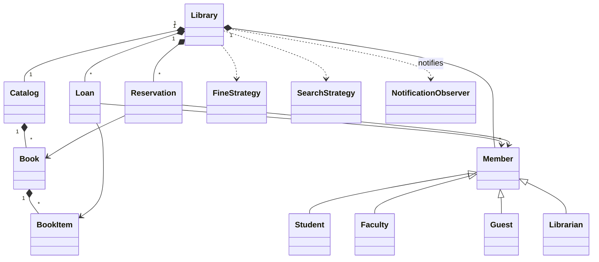

# 36 — Library Management System (LLD Interview Walkthrough)

> **Why this problem?** It's the second-most-asked LLD problem after Parking Lot. It introduces three new dimensions you didn't get in Parking Lot — a **user/account model**, a **borrow ⇄ return state machine**, and **time-based fines**. Master this and you have the template for any system with users, inventory, and lifecycle (Movie Booking, Bike Rental, Hotel Room booking, equipment lending, e-commerce checkout).

---

## 1. The Setup

> Interviewer: *"Design a Library Management System."*

The trap most candidates fall into: they immediately model `Book` with a `borrow()` method and start coding. They miss:

- `Book` vs `BookItem` (the catalog title vs the physical copy on a shelf — *different things*).
- `Loan` is a first-class entity, not a flag on a book.
- The state machine on `BookItem` (`AVAILABLE → LOANED → RESERVED → LOST → REMOVED`).

Get those three right and you're already ahead of 80% of candidates.

---

## 2. Requirements Clarification (Phase 1 — ~10 min)

### 2.1 Functional questions

| # | Question | Why it matters |
|---|---|---|
| Q1 | One library or a network of branches? | Branch entity, inter-branch transfer |
| Q2 | Multiple physical copies of one title? | `Book` (title) vs `BookItem` (copy) — *critical split* |
| Q3 | Can members reserve a book that's currently loaned? | Reservation queue (FIFO) + Observer for notifications |
| Q4 | Fine policy — fixed/day, slab, daily cap? | Strategy pattern for fines |
| Q5 | Max books per member, max loan duration? | Policy / business rules |
| Q6 | Member types — Student, Faculty, Guest, Librarian? | Role-based limits + permissions |
| Q7 | Search by — title / author / subject / ISBN? | Catalog index design |
| Q8 | What happens on a lost book? | New terminal state + replacement fee |
| Q9 | Can members renew a loan? | Loan extension flow, blocked if reserved |
| Q10 | Do librarians have a special UI / privileges? | RBAC — they add books, waive fines |

### 2.2 Non-functional questions

- Scale — 1 small library (10K books) or a university system (1M books, 50 branches)?
- Concurrency — what if two members try to borrow the last copy simultaneously?
- Notifications — email/SMS/in-app for due dates and reservation-ready alerts?

### 2.3 The scope lock

> *"OK, scoping: single library (one branch — we'll discuss multi-branch as an extension). Multiple copies per title. 4 member types: Student / Faculty / Guest / Librarian, with different max-books and max-days limits. Reservations allowed with FIFO queue. Fixed-rate fine per overdue day with a daily cap. Members can renew a loan if no one has reserved it. Search by title, author, subject, ISBN. Notifications via an Observer port — actual transport (email/SMS) is pluggable. Lost books incur a replacement fee."*

---

## 3. Entity Modeling (Phase 2 — ~5 min)

**The mental model** — and this is the most important thing in the whole problem:

```
Book  =  the TITLE  (e.g., "Clean Code by Robert Martin, ISBN-9780132350884")
         ─ one row in your catalog
         ─ has metadata: title, author, isbn, subject, publisher

BookItem = the PHYSICAL COPY  (e.g., copy #3 of "Clean Code" sitting on shelf B-12)
         ─ a Book has 1..N BookItems
         ─ each has its own status: AVAILABLE / LOANED / RESERVED / LOST / REMOVED
         ─ each has its own barcode, shelf location, condition
         ─ THIS is what gets borrowed, not the Book
```

Miss this distinction → your design collapses the moment the interviewer asks "what if we have 5 copies of the same book?"

### Entities

| Entity | Role | Notes |
|---|---|---|
| `Library` | Root — owns catalog, members, loans, reservations | Singleton |
| `Catalog` | Searchable index over Books | Has indexes by title/author/subject/isbn |
| `Book` | The title (logical entity) | Immutable metadata |
| `BookItem` | A physical copy | Has a `BookItemStatus` state machine |
| `Member` (abstract) | A library user | Sub-types per role |
| `Student` / `Faculty` / `Guest` / `Librarian` | Different limits & permissions | |
| `Loan` | A borrowing event | `bookItem, member, issuedAt, dueAt, returnedAt` |
| `Reservation` | A hold on a book | FIFO queue per Book |
| `Fine` | Money owed due to overdue/lost | Computed via `FineStrategy` |
| `FineStrategy` | Pricing rule | Strategy pattern |
| `SearchStrategy` | How catalog searches | Strategy pattern |
| `NotificationService` | Push out due reminders, reservation-ready | Observer port |
| `BookItemStatus` | State machine | `AVAILABLE → LOANED → RESERVED → LOST → REMOVED` |

---

## 4. UML Class Diagram (Phase 3 — ~5 min)

```
                 ┌────────────────────────┐
                 │       Library          │ ◀── Singleton
                 │  - catalog             │
                 │  - members             │
                 │  - activeLoans         │
                 │  - reservations        │
                 │  + checkout(m, item)   │
                 │  + return(loan)        │
                 │  + reserve(m, book)    │
                 │  + renew(loan)         │
                 └─────────┬──────────────┘
                           │
            ┌──────────────┼──────────────┐
            ▼              ▼              ▼
       ┌─────────┐   ┌──────────┐   ┌──────────────┐
       │ Catalog │   │  Member  │   │   Loan       │
       └────┬────┘   │ «abstract» │ │ - bookItem   │
            │1..*    └────▲─────┘   │ - member     │
            ▼             │         │ - issuedAt   │
       ┌─────────┐  ┌─────┴───┬────────┬──────┐
       │  Book   │  Student Faculty  Guest Librarian
       └────┬────┘
            │1..*
            ▼
       ┌──────────────┐         ┌────────────────────┐
       │  BookItem    │ ──────▶ │ «enum» BookStatus  │
       │ - barcode    │         │ AVAILABLE/LOANED/  │
       │ - shelfLoc   │         │ RESERVED/LOST/REM  │
       │ - status     │         └────────────────────┘
       └──────────────┘

  «interface» FineStrategy        «interface» SearchStrategy
       ▲                                ▲
       │                                │
  FixedDailyFine + cap          TitleSearch / AuthorSearch / ISBN…

  «Observer»                              «Subject»
  NotificationService  ◀── observes ──  Library
  (Email/SMS/InApp transports as concrete observers)
```

Mermaid version:



---

## 5. Design Patterns Chosen (Phase 4 — ~3 min)

| Pattern | Where | Why |
|---|---|---|
| **Singleton** | `Library` | One root aggregate per process |
| **State** | `BookItem` status transitions | Enforces legal transitions (can't return an `AVAILABLE` item) |
| **Strategy** | `FineStrategy`, `SearchStrategy` | Fine rules and search modes vary independently |
| **Observer** | `NotificationService` listens to `Library` events | Decouple "due tomorrow" / "your reservation is ready" from core logic |
| **Factory** | `MemberFactory.create(type, …)` | Avoid `new Student()` calls scattered everywhere |
| **Template Method** *(optional)* | `Member.canBorrow(items)` with role-specific `maxBooks()` + `maxDays()` | Shared algorithm, role-specific knobs |

---

## 6. TypeScript Code (Phase 5 — ~25 min)

### 6.1 Enums & shared types

```typescript
export enum BookItemStatus {
  AVAILABLE = "AVAILABLE",
  LOANED    = "LOANED",
  RESERVED  = "RESERVED",
  LOST      = "LOST",
  REMOVED   = "REMOVED",
}

export enum MemberType {
  STUDENT   = "STUDENT",
  FACULTY   = "FACULTY",
  GUEST     = "GUEST",
  LIBRARIAN = "LIBRARIAN",
}

export enum NotificationType {
  DUE_SOON          = "DUE_SOON",
  OVERDUE           = "OVERDUE",
  RESERVATION_READY = "RESERVATION_READY",
  FINE_ISSUED       = "FINE_ISSUED",
}
```

### 6.2 Book vs BookItem

```typescript
export class Book {
  constructor(
    public readonly isbn: string,
    public readonly title: string,
    public readonly authors: string[],
    public readonly subjects: string[],
    public readonly publisher: string,
  ) {}
}

export class BookItem {
  private status: BookItemStatus = BookItemStatus.AVAILABLE;

  constructor(
    public readonly barcode: string,
    public readonly book: Book,
    public readonly shelfLocation: string,
  ) {}

  getStatus(): BookItemStatus { return this.status; }

  // State machine — only legal transitions allowed
  private transition(from: BookItemStatus, to: BookItemStatus) {
    if (this.status !== from) {
      throw new Error(`Illegal transition ${this.status} → ${to} (must be from ${from})`);
    }
    this.status = to;
  }

  markLoaned()   { this.transition(BookItemStatus.AVAILABLE, BookItemStatus.LOANED);  }
  markReturned() { this.transition(BookItemStatus.LOANED,    BookItemStatus.AVAILABLE); }
  markReserved() { this.transition(BookItemStatus.AVAILABLE, BookItemStatus.RESERVED); }
  markUnreserved() { this.transition(BookItemStatus.RESERVED, BookItemStatus.AVAILABLE); }
  markLost()     { /* lost can come from LOANED or AVAILABLE */
    if (this.status === BookItemStatus.LOANED || this.status === BookItemStatus.AVAILABLE) {
      this.status = BookItemStatus.LOST;
    } else throw new Error(`Cannot mark ${this.status} as LOST`);
  }
}
```

> **Why a state machine instead of a boolean `isLoaned`?** Because `isLoaned=false` doesn't tell you if it's available, reserved, lost, or removed. State enforces transition legality at the **type** level. Try to return an `AVAILABLE` item → exception, before any database write.

### 6.3 Member hierarchy (Template Method)

```typescript
export abstract class Member {
  constructor(
    public readonly id: string,
    public readonly name: string,
    public readonly email: string,
    public readonly type: MemberType,
  ) {}

  // Subclasses set the knobs
  abstract maxBooks(): number;
  abstract maxDays(): number;

  // Shared algorithm — Template Method
  canBorrow(currentLoanCount: number): boolean {
    return currentLoanCount < this.maxBooks();
  }
}

export class Student   extends Member { maxBooks() { return 5; }  maxDays() { return 14; } }
export class Faculty   extends Member { maxBooks() { return 10; } maxDays() { return 60; } }
export class Guest     extends Member { maxBooks() { return 2; }  maxDays() { return 7;  } }
export class Librarian extends Member { maxBooks() { return 50; } maxDays() { return 90; } }
```

### 6.4 Loan, Reservation, Fine

```typescript
export class Loan {
  public returnedAt: Date | null = null;

  constructor(
    public readonly id: string,
    public readonly bookItem: BookItem,
    public readonly member: Member,
    public readonly issuedAt: Date,
    public dueAt: Date,
  ) {}

  isOverdue(now: Date = new Date()): boolean {
    return !this.returnedAt && now > this.dueAt;
  }

  overdueDays(now: Date = new Date()): number {
    if (!this.isOverdue(now)) return 0;
    const ms = now.getTime() - this.dueAt.getTime();
    return Math.ceil(ms / (24 * 60 * 60 * 1000));
  }
}

export class Reservation {
  constructor(
    public readonly id: string,
    public readonly book: Book,       // reservations are on TITLE, not a specific copy
    public readonly member: Member,
    public readonly createdAt: Date = new Date(),
  ) {}
}

export class Fine {
  constructor(
    public readonly id: string,
    public readonly loan: Loan,
    public readonly amount: number,
    public paid: boolean = false,
  ) {}
}
```

### 6.5 Strategy interfaces

```typescript
export interface FineStrategy {
  calculate(loan: Loan, now: Date): number;
}

export interface SearchStrategy {
  search(catalog: Book[], query: string): Book[];
}
```

### 6.6 Concrete strategies

```typescript
export class FixedDailyFine implements FineStrategy {
  constructor(
    private perDay: number = 5,
    private dailyCap: number = 100,  // total cap
  ) {}
  calculate(loan: Loan, now: Date): number {
    const days = loan.overdueDays(now);
    return Math.min(days * this.perDay, this.dailyCap);
  }
}

export class TitleSearch implements SearchStrategy {
  search(catalog: Book[], q: string): Book[] {
    const needle = q.toLowerCase();
    return catalog.filter(b => b.title.toLowerCase().includes(needle));
  }
}

export class AuthorSearch implements SearchStrategy {
  search(catalog: Book[], q: string): Book[] {
    const needle = q.toLowerCase();
    return catalog.filter(b => b.authors.some(a => a.toLowerCase().includes(needle)));
  }
}

export class IsbnSearch implements SearchStrategy {
  search(catalog: Book[], q: string): Book[] {
    return catalog.filter(b => b.isbn === q);
  }
}
```

### 6.7 Catalog

```typescript
export class Catalog {
  // Book ↔ its copies
  private books = new Map<string, Book>();             // isbn → Book
  private items = new Map<string, BookItem[]>();       // isbn → BookItem[]

  addBook(book: Book): void {
    if (!this.books.has(book.isbn)) {
      this.books.set(book.isbn, book);
      this.items.set(book.isbn, []);
    }
  }

  addItem(item: BookItem): void {
    this.addBook(item.book);
    this.items.get(item.book.isbn)!.push(item);
  }

  allBooks(): Book[] { return [...this.books.values()]; }
  itemsOf(isbn: string): BookItem[] { return this.items.get(isbn) ?? []; }

  search(strategy: SearchStrategy, q: string): Book[] {
    return strategy.search(this.allBooks(), q);
  }

  findAvailableItem(isbn: string): BookItem | null {
    return this.itemsOf(isbn).find(i => i.getStatus() === BookItemStatus.AVAILABLE) ?? null;
  }
}
```

### 6.8 Notification (Observer)

```typescript
export interface NotificationObserver {
  notify(type: NotificationType, recipient: Member, payload: Record<string, unknown>): void;
}

export class EmailNotifier implements NotificationObserver {
  notify(type: NotificationType, recipient: Member, payload: Record<string, unknown>) {
    console.log(`[EMAIL → ${recipient.email}] ${type}`, payload);
  }
}

export class SmsNotifier implements NotificationObserver {
  notify(type: NotificationType, recipient: Member, payload: Record<string, unknown>) {
    console.log(`[SMS → ${recipient.name}] ${type}`, payload);
  }
}
```

### 6.9 The Library (Singleton + Subject)

```typescript
export class Library {
  private static instance: Library | null = null;

  private catalog = new Catalog();
  private members = new Map<string, Member>();
  private loans = new Map<string, Loan>();
  private reservations = new Map<string, Reservation[]>(); // isbn → FIFO queue
  private fines: Fine[] = [];
  private observers: NotificationObserver[] = [];
  private loanSeq = 1;
  private resSeq = 1;
  private fineSeq = 1;

  private constructor(private fineStrategy: FineStrategy) {}

  static getInstance(fineStrategy: FineStrategy = new FixedDailyFine()): Library {
    if (!Library.instance) Library.instance = new Library(fineStrategy);
    return Library.instance;
  }

  // --- registration ---
  addMember(m: Member): void { this.members.set(m.id, m); }
  addObserver(o: NotificationObserver): void { this.observers.push(o); }
  getCatalog(): Catalog { return this.catalog; }

  // --- core flow ---
  checkout(memberId: string, isbn: string): Loan {
    const member = this.required(this.members.get(memberId), `Member ${memberId}`);
    const activeLoans = [...this.loans.values()].filter(
      l => l.member.id === memberId && !l.returnedAt,
    ).length;
    if (!member.canBorrow(activeLoans)) {
      throw new Error(`${member.name} has hit max-books limit (${member.maxBooks()})`);
    }

    const item = this.catalog.findAvailableItem(isbn);
    if (!item) throw new Error(`No available copy of ${isbn}`);

    item.markLoaned();
    const issuedAt = new Date();
    const dueAt    = new Date(issuedAt.getTime() + member.maxDays() * 86_400_000);
    const loan = new Loan(`L-${this.loanSeq++}`, item, member, issuedAt, dueAt);
    this.loans.set(loan.id, loan);
    return loan;
  }

  returnBook(loanId: string): Fine | null {
    const loan = this.required(this.loans.get(loanId), `Loan ${loanId}`);
    if (loan.returnedAt) throw new Error(`Loan ${loanId} already returned`);

    const now = new Date();
    loan.returnedAt = now;
    loan.bookItem.markReturned();

    // Fine if overdue
    let fine: Fine | null = null;
    const amount = this.fineStrategy.calculate(loan, now);
    if (amount > 0) {
      fine = new Fine(`F-${this.fineSeq++}`, loan, amount);
      this.fines.push(fine);
      this.fire(NotificationType.FINE_ISSUED, loan.member, { amount });
    }

    // Promote next reservation, if any
    this.promoteReservation(loan.bookItem.book.isbn);
    return fine;
  }

  reserve(memberId: string, isbn: string): Reservation {
    const member = this.required(this.members.get(memberId), `Member ${memberId}`);
    const book = this.catalog.allBooks().find(b => b.isbn === isbn);
    if (!book) throw new Error(`Unknown book ${isbn}`);

    const queue = this.reservations.get(isbn) ?? [];
    const r = new Reservation(`R-${this.resSeq++}`, book, member);
    queue.push(r);
    this.reservations.set(isbn, queue);

    // If a copy is sitting available, hold it for this member immediately
    const free = this.catalog.findAvailableItem(isbn);
    if (free && queue.length === 1) {
      free.markReserved();
      this.fire(NotificationType.RESERVATION_READY, member, { isbn });
    }
    return r;
  }

  renew(loanId: string): Loan {
    const loan = this.required(this.loans.get(loanId), `Loan ${loanId}`);
    if (loan.returnedAt) throw new Error(`Loan already closed`);

    // Block renewal if someone else is waiting
    const queue = this.reservations.get(loan.bookItem.book.isbn) ?? [];
    if (queue.length > 0) throw new Error(`Cannot renew — reservation pending`);

    loan.dueAt = new Date(loan.dueAt.getTime() + loan.member.maxDays() * 86_400_000);
    return loan;
  }

  // --- helpers ---
  private promoteReservation(isbn: string): void {
    const queue = this.reservations.get(isbn) ?? [];
    if (queue.length === 0) return;
    const next = queue[0];
    const item = this.catalog.findAvailableItem(isbn);
    if (!item) return;
    item.markReserved();
    this.fire(NotificationType.RESERVATION_READY, next.member, { isbn });
  }

  private fire(type: NotificationType, recipient: Member, payload: Record<string, unknown>) {
    this.observers.forEach(o => o.notify(type, recipient, payload));
  }

  private required<T>(v: T | undefined, label: string): T {
    if (!v) throw new Error(`${label} not found`);
    return v;
  }
}
```

### 6.10 Driver — putting it together

```typescript
const lib = Library.getInstance();

// Books + copies
const cleanCode = new Book("9780132350884", "Clean Code", ["Robert C. Martin"],
                           ["Software"], "Prentice Hall");
lib.getCatalog().addItem(new BookItem("CC-001", cleanCode, "B-12"));
lib.getCatalog().addItem(new BookItem("CC-002", cleanCode, "B-12"));

// Members
const alice = new Student("M-1", "Alice", "alice@uni.edu", MemberType.STUDENT);
const bob   = new Faculty("M-2", "Bob",   "bob@uni.edu",   MemberType.FACULTY);
lib.addMember(alice);
lib.addMember(bob);

// Notifications
lib.addObserver(new EmailNotifier());

// Flow
const loan = lib.checkout(alice.id, cleanCode.isbn);   // Alice takes copy CC-001
console.log("Issued:", loan.id, "due:", loan.dueAt);

const reservation = lib.reserve(bob.id, cleanCode.isbn); // Bob reserves the title
console.log("Reservation:", reservation.id);

const fine = lib.returnBook(loan.id);                  // Alice returns
console.log("Fine on return:", fine?.amount ?? 0);
// → Bob gets RESERVATION_READY notification
```

---

## 7. Extension Follow-Ups (Phase 6 — ~5 min)

### 7.1 "What if two members try to borrow the last copy at the same time?"
In JS the event loop serializes it. In a real distributed system: do an atomic state transition in the DB — `UPDATE book_item SET status='LOANED', loan_id=... WHERE barcode=X AND status='AVAILABLE'`. Check `affectedRows === 1`. The other request gets the failure path and you fall back to reservation.

### 7.2 "Add a daily background job that emails members about due-soon and overdue loans."
A separate `DueNotifier` runs daily, scans `activeLoans` where `now() > dueAt − 1 day`, and fires `DUE_SOON` / `OVERDUE` events via the same `NotificationObserver` ports. The Library code doesn't change — that's why Observer matters.

### 7.3 "Multi-branch support."
Promote `Library` from Singleton to a per-branch entity. Introduce `LibrarySystem` (the new singleton) holding a `Map<branchId, Library>`. Add `transfer(bookItem, fromBranch, toBranch)`. Loans, reservations, and members may or may not be branch-scoped — interviewer's call.

### 7.4 "Variable fines for different member types."
Make `FineStrategy` accept `member.type` and look up the rate. Or compose: `MemberAwareFineStrategy` wraps a base strategy and applies a multiplier per member type. (Decorator-ish.) Avoid `if (member.type === STUDENT) … else if (FACULTY) …` blocks in the Library class — that's the Open/Closed violation interviewers fish for.

### 7.5 "Lost book replacement workflow."
Add a method `reportLost(loanId)` → `loan.bookItem.markLost()` + create a `Fine` for `book.replacementCost`. The reservation queue gets notified that this copy is lost, but other copies of the same Book may still satisfy the reservation.

### 7.6 "Inventory analytics — most-borrowed books, deadbeat members, etc."
That's an OLAP/reporting concern. Don't bolt it onto `Library`. Either (a) emit domain events (`LoanIssued`, `LoanReturned`) and have a separate `AnalyticsService` subscribe via the same Observer mechanism, or (b) replay from the loans table in a nightly batch job. Keep transactional and analytical paths separate.

---

## 8. Real-World Production Notes

- **Real systems** — Koha (open source), Evergreen, Alma (Ex Libris), library.link from OCLC, Symphony from SirsiDynix.
- **ISBN is not a primary key** — different editions of the same book have different ISBNs. Real systems use a separate `WorkID` (FRBR model: Work → Expression → Manifestation → Item). Our `Book` here is roughly a *Manifestation* and our `BookItem` is an *Item*.
- **Barcode vs RFID** — modern libraries embed RFID in each `BookItem` for fast self-checkout. The data model is identical — only the read mechanism changes.
- **GDPR / privacy** — never log "Alice borrowed *Catcher in the Rye*" beyond what's required. Loan history is sensitive in many jurisdictions.

---

## 9. Interview Questions (with answers)

**Q1. Why split `Book` and `BookItem` instead of putting a `copyCount` field on `Book`?**
Because each physical copy has independent state: shelf location, condition, who has it, whether it's lost. A `copyCount` integer can't express *"copy #2 is loaned to Alice, copy #5 is missing, copy #3 is in transit"*. Modeling each copy as a `BookItem` keeps the state per-copy where it physically lives. This is the same reason `Order` and `OrderLineItem` are separate in e-commerce.

**Q2. Why model `BookItem` status as a state machine instead of two booleans (`isLoaned`, `isReserved`)?**
Two booleans give you 4 combinations, of which only 3 are legal — `isLoaned && isReserved` is a logical impossibility but the type system happily allows it. A state machine encodes "exactly one state at a time" and validates transitions: returning an `AVAILABLE` book throws *before* it corrupts your DB. Same reason your form library uses a `Status` enum instead of `isLoading`, `isError`, `isSuccess` booleans.

**Q3. Why is the fine computed via a `FineStrategy` rather than `loan.calculateFine()`?**
Fine rules change all the time (festive amnesty, special student rates, fines disabled in summer). If the rule lives on `Loan`, every rule change rewrites `Loan`. With a `FineStrategy` interface, you add `SummerNoFine`, `FacultyHalfRateFine`, `EscalatingFine` as new classes and inject them — `Loan` doesn't change. Open/Closed.

**Q4. Why does `renew()` fail if there's a reservation?**
Because renewal extends one member's access at the expense of another who's already waiting. Reservations are a queue with FIFO fairness — letting the current holder skip ahead breaks that contract. Real libraries (and AWS, ticketing systems, etc.) work the same way: holds block renewals.

**Q5. The notification system uses Observers. What's the downside, and how would you handle it at scale?**
The naive Observer is synchronous and in-process: a slow `SmsNotifier` blocks `checkout()`. At scale, swap the in-process notify for an event bus — `Library` publishes `LoanReturned` to Kafka/SNS, and notifier workers consume it. The shape of the code doesn't change (still an `Observer` interface) but the transport becomes async. This pattern is sometimes called **domain events** — Observer over a message bus.

**Q6. (Trap) Should `Member.borrow(bookItem)` exist?**
No — same trap as `Vehicle.park(spot)` in the Parking Lot problem. Borrowing isn't a state change on the member; the member's identity doesn't change. The state changes are: `BookItem.status → LOANED`, a new `Loan` is created, and `Library.loans` grows. The orchestration belongs on the aggregate root (`Library.checkout`). Putting `borrow` on `Member` is anemic-domain confusion in the *opposite* direction — making a passive entity active.

---

## 10. The Cheat-Sheet (last-minute revision)

```
Big idea:    Book (title) ≠ BookItem (copy). Loan & Reservation are first-class.

Patterns:
  Singleton  → Library
  State      → BookItem (AVAILABLE/LOANED/RESERVED/LOST/REMOVED)
  Strategy   → FineStrategy, SearchStrategy
  Observer   → NotificationService (Email/SMS/InApp)
  Template   → Member.canBorrow() with role-specific maxBooks/maxDays
  Factory    → MemberFactory.create(type, …)

Flow:
  checkout:  member.canBorrow? → findAvailableItem → item.markLoaned → new Loan
  return:    item.markReturned → fineStrategy.calculate → promote reservation
  reserve:   queue per ISBN; first in line gets RESERVATION_READY when free
  renew:     blocked if reservation queue non-empty

Traps:
  - copyCount on Book (wrong — split into BookItem)
  - isLoaned boolean (wrong — use state machine)
  - Member.borrow() (wrong — Library orchestrates)
  - if/else fine rules in Library (wrong — Strategy)
  - Synchronous Observer at scale (push to event bus)

Concurrency:
  Atomic UPDATE on item status (single-row CAS); reservation queue serialized per ISBN.
```

You now have a template that ports almost 1:1 to Movie Booking (Show ≈ Book, Seat ≈ BookItem, Booking ≈ Loan), Hotel (Hotel→Room→RoomNight), and bike rentals.
