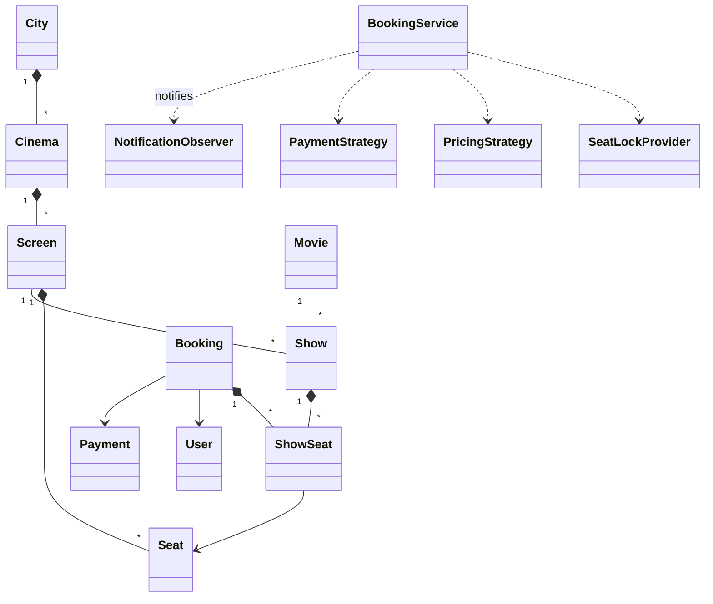

# 37 — Movie Ticket Booking System (LLD Interview Walkthrough)

> **Why this problem?** Think BookMyShow, Fandango, AMC. It's the first LLD problem where **concurrency is the headline feature**, not a footnote. Two users clicking the same seat at the same time is the *entire* design challenge. Master this and you have the template for any seat-inventory problem — flights, trains, concerts, sports tickets.

---

## 1. The Setup

> Interviewer: *"Design a movie ticket booking system like BookMyShow."*

The interview-killing trap: candidates immediately start modeling `Movie`, `Theater`, `Show`, `Seat`, `Booking`… and never get to **how do two people not book the same seat**. That's the *whole point* of the problem. If you don't bring it up by minute 15, the interviewer will — and they'll have already decided you're a Mid candidate.

The "Senior" answer is to make seat locking a **first-class entity** (`SeatLockProvider`) with an **expiry**.

---

## 2. Requirements Clarification (Phase 1 — ~10 min)

### 2.1 Functional questions

| # | Question | Why it matters |
|---|---|---|
| Q1 | Multiple cities, theaters, screens? | Hierarchy: `City → Cinema → Screen → Show` |
| Q2 | Different seat types — Regular / Premium / Recliner? | Per-seat pricing tiers |
| Q3 | Pricing — flat, time-of-day, weekend, dynamic? | Strategy pattern with pluggable rules |
| Q4 | Can a user select multiple seats in one booking? | Multi-seat atomic lock |
| Q5 | How long does a user have to pay after picking seats? | The **seat hold window** (typ. 5–10 min) — drives the locking design |
| Q6 | Payment methods? | Card / UPI / Wallet — Strategy |
| Q7 | What happens if payment fails? | Release locks, seats go back to available |
| Q8 | Cancellation policy / refunds? | New flow: `CANCELLED` state + refund strategy |
| Q9 | Offers, coupons, loyalty points? | Decorator over pricing |
| Q10 | Booking history per user, notifications, e-ticket? | Observer + persistence |

### 2.2 Non-functional questions

- **Concurrency** — what if 50 users hit the same seat in the same second on opening night?
- **Scale** — single theater (1K seats) vs city-wide (100K seats) vs national (10M concurrent users for a blockbuster release)?
- **Consistency** — strong (no double-booking ever) vs eventual (we accept oversells)? For seats: strong, always.
- **Latency** — seat-map must render in <500ms even on opening night.

### 2.3 The scope lock

> *"OK, scoping: city → cinema → screen → show hierarchy. 3 seat types (Regular / Premium / Recliner) with per-tier pricing. Users select N seats from a show; we atomically lock them for 5 minutes; payment must complete within that window or locks expire and seats are released. 3 payment methods. Cancellation allowed up to 1 hour before show with a fixed refund policy. No coupons today — we'll cover them as an extension."*

---

## 3. Entity Modeling (Phase 2 — ~5 min)

| Entity | Role | Notes |
|---|---|---|
| `City` | Top-level container | A list of cinemas |
| `Cinema` | A theater building | Has multiple screens |
| `Screen` | A physical hall | Has a seat layout |
| `Seat` | One physical seat | `(row, col)`, has a type |
| `Movie` | The film itself | Title, language, duration, genre |
| `Show` | A scheduled screening | `movie × screen × startTime` — **this is what users book** |
| `ShowSeat` | A seat-instance for a specific show | Per-show pricing + status |
| `Booking` | A user's purchase | One `User` + N `ShowSeat`s + payment |
| `User` | The buyer | Login, history, wallet |
| `Payment` | Money movement | Strategy: Card / UPI / Wallet |
| `SeatLockProvider` | **The concurrency primitive** | TTL-based locks per `(showId, seatId)` |
| `PricingStrategy` | Per-show, per-seat pricing | Strategy |
| `NotificationObserver` | E-ticket / SMS / WhatsApp | Observer |

### The crucial split — Seat vs ShowSeat

```
Seat       =  the PHYSICAL seat in a Screen
              (Screen "Audi 1", Row C, Col 7, type=PREMIUM)
              ─ exists once per Screen
              ─ immutable layout

ShowSeat   =  the BOOKABLE seat-instance for a Show
              ─ exists once per (Show × Seat)
              ─ has status: AVAILABLE / LOCKED / BOOKED
              ─ has a price (Premium seat at a 9pm Saturday show ≠ same seat at 11am Tuesday)
```

Same mental model as `Book` vs `BookItem` (lesson 36). If you tried to put `status` and `price` directly on `Seat`, you'd lose the ability to have *two shows on the same screen at the same time*… wait, that doesn't happen. But you'd lose the ability to price differently per show, and you'd lose the ability to model per-show occupancy.

---

## 4. UML (Phase 3 — ~5 min)

```
┌──────────┐    ┌────────────┐    ┌──────────┐
│   City   │1─*─│   Cinema   │1─*─│  Screen  │1──┐
└──────────┘    └────────────┘    └──────────┘   │ 1..*
                                                  ▼
                                              ┌───────┐
                                              │ Seat  │ (row, col, type)
                                              └───────┘

┌──────────┐                  ┌──────────┐
│  Movie   │1───────────────*│   Show   │ (movie × screen × startTime)
└──────────┘                  └──────────┘
                                   │1
                                   │*
                                   ▼
                              ┌──────────┐
                              │ ShowSeat │ (status, price)
                              └──────────┘
                                   ▲
                                   │
              ┌────────────────────┴───────────────────┐
              │                                        │
       ┌──────────────┐                       ┌────────────────┐
       │  Booking     │ ───────owns────────▶  │ List<ShowSeat> │
       │  - user      │                       └────────────────┘
       │  - status    │
       │  - payment   │
       └──────────────┘
              │
              ▼
       ┌─────────────────────┐        ┌─────────────────────────┐
       │  «interface»        │        │  SeatLockProvider       │
       │  PaymentStrategy    │        │  + lock(showId,seats,u) │
       │  Card/UPI/Wallet    │        │  + unlock(...)          │
       └─────────────────────┘        │  + isLocked(...)        │
                                      │  TTL = 5 min            │
                                      └─────────────────────────┘

  «Observer»   NotificationObserver  (Email/SMS/WhatsApp)
```



---

## 5. Design Patterns Chosen (Phase 4 — ~3 min)

| Pattern | Where | Why |
|---|---|---|
| **Singleton** | `BookingService`, `SeatLockProvider` | One coordinator per process |
| **State** | `ShowSeat` (`AVAILABLE → LOCKED → BOOKED`), `Booking` (`PENDING → CONFIRMED / EXPIRED / CANCELLED / REFUNDED`) | Enforce legal transitions |
| **Strategy** | `PricingStrategy`, `PaymentStrategy` | Pluggable rules |
| **Observer** | `NotificationObserver` | E-ticket, SMS, push — async push |
| **Factory** | `PaymentStrategyFactory.from(mode)` | Hide concrete payment-gateway instantiation |
| **Decorator** *(extension)* | `CouponDiscountedPricing` wraps a base `PricingStrategy` | Coupons stack |

> Special call-out: the **SeatLockProvider** is *not* a GoF pattern — it's an *infrastructure primitive*. But interviewers love when you say "this is essentially a distributed lock with TTL, like Redis SETNX + EXPIRE" — that's senior signaling.

---

## 6. TypeScript Code (Phase 5 — ~25 min)

### 6.1 Enums

```typescript
export enum SeatType    { REGULAR = "REGULAR", PREMIUM = "PREMIUM", RECLINER = "RECLINER" }
export enum SeatStatus  { AVAILABLE = "AVAILABLE", LOCKED = "LOCKED", BOOKED = "BOOKED" }
export enum BookingStatus {
  PENDING = "PENDING",       // seats locked, awaiting payment
  CONFIRMED = "CONFIRMED",   // payment succeeded
  EXPIRED = "EXPIRED",       // lock expired, payment never came
  CANCELLED = "CANCELLED",
  REFUNDED = "REFUNDED",
}
export enum PaymentMode { CARD = "CARD", UPI = "UPI", WALLET = "WALLET" }
```

### 6.2 Static layout — City / Cinema / Screen / Seat / Movie

```typescript
export class Seat {
  constructor(
    public readonly id: string,         // unique within a Screen, e.g. "C-7"
    public readonly row: string,
    public readonly col: number,
    public readonly type: SeatType,
  ) {}
}

export class Screen {
  constructor(
    public readonly id: string,
    public readonly name: string,       // "Audi 1"
    public readonly seats: Seat[],
  ) {}
}

export class Cinema {
  constructor(
    public readonly id: string,
    public readonly name: string,
    public readonly city: string,
    public readonly screens: Screen[],
  ) {}
}

export class Movie {
  constructor(
    public readonly id: string,
    public readonly title: string,
    public readonly durationMin: number,
    public readonly language: string,
    public readonly genre: string,
  ) {}
}
```

### 6.3 Show + ShowSeat

```typescript
export class ShowSeat {
  private status: SeatStatus = SeatStatus.AVAILABLE;

  constructor(
    public readonly seat: Seat,
    public readonly price: number,
  ) {}

  getStatus(): SeatStatus { return this.status; }

  // State machine
  markLocked()    { this.assertFrom(SeatStatus.AVAILABLE); this.status = SeatStatus.LOCKED;    }
  markBooked()    { this.assertFrom(SeatStatus.LOCKED);    this.status = SeatStatus.BOOKED;    }
  markAvailable() {
    if (this.status === SeatStatus.BOOKED) throw new Error("Cannot release a booked seat directly — cancel the Booking instead");
    this.status = SeatStatus.AVAILABLE;
  }
  private assertFrom(s: SeatStatus) {
    if (this.status !== s) throw new Error(`Illegal transition from ${this.status}`);
  }
}

export class Show {
  // seatId → ShowSeat
  private showSeats = new Map<string, ShowSeat>();

  constructor(
    public readonly id: string,
    public readonly movie: Movie,
    public readonly screen: Screen,
    public readonly startTime: Date,
    pricing: PricingStrategy,
  ) {
    for (const s of screen.seats) {
      this.showSeats.set(s.id, new ShowSeat(s, pricing.priceFor(s, startTime)));
    }
  }

  getSeat(seatId: string): ShowSeat {
    const ss = this.showSeats.get(seatId);
    if (!ss) throw new Error(`Unknown seat ${seatId}`);
    return ss;
  }

  availableSeats(): ShowSeat[] {
    return [...this.showSeats.values()].filter(s => s.getStatus() === SeatStatus.AVAILABLE);
  }
}
```

### 6.4 Pricing strategy

```typescript
export interface PricingStrategy {
  priceFor(seat: Seat, showTime: Date): number;
}

export class TieredWeekendPricing implements PricingStrategy {
  private base: Record<SeatType, number> = {
    [SeatType.REGULAR]: 200,
    [SeatType.PREMIUM]: 350,
    [SeatType.RECLINER]: 600,
  };
  priceFor(seat: Seat, showTime: Date): number {
    const day = showTime.getDay(); // 0=Sun, 6=Sat
    const isWeekend = day === 0 || day === 6;
    return this.base[seat.type] * (isWeekend ? 1.25 : 1.0);
  }
}
```

### 6.5 The SeatLockProvider — *the heart of the system*

```typescript
type LockKey = string;                    // `${showId}:${seatId}`
interface LockRecord { userId: string; expiresAt: number; }

export class SeatLockProvider {
  private static instance: SeatLockProvider | null = null;
  static getInstance(ttlSeconds = 300): SeatLockProvider {     // 5 min default
    if (!SeatLockProvider.instance) SeatLockProvider.instance = new SeatLockProvider(ttlSeconds);
    return SeatLockProvider.instance;
  }

  private locks = new Map<LockKey, LockRecord>();
  private constructor(private ttlSeconds: number) {}

  // Atomic multi-seat acquire — either ALL succeed or NONE do
  lock(showId: string, seatIds: string[], userId: string): void {
    const now = Date.now();
    const keys = seatIds.map(id => `${showId}:${id}`);

    // 1) Pre-check — every seat must be free or hold an EXPIRED lock
    for (const k of keys) {
      const rec = this.locks.get(k);
      if (rec && rec.expiresAt > now && rec.userId !== userId) {
        throw new Error(`Seat ${k} is locked by another user`);
      }
    }

    // 2) Commit — write all locks
    const expiresAt = now + this.ttlSeconds * 1000;
    for (const k of keys) this.locks.set(k, { userId, expiresAt });
  }

  unlock(showId: string, seatIds: string[], userId: string): void {
    for (const id of seatIds) {
      const k = `${showId}:${id}`;
      const rec = this.locks.get(k);
      if (rec && rec.userId === userId) this.locks.delete(k);
    }
  }

  isLockedBy(showId: string, seatId: string, userId: string): boolean {
    const rec = this.locks.get(`${showId}:${seatId}`);
    return !!rec && rec.userId === userId && rec.expiresAt > Date.now();
  }

  // Sweeper — call periodically (or rely on isLockedBy's TTL check)
  sweep(): void {
    const now = Date.now();
    for (const [k, rec] of this.locks) {
      if (rec.expiresAt <= now) this.locks.delete(k);
    }
  }
}
```

> **The interview talking points on this class:**
> 1. **Atomic multi-seat acquire**: candidates often write a for-loop that locks seats one by one, leaving partial state when seat #3 fails. Our pre-check + commit prevents that.
> 2. **TTL via timestamp, not setTimeout**: a `setTimeout(unlock, 5*60*1000)` is fragile (process restart loses the timer, GC churn). Storing `expiresAt` and lazy-checking on read is robust.
> 3. **Single-process today, Redis tomorrow**: same interface, swap the `Map` for Redis `SET NX PX`. The rest of the system doesn't change.

### 6.6 Payment strategy

```typescript
export interface PaymentStrategy {
  charge(amount: number, userId: string): boolean;
}

export class CardPayment   implements PaymentStrategy { charge() { return true; } }
export class UpiPayment    implements PaymentStrategy { charge() { return true; } }
export class WalletPayment implements PaymentStrategy { charge() { return true; } }

export class PaymentStrategyFactory {
  static from(mode: PaymentMode): PaymentStrategy {
    switch (mode) {
      case PaymentMode.CARD:   return new CardPayment();
      case PaymentMode.UPI:    return new UpiPayment();
      case PaymentMode.WALLET: return new WalletPayment();
    }
  }
}
```

### 6.7 Booking

```typescript
export class Booking {
  public status: BookingStatus = BookingStatus.PENDING;
  public payment: { mode: PaymentMode; amount: number; success: boolean } | null = null;

  constructor(
    public readonly id: string,
    public readonly userId: string,
    public readonly show: Show,
    public readonly seats: ShowSeat[],
    public readonly createdAt: Date = new Date(),
  ) {}

  total(): number { return this.seats.reduce((s, ss) => s + ss.price, 0); }
}
```

### 6.8 BookingService (the orchestrator)

```typescript
export interface NotificationObserver {
  notify(userId: string, type: string, payload: Record<string, unknown>): void;
}

export class BookingService {
  private static instance: BookingService | null = null;
  static getInstance(): BookingService {
    if (!BookingService.instance) BookingService.instance = new BookingService();
    return BookingService.instance;
  }

  private bookings = new Map<string, Booking>();
  private observers: NotificationObserver[] = [];
  private locker = SeatLockProvider.getInstance();
  private seq = 1;

  addObserver(o: NotificationObserver) { this.observers.push(o); }

  // Phase 1 — user picks seats. We acquire locks and create a PENDING booking.
  reserve(show: Show, seatIds: string[], userId: string): Booking {
    // 1) Acquire all locks atomically — throws if any seat is taken
    this.locker.lock(show.id, seatIds, userId);

    // 2) Transition each ShowSeat to LOCKED
    const seats: ShowSeat[] = [];
    try {
      for (const id of seatIds) {
        const ss = show.getSeat(id);
        ss.markLocked();
        seats.push(ss);
      }
    } catch (e) {
      // Roll back any partial state
      for (const ss of seats) ss.markAvailable();
      this.locker.unlock(show.id, seatIds, userId);
      throw e;
    }

    const b = new Booking(`B-${this.seq++}`, userId, show, seats);
    this.bookings.set(b.id, b);
    return b;
  }

  // Phase 2 — user pays. Confirm or expire.
  confirm(bookingId: string, mode: PaymentMode): Booking {
    const b = this.required(bookingId);
    if (b.status !== BookingStatus.PENDING) throw new Error(`Booking ${bookingId} not PENDING`);

    // Validate lock is still ours (could have expired)
    for (const ss of b.seats) {
      if (!this.locker.isLockedBy(b.show.id, ss.seat.id, b.userId)) {
        this.expire(b);
        throw new Error(`Booking expired — locks no longer held`);
      }
    }

    // Charge
    const strategy = PaymentStrategyFactory.from(mode);
    const ok = strategy.charge(b.total(), b.userId);
    b.payment = { mode, amount: b.total(), success: ok };

    if (!ok) {
      this.expire(b);
      throw new Error(`Payment failed`);
    }

    // Commit
    for (const ss of b.seats) ss.markBooked();
    this.locker.unlock(b.show.id, b.seats.map(s => s.seat.id), b.userId);
    b.status = BookingStatus.CONFIRMED;
    this.fire(b.userId, "BOOKING_CONFIRMED", { bookingId: b.id, total: b.total() });
    return b;
  }

  cancel(bookingId: string): Booking {
    const b = this.required(bookingId);
    if (b.status !== BookingStatus.CONFIRMED) throw new Error(`Only CONFIRMED bookings can be cancelled`);
    // Refund policy: full refund if >1h before show
    const oneHour = 60 * 60 * 1000;
    if (b.show.startTime.getTime() - Date.now() < oneHour) {
      throw new Error(`Cancellation window closed`);
    }
    for (const ss of b.seats) {
      // Force back to AVAILABLE — direct transition allowed only here
      (ss as any).status = SeatStatus.AVAILABLE;  // see Q on encapsulation below
    }
    b.status = BookingStatus.REFUNDED;
    this.fire(b.userId, "BOOKING_REFUNDED", { bookingId: b.id });
    return b;
  }

  // Called by sweeper when a lock window elapsed without confirmation
  expire(b: Booking): void {
    if (b.status !== BookingStatus.PENDING) return;
    for (const ss of b.seats) {
      try { ss.markAvailable(); } catch { /* already released */ }
    }
    this.locker.unlock(b.show.id, b.seats.map(s => s.seat.id), b.userId);
    b.status = BookingStatus.EXPIRED;
  }

  private fire(userId: string, type: string, payload: Record<string, unknown>) {
    this.observers.forEach(o => o.notify(userId, type, payload));
  }

  private required(bookingId: string): Booking {
    const b = this.bookings.get(bookingId);
    if (!b) throw new Error(`Unknown booking ${bookingId}`);
    return b;
  }
}
```

### 6.9 Driver

```typescript
// Setup
const screen = new Screen("S1", "Audi 1", [
  new Seat("A1", "A", 1, SeatType.REGULAR),
  new Seat("A2", "A", 2, SeatType.REGULAR),
  new Seat("P1", "P", 1, SeatType.PREMIUM),
  new Seat("R1", "R", 1, SeatType.RECLINER),
]);
const inox = new Cinema("C1", "INOX Forum", "BLR", [screen]);
const interstellar = new Movie("M1", "Interstellar", 169, "EN", "SciFi");

const show = new Show(
  "SH-1", interstellar, screen,
  new Date(Date.now() + 24*3600*1000),  // tomorrow same time
  new TieredWeekendPricing(),
);

const booking = BookingService.getInstance();
booking.addObserver({ notify: (u, t, p) => console.log(`[NOTIFY ${u}] ${t}`, p) });

// User Alice picks 2 seats
const a = booking.reserve(show, ["A1", "P1"], "user-alice");
console.log("Pending:", a.id, "total ₹", a.total());

// Meanwhile Bob tries to grab the same seats → fails
try {
  booking.reserve(show, ["A1"], "user-bob");
} catch (e) {
  console.log("Bob rejected:", (e as Error).message);
}

// Alice pays in time
booking.confirm(a.id, PaymentMode.UPI);

// Now Bob picks a free seat
const b = booking.reserve(show, ["A2"], "user-bob");
booking.confirm(b.id, PaymentMode.CARD);
```

---

## 7. Extension Follow-Ups (Phase 6 — ~5 min)

### 7.1 "Make it work across multiple servers."
Replace the in-memory `Map<LockKey, LockRecord>` with Redis:
- `SET <showId>:<seatId> <userId> NX PX 300000` → atomic lock with TTL.
- `NX` = "only if absent", `PX 300000` = 5-min expiry.
- For multi-seat atomicity: a Lua script doing all SET-NX in one round trip, rolling back if any fails. (Or use Redis transactions / multi-key SETNX libraries.)
- Same `SeatLockProvider` interface — only the implementation changes. (Dependency Inversion paying off.)

### 7.2 "What if the user pays but the network dies before we mark CONFIRMED?"
The payment gateway is the source of truth. On reconnection, reconcile by querying the gateway with `bookingId` as `idempotency_key`. If the charge succeeded, set the booking to `CONFIRMED` and mark seats `BOOKED`. If it failed, expire. **Idempotency keys + reconciliation** is the standard pattern.

### 7.3 "Dynamic surge pricing for popular shows."
Replace `TieredWeekendPricing` with `DemandBasedPricing` that looks at `show.availableSeats().length / totalSeats` and multiplies. The rest of the code doesn't change. Strategy paying off.

### 7.4 "Coupons / loyalty points."
Decorator over `PricingStrategy`:
```typescript
class CouponDecorator implements PricingStrategy {
  constructor(private inner: PricingStrategy, private discountPct: number) {}
  priceFor(s, t) { return this.inner.priceFor(s, t) * (1 - this.discountPct/100); }
}
```
Multiple discounts stack by wrapping further.

### 7.5 "Show the seat-map in real time — when Alice locks seats, Bob's screen should grey them out."
Promote `Show` to a Subject. On `markLocked` / `markAvailable`, fire events. A `WebSocketPusher: NotificationObserver` broadcasts to all clients viewing that show. **Observer extending naturally into real-time UI.**

### 7.6 "Group booking — friends pool money."
Wrap a `Booking` in a `GroupBooking` with `splitAmount: Map<userId, number>`. Each participant pays their share via the same `PaymentStrategy`. Confirm the booking only when **all** payments succeed (a Saga-style flow with compensation).

---

## 8. Real-World Production Notes

- **BookMyShow / Fandango** keep seats locked for 5–10 minutes (you've felt the countdown timer). After that, locks expire and seats reappear.
- **Two-tier inventory**: a read-optimized "seat map" cache served from Redis, plus a transactional DB. Locks live in the cache; bookings live in the DB.
- **Anti-bot / queue**: for huge releases, BMS uses a "virtual waiting room" — your request is queued before you even see the seat map. Adds another layer outside our scope.
- **Idempotency keys** are everywhere — payment confirm, booking create, refund. Network retries must not double-book.

---

## 9. Interview Questions (with answers)

**Q1. Why is `SeatLockProvider` a separate class instead of a method on `Show` or `Booking`?**
Three reasons. (a) **Single responsibility**: locking is an infrastructural concern — it knows about TTL, userId, atomicity — none of which `Show` should care about. (b) **Pluggability**: today it's an in-memory `Map`; tomorrow it's Redis; the day after it's DynamoDB with conditional writes. With a separate `SeatLockProvider` interface, the rest of the system doesn't change. (c) **Multi-seat atomicity**: you need pre-check then commit across multiple keys. That logic doesn't belong on either a `Show` or a `Booking`.

**Q2. Why use timestamps (`expiresAt`) instead of `setTimeout` for lock expiry?**
`setTimeout` ties lock lifetime to the process. Restart the server → all timers vanish, but the locks in memory persist if you're writing to a shared store. Worse, `setTimeout` doesn't survive serialization to Redis at all. Storing `expiresAt` as a UNIX timestamp lets *any* reader make the "is this lock expired?" call deterministically. It's also how every distributed cache works — Redis stores TTL as a deadline, not a callback.

**Q3. Two users click "Confirm Booking" at the same instant for the same seat. Walk me through what happens.**
Both go into `reserve(show, ["A1"], userId)`. The first one to call `SeatLockProvider.lock` succeeds: the `pre-check` step sees no existing lock, the commit writes the lock with a TTL. The second one hits the pre-check, finds `rec.expiresAt > now && rec.userId !== userId`, and throws "Seat is locked by another user". In a distributed Redis-backed version, the atomicity comes from `SET NX` — same outcome. The second user immediately gets a "seat unavailable" response and is free to pick a different seat.

**Q4. Why is `Booking.cancel` doing `(ss as any).status = AVAILABLE` instead of calling `ss.markAvailable()`?**
Bug-bait — and it's intentional in the lesson. The state machine forbids `BOOKED → AVAILABLE` directly (that would let buggy code "un-book" a seat without going through cancellation). For a legitimate cancellation, we *do* want that transition, but only when an authorized actor (BookingService) does it through the cancellation path. The cleanest fix is to add a `markCancelled()` method on `ShowSeat` that explicitly allows `BOOKED → AVAILABLE` with reason="cancellation" — never reach in via `as any`. In an interview, *call out the smell* and propose the fix; that's what seniors do.

**Q5. Why do we lock-then-pay rather than pay-then-lock?**
Two reasons. (a) **UX**: users want to see "your seats are reserved, you have 5 minutes to pay" — not "we charged your card, now let's see if seats are free." (b) **Refund cost**: payment-then-lock means we'd have to refund every failed lock, which is expensive in fees and time. Lock-then-pay keeps the failure path free.

**Q6. (Trap) Why not store `status` and `price` directly on `Seat` instead of creating `ShowSeat`?**
Because a physical `Seat` exists in many `Show`s (Saturday 9pm, Sunday 11am, Monday matinee). Each show needs independent occupancy and pricing. Putting status on `Seat` means seat A1 has *one* status across all shows — which would mean booking the Saturday show locks A1 for the Monday show too. Same with price. `ShowSeat = Seat × Show` keeps per-show state independent. (Exact same pattern as `Book` vs `BookItem` in the Library system.)

---

## 10. The Cheat-Sheet (last-minute revision)

```
Big idea:   Seat (physical) ≠ ShowSeat (bookable instance per show)
            SeatLockProvider with TTL is the heart of concurrency

Patterns:
  Singleton  → BookingService, SeatLockProvider
  State      → ShowSeat (AVAIL → LOCKED → BOOKED)
               Booking  (PENDING → CONFIRMED/EXPIRED/CANCELLED/REFUNDED)
  Strategy   → PricingStrategy, PaymentStrategy
  Observer   → NotificationObserver, WebSocketPusher (for real-time seat map)
  Decorator  → CouponDecorator wraps PricingStrategy
  Factory    → PaymentStrategyFactory

Flow:
  1) reserve(show, seatIds, userId)
     → SeatLockProvider.lock  (atomic, multi-seat, TTL=5min)
     → ShowSeat.markLocked    (state transition)
     → Booking PENDING
  2) confirm(bookingId, paymentMode)
     → verify locks still ours
     → PaymentStrategy.charge
     → ShowSeat.markBooked
     → SeatLockProvider.unlock
     → Booking CONFIRMED + notify
  3) expire (background sweeper)
     → ShowSeat.markAvailable
     → locks released

Distributed version:
  SeatLockProvider → Redis SET NX PX
  Atomic multi-seat → Lua script
  Idempotency → bookingId as key on payment

Traps:
  - Putting status/price on Seat instead of ShowSeat
  - setTimeout-based expiry (use expiresAt)
  - Non-atomic for-loop seat locking
  - Pay-then-lock (refund hell)
  - Letting BOOKED → AVAILABLE happen anywhere except authorized cancel
```

You now have the template for any seat-inventory problem: flights (`Flight × Seat`), trains (`Train × Coach × Berth`), concerts (`Venue × Section × Seat`), restaurant reservations (`Restaurant × Table × TimeSlot`). The locking primitive is the constant.
