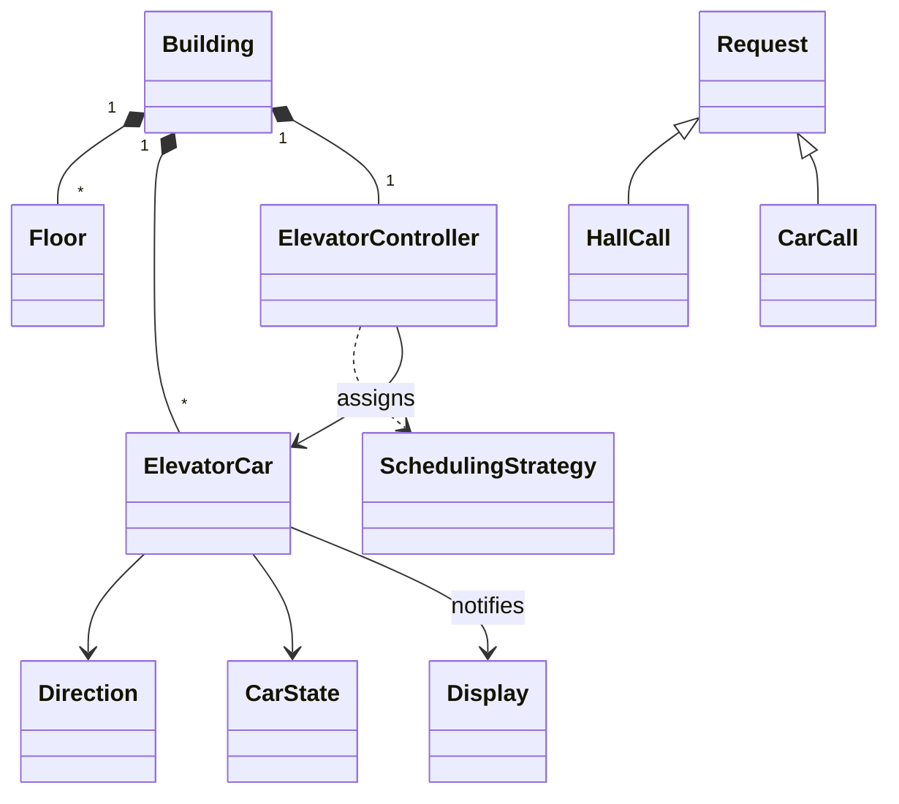

# 38 — Elevator System (LLD Interview Walkthrough)

> **Why this problem?** It's the **scheduling** problem of the LLD canon. No payments, no users, no inventory — the entire design is "given pending requests, where should each car go next?" Master this and you have the template for any dispatcher-style system: print spooler, task queue, Uber driver assignment, CPU scheduling.

---

## 1. The Setup

> Interviewer: *"Design an elevator system for a 20-floor building."*

Two questions decide whether you'll succeed:

1. **Hall calls vs car calls** — do you know the difference? (Hall call = button outside the elevator on a floor; car call = button inside, requesting a destination.)
2. **Scheduling algorithm** — can you name and pick between FCFS, SCAN/LOOK, and Nearest-Car (the one real elevators use)?

If you can frame the system around those two distinctions, the rest writes itself.

---

## 2. Requirements Clarification (Phase 1 — ~10 min)

### 2.1 Functional questions

| # | Question | Why it matters |
|---|---|---|
| Q1 | Single elevator or multiple cars sharing the building? | Adds an `ElevatorController` dispatcher across cars |
| Q2 | How many floors? Basement levels? | Floor numbering, range checks |
| Q3 | Are there "hall calls" (UP/DOWN from a floor) AND "car calls" (destination floor from inside)? | Two request types — different dispatch logic |
| Q4 | Scheduling preference — FCFS (simple), SCAN/LOOK (efficient sweeps), Nearest-Car (lowest wait time)? | Strategy pattern hint |
| Q5 | Capacity / weight sensor? | Reject overweight, skip floors when full |
| Q6 | Door-open timeout? Re-open on obstruction? | Door state machine |
| Q7 | Service mode, fire alarm, VIP/express mode? | Override states |
| Q8 | Display panels — show current floor + direction? | Observer pattern |
| Q9 | Maintenance mode — take a car offline without restarting the system? | State machine + admin command |

### 2.2 Non-functional questions

- Real-time constraints — control loop tick rate? (typically 100ms–1s)
- Safety — what happens if the controller crashes? (Hardware interlocks below software, but design must fail safe.)
- Persistence — do we remember pending requests across power cycles?

### 2.3 The scope lock

> *"OK, scoping: a building with multiple elevator cars (we'll demo with 3), 20 floors (0 = ground, 1..19 upper). Both hall calls and car calls. Pluggable scheduling — I'll implement Nearest-Car and LOOK and we can compare. Each car has a state machine: IDLE / MOVING_UP / MOVING_DOWN / STOPPED / OUT_OF_SERVICE. Weight limit enforced — reject new car calls if over capacity. Display panel per car, observable. No fire mode or VIP today — extensions."*

---

## 3. Entity Modeling (Phase 2 — ~5 min)

The trick is to separate **mechanism** (the car, its state, doors) from **policy** (which car should answer which request).

| Entity | Role | Notes |
|---|---|---|
| `Building` | Top container | Holds cars and floors |
| `Floor` | A physical floor | Has hall-call buttons (UP/DOWN) |
| `ElevatorCar` | One physical car | State machine + current floor + direction + load |
| `Door` | Door of a car | OPEN / CLOSED / OPENING / CLOSING |
| `Request` (abstract) | Something the car must service | Sub-types: `HallCall(floor, direction)`, `CarCall(floor)` |
| `ButtonPanel` | Hall buttons (per floor) + car buttons (per car) | Source of requests |
| `Display` | Shows current floor + direction | Observer |
| `ElevatorController` | Brain — assigns requests to cars | Uses `SchedulingStrategy` |
| `SchedulingStrategy` | The dispatching policy | Strategy: FCFS / LOOK / NearestCar |
| `WeightSensor` | Detects overload | Hardware port |

### Mechanism vs Policy — the senior framing

```
Mechanism (the car):
  - Knows its floor, direction, load
  - Has a state machine
  - Has a queue of stops it owes
  - Each tick: move one floor toward the next stop

Policy (the controller + strategy):
  - Doesn't know HOW the car moves
  - Decides WHICH car each new request goes to
  - Chooses based on the strategy plugged in
```

This separation is exactly what lets you swap FCFS for LOOK without touching `ElevatorCar`.

---

## 4. UML (Phase 3 — ~5 min)

```
┌────────────────┐
│   Building     │
│  - floors[]    │
│  - cars[]      │
│  - controller  │
└───────┬────────┘
        │ owns
        ▼
┌─────────────────────────┐
│   ElevatorController    │ ─── uses ──▶ ┌──────────────────────┐
│   - cars[]              │              │ «interface»          │
│   - pendingRequests     │              │ SchedulingStrategy   │
│   + handle(request)     │              │ + pickCar(cars, r)   │
│   + tick()              │              └──────────┬───────────┘
└─────────┬───────────────┘                         │
          │                      ┌──────────────────┼──────────────────┐
          │ assigns to           │                  │                  │
          ▼                      ▼                  ▼                  ▼
   ┌─────────────────┐    FCFSStrategy       LookStrategy       NearestCarStrategy
   │  ElevatorCar    │
   │  - id           │
   │  - floor        │
   │  - direction    │  ─── has ──▶  «enum» Direction (UP / DOWN / IDLE)
   │  - state        │  ─── has ──▶  «enum» CarState  (IDLE / MOVING / STOPPED / OOS)
   │  - upStops      │
   │  - downStops    │
   │  - load (kg)    │
   │  - capacity     │
   │  + step()       │
   │  + addStop(f)   │
   └────────┬────────┘
            │ notifies
            ▼
       ┌─────────┐
       │ Display │  «Observer»
       └─────────┘

«abstract» Request
     ▲
     │
HallCall(floor, dir)     CarCall(floor)
```



---

## 5. Design Patterns Chosen (Phase 4 — ~3 min)

| Pattern | Where | Why |
|---|---|---|
| **State** | `ElevatorCar` (`IDLE / MOVING_UP / MOVING_DOWN / STOPPED / OUT_OF_SERVICE`) and `Door` (`OPEN/CLOSED/OPENING/CLOSING`) | Enforces legal transitions — can't open the door while MOVING |
| **Strategy** | `SchedulingStrategy` (FCFS / LOOK / NearestCar) | The whole point of the problem |
| **Command** | `HallCall` / `CarCall` as `Request` objects | Encapsulates "what was asked" so it can be queued, retried, logged |
| **Observer** | `Display` watches `ElevatorCar` | Floor/direction shown live |
| **Singleton** | `ElevatorController` | One brain per building |
| **Chain of Responsibility** *(optional, extension)* | Override modes (Fire → Service → Normal) intercept requests in priority order | |

> **Why scheduling deserves Strategy specifically:** the same building wants FCFS for small offices, LOOK for big commercial towers, and a custom "VIP express to floor 50" for hotels. Hard-coding one algorithm fails the moment you ship to a different customer.

---

## 6. TypeScript Code (Phase 5 — ~25 min)

### 6.1 Enums & basic types

```typescript
export enum Direction { UP = "UP", DOWN = "DOWN", IDLE = "IDLE" }
export enum CarState  { IDLE = "IDLE", MOVING_UP = "MOVING_UP", MOVING_DOWN = "MOVING_DOWN",
                        STOPPED = "STOPPED", OUT_OF_SERVICE = "OUT_OF_SERVICE" }
export enum DoorState { OPEN = "OPEN", CLOSED = "CLOSED", OPENING = "OPENING", CLOSING = "CLOSING" }
```

### 6.2 Requests — Command pattern

```typescript
export abstract class Request {
  readonly createdAt = Date.now();
  abstract readonly targetFloor: number;
}

export class HallCall extends Request {
  constructor(public readonly targetFloor: number, public readonly direction: Direction) {
    super();
    if (direction === Direction.IDLE) throw new Error("Hall calls must be UP or DOWN");
  }
}

export class CarCall extends Request {
  constructor(public readonly targetFloor: number, public readonly carId: string) { super(); }
}
```

> Modeling requests as objects (not just numbers) is what makes Command-style logging, retry-on-failure, and "show pending requests" trivial later.

### 6.3 The ElevatorCar — the mechanism

```typescript
export interface CarObserver {
  onUpdate(carId: string, floor: number, direction: Direction, state: CarState): void;
}

export class ElevatorCar {
  private floor = 0;
  private direction: Direction = Direction.IDLE;
  private state: CarState = CarState.IDLE;
  private doorState: DoorState = DoorState.CLOSED;

  // Two sorted sets — stops above (ascending) and below (descending)
  private upStops    = new Set<number>();
  private downStops  = new Set<number>();

  private load = 0;
  private observers: CarObserver[] = [];

  constructor(
    public readonly id: string,
    public readonly minFloor: number,
    public readonly maxFloor: number,
    public readonly capacityKg: number,
  ) {}

  // --- introspection ---
  getFloor(): number       { return this.floor; }
  getDirection(): Direction{ return this.direction; }
  getState(): CarState     { return this.state; }
  getLoad(): number        { return this.load; }
  hasWork(): boolean       { return this.upStops.size + this.downStops.size > 0; }
  addObserver(o: CarObserver) { this.observers.push(o); }
  setLoad(kg: number)      { this.load = kg; this.fire(); }

  // --- requests ---
  // Called by the controller after deciding "this car serves this floor"
  addStop(floor: number): void {
    if (floor < this.minFloor || floor > this.maxFloor) throw new Error(`Floor ${floor} out of range`);
    if (floor === this.floor) {
      // Already here — open doors next tick
      this.scheduleStopHere();
      return;
    }
    if (floor > this.floor) this.upStops.add(floor);
    else                    this.downStops.add(floor);

    if (this.state === CarState.IDLE) this.kick();
    this.fire();
  }

  setOutOfService(out: boolean) {
    if (out) this.state = CarState.OUT_OF_SERVICE;
    else if (this.state === CarState.OUT_OF_SERVICE) { this.state = CarState.IDLE; this.kick(); }
    this.fire();
  }

  // One simulation tick — move one floor toward the next stop
  step(): void {
    if (this.state === CarState.OUT_OF_SERVICE) return;
    if (this.state === CarState.STOPPED) {
      // Close doors and pick next direction
      this.doorState = DoorState.CLOSED;
      this.kick();
      return;
    }

    if (!this.hasWork()) {
      this.direction = Direction.IDLE;
      this.state = CarState.IDLE;
      this.fire();
      return;
    }

    // LOOK-style: keep going in current direction until that direction has no more stops
    if (this.direction === Direction.UP) {
      this.floor++;
      this.state = CarState.MOVING_UP;
      if (this.upStops.has(this.floor))    this.arrived(this.upStops);
      else if (this.upStops.size === 0)    this.flip();    // exhausted upward — turn around
    } else if (this.direction === Direction.DOWN) {
      this.floor--;
      this.state = CarState.MOVING_DOWN;
      if (this.downStops.has(this.floor))  this.arrived(this.downStops);
      else if (this.downStops.size === 0)  this.flip();
    }
    this.fire();
  }

  // --- internals ---
  private kick() {
    if (this.upStops.size > 0)        this.direction = Direction.UP;
    else if (this.downStops.size > 0) this.direction = Direction.DOWN;
    else { this.direction = Direction.IDLE; this.state = CarState.IDLE; }
  }

  private arrived(set: Set<number>) {
    set.delete(this.floor);
    this.state = CarState.STOPPED;
    this.doorState = DoorState.OPEN;
    // Next tick, doors close and kick() decides the new direction
  }

  private flip() {
    // We were going UP but no upStops remain. If downStops below us exist, switch.
    if (this.direction === Direction.UP && this.downStops.size > 0)   this.direction = Direction.DOWN;
    else if (this.direction === Direction.DOWN && this.upStops.size > 0) this.direction = Direction.UP;
  }

  private scheduleStopHere() {
    this.state = CarState.STOPPED;
    this.doorState = DoorState.OPEN;
    this.fire();
  }

  private fire() {
    this.observers.forEach(o => o.onUpdate(this.id, this.floor, this.direction, this.state));
  }
}
```

> **Why two sets `upStops` / `downStops` instead of one?** This is the data-structure choice behind the LOOK algorithm. Going UP, we service every floor in `upStops` in ascending order, then turn around and service `downStops` descending. A single sorted list forces re-sorting on every reversal.

### 6.4 Scheduling strategies

```typescript
export interface SchedulingStrategy {
  pickCar(cars: ElevatorCar[], req: Request): ElevatorCar;
}

// FCFS — pick the first car that's IDLE; else any car
export class FCFSStrategy implements SchedulingStrategy {
  pickCar(cars: ElevatorCar[], _: Request): ElevatorCar {
    return cars.find(c => c.getState() === CarState.IDLE) ?? cars[0];
  }
}

// Nearest-Car — minimize |car.floor - req.floor| with a direction-friendly bonus
export class NearestCarStrategy implements SchedulingStrategy {
  pickCar(cars: ElevatorCar[], req: Request): ElevatorCar {
    let best = cars[0], bestScore = Number.POSITIVE_INFINITY;
    for (const c of cars) {
      if (c.getState() === CarState.OUT_OF_SERVICE) continue;
      const dist = Math.abs(c.getFloor() - req.targetFloor);
      // Bonus: prefer cars moving the same way *toward* the request floor
      const sameDir =
        req instanceof HallCall &&
        ((c.getDirection() === Direction.UP   && req.direction === Direction.UP   && c.getFloor() <= req.targetFloor) ||
         (c.getDirection() === Direction.DOWN && req.direction === Direction.DOWN && c.getFloor() >= req.targetFloor));
      const score = dist - (sameDir ? 2 : 0);
      if (score < bestScore) { bestScore = score; best = c; }
    }
    return best;
  }
}

// LOOK-friendly — same as Nearest-Car but only assigns to a car
// whose existing direction includes the new floor; falls back to nearest IDLE.
export class LookStrategy implements SchedulingStrategy {
  pickCar(cars: ElevatorCar[], req: Request): ElevatorCar {
    const candidates = cars.filter(c => {
      if (c.getState() === CarState.OUT_OF_SERVICE) return false;
      const dir = c.getDirection();
      const f = c.getFloor();
      if (dir === Direction.IDLE) return true;
      if (dir === Direction.UP   && req.targetFloor >= f) return true;
      if (dir === Direction.DOWN && req.targetFloor <= f) return true;
      return false;
    });
    const pool = candidates.length ? candidates : cars;
    return pool.reduce((best, c) =>
      Math.abs(c.getFloor() - req.targetFloor) < Math.abs(best.getFloor() - req.targetFloor) ? c : best
    );
  }
}
```

### 6.5 The Controller

```typescript
export class ElevatorController {
  private static instance: ElevatorController | null = null;
  static getInstance(strategy: SchedulingStrategy = new NearestCarStrategy()): ElevatorController {
    if (!ElevatorController.instance) ElevatorController.instance = new ElevatorController(strategy);
    return ElevatorController.instance;
  }

  private cars: ElevatorCar[] = [];
  private pending: Request[] = [];
  private constructor(private strategy: SchedulingStrategy) {}

  addCar(c: ElevatorCar): void { this.cars.push(c); }
  setStrategy(s: SchedulingStrategy): void { this.strategy = s; }

  submit(req: Request): void {
    // Car calls always go to the specific car
    if (req instanceof CarCall) {
      const car = this.cars.find(c => c.id === req.carId);
      if (!car) throw new Error(`Unknown car ${req.carId}`);
      car.addStop(req.targetFloor);
      return;
    }
    // Hall call — strategy decides
    const car = this.strategy.pickCar(this.cars, req);
    car.addStop(req.targetFloor);
  }

  // Advance the simulation by one tick (every car moves at most one floor)
  tick(): void { this.cars.forEach(c => c.step()); }
}
```

### 6.6 Display — Observer

```typescript
export class Display implements CarObserver {
  onUpdate(carId: string, floor: number, dir: Direction, state: CarState): void {
    const arrow = dir === Direction.UP ? "▲" : dir === Direction.DOWN ? "▼" : "•";
    console.log(`[Car ${carId}] floor=${floor} ${arrow}  state=${state}`);
  }
}
```

### 6.7 Driver

```typescript
const c1 = new ElevatorCar("A", 0, 19, 800);
const c2 = new ElevatorCar("B", 0, 19, 800);
const c3 = new ElevatorCar("C", 0, 19, 800);
[c1, c2, c3].forEach(c => c.addObserver(new Display()));

const controller = ElevatorController.getInstance(new NearestCarStrategy());
[c1, c2, c3].forEach(c => controller.addCar(c));

// Hall calls
controller.submit(new HallCall(7, Direction.UP));   // someone on floor 7 wants to go up
controller.submit(new HallCall(3, Direction.UP));   // floor 3 also wants up
controller.submit(new HallCall(15, Direction.DOWN));// floor 15 wants down

// Simulate 30 ticks
for (let t = 0; t < 30; t++) controller.tick();

// User inside car A presses 12
controller.submit(new CarCall(12, "A"));
for (let t = 0; t < 15; t++) controller.tick();
```

Even at this scale you'll see Nearest-Car beating FCFS — each car answers the call closest to it instead of one car running every job.

---

## 7. Extension Follow-Ups (Phase 6 — ~5 min)

### 7.1 "Add a fire alarm — all cars go to ground floor and stop accepting requests."
A **Chain of Responsibility** of modes: `FireMode → ServiceMode → NormalMode`. When fire is triggered, `FireMode` intercepts all `submit()` calls, drops the request, and sends every car a single `addStop(0)`. After arrival, cars enter `OUT_OF_SERVICE`. Resetting fire mode pops the link off the chain.

### 7.2 "Weight overload — refuse to move if over capacity."
`ElevatorCar.setLoad()` already exists; just check `load > capacityKg` in `step()` and stop moving until load drops. New car calls from inside the car are accepted (the doors are open, people can step out) but new hall calls from outside are reassigned by the controller.

### 7.3 "VIP / express mode — a service elevator that skips intermediate floors."
Add `expressFloors: Set<number>` to `ElevatorCar` — when in express mode, the car *only* services those floors. The strategy filters which cars can answer which requests: if floor 5 is not in a car's `expressFloors`, that car is filtered out for floor 5 requests. Open/Closed clean.

### 7.4 "How do you avoid two cars converging on the same hall call?"
The strategy must look at *pending stops*, not just current floor. Extend `pickCar` to take `c.upStops.size + c.downStops.size` into account (a "load score"). Also: only one car gets assigned per hall call — the controller doesn't broadcast. That property comes free from our design: `strategy.pickCar` returns *one* car, so duplicate dispatch is impossible.

### 7.5 "Persist pending requests across a controller crash."
Append every `Request` to a write-ahead log before assigning it. On recovery, replay the log filtered against `addStop`s that completed. This is the same pattern as message queues — at-least-once delivery with idempotency.

### 7.6 "Multiple buildings, shared monitoring."
Promote `ElevatorController` from singleton to per-building, with a top-level `Fleet` registry. Each car emits to a central observer (Kafka topic). Cross-building scheduling is rarely useful (cars can't teleport) but cross-building **monitoring** is — alerting on stuck cars, abnormal wait times, etc.

---

## 8. Real-World Production Notes

- **Real algorithms** — Otis, KONE, Schindler use proprietary "destination control" systems where you enter your destination *before* boarding (at the hall panel). The dispatcher then groups passengers heading to similar floors into the same car, drastically cutting wait time. Same data model — just `HallCall(from, to)` instead of `HallCall(from, dir)`.
- **Safety subsystem** is *below* the software in the stack — a hardware governor + brakes ensures the car can never free-fall regardless of any code bug.
- **Maintenance signals** — most modern cars publish telemetry over BACnet/MQTT; remote diagnostics catch wear-and-tear long before failure. Our `CarObserver` is the same pattern, just plugged into a real bus.

---

## 9. Interview Questions (with answers)

**Q1. Why model `HallCall` and `CarCall` as separate classes instead of one `Request(floor, source)`?**
Because they dispatch differently. A `CarCall` is fixed to a known car (the person is already inside it) — no strategy involved. A `HallCall` is "any car please come here", and the strategy decides which. Different dispatch logic = different shapes = different classes. It also makes the LOOK strategy's "is this request consistent with the car's direction?" check meaningful only for `HallCall`s (which carry direction); `CarCall`s always have the car's destination as truth.

**Q2. Why two `Set<number>` instead of one sorted array of stops?**
Because the LOOK algorithm needs O(1) "what's the next stop in my current direction?" while ignoring stops that go the other way. With one mixed list you'd re-sort or filter on every reversal. Two direction-keyed sets give you the right partition for free: while going up, look only at `upStops`; when empty, switch to `downStops`. Same data-structure intuition as `priorityQueue` vs `sortedList`.

**Q3. Walk me through what happens on each `tick()`.**
For each car: if `OUT_OF_SERVICE`, do nothing. If `STOPPED`, close doors and call `kick()` to pick a new direction based on remaining stops. Else if there are no stops, go IDLE. Else move one floor in the current direction. If the floor we arrived at is a stop, transition to `STOPPED` and open doors. If the current direction has no more stops, `flip()` to consider the opposite direction's pending stops. That's the entire LOOK algorithm in 20 lines.

**Q4. Two hall calls land at the exact same time. How is each one assigned?**
They go through `controller.submit()` sequentially (single-threaded). The first call sees the world as-is and picks a car; the second sees the updated world (that car now has one more stop) and may pick a different car. In a distributed setup (multi-process controller), you'd serialize through a single dispatcher process or a Redis-backed FIFO — same outcome.

**Q5. (Trap) Why doesn't `ElevatorCar` know about `SchedulingStrategy`?**
Because mechanism doesn't depend on policy. The car knows *how to move toward a stop list*; it doesn't know *which stops it should be assigned*. If the car called into the strategy itself, every algorithm change would touch every car. Dependency points one way: Controller → Strategy → outputs which car; Car receives `addStop(floor)` and runs its physics. Same principle as a database engine knowing nothing about the SQL optimizer's heuristics.

**Q6. How would you replace the in-memory `pending` queue with a real message bus for resilience?**
Make `Request` JSON-serializable. The producer side (`submit`) publishes to a queue (Kafka, SQS, Redis Streams). A consumer process reads, runs `strategy.pickCar(snapshot_of_cars, req)`, and calls `car.addStop`. The snapshot of cars comes from a state store updated by each car's `CarObserver`. Add idempotency: `request_id` deduplication so a retried message doesn't double-stop a car. The class shapes don't change — only the transports do.

---

## 10. The Cheat-Sheet (last-minute revision)

```
Big idea:   Separate MECHANISM (ElevatorCar physics + state machine)
            from POLICY (ElevatorController + SchedulingStrategy)
            Hall call ≠ Car call

Patterns:
  State    → ElevatorCar (IDLE/MOVING_UP/MOVING_DOWN/STOPPED/OOS)
             Door         (OPEN/CLOSED/OPENING/CLOSING)
  Strategy → SchedulingStrategy (FCFS / Nearest-Car / LOOK)
  Command  → Request hierarchy (HallCall / CarCall)
  Observer → Display + telemetry
  Singleton → ElevatorController
  CoR (ext.) → FireMode → ServiceMode → NormalMode

Data:     upStops:Set + downStops:Set (LOOK-friendly partitions)

Flow:
  submit(HallCall)  → strategy.pickCar → car.addStop
  submit(CarCall)   → car.addStop directly
  tick() per car:
    if STOPPED        → close door, kick()
    elif no stops     → IDLE
    else              → move 1 floor; if arrived, STOPPED + open door
                                       if direction empty, flip()

Traps:
  - Single sorted list of stops (use two direction sets)
  - Car calling into strategy (mechanism depends on policy — wrong way)
  - Same request → multiple cars (controller dispatches to ONE)
  - Modeling door state with a boolean (use a state machine)

Scaling:
  Strategy can be FCFS for small offices, NearestCar for residential,
  LOOK for tall buildings, destination-control for skyscrapers.
```

You now have the template for any **scheduler/dispatcher** problem: cab assignment, print queue, task workers, CPU process scheduling. The shape (Mechanism + Pluggable Policy + Pending Requests + Tick) generalizes everywhere.
