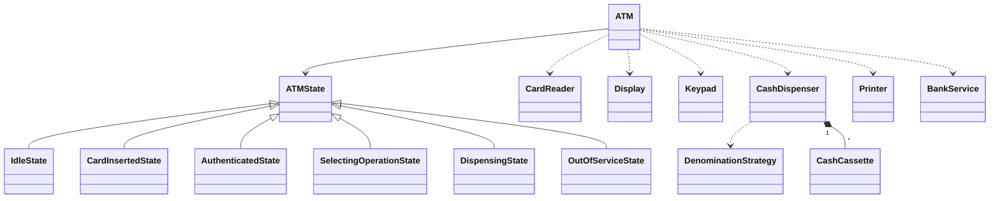

# 39 — ATM Machine (LLD Interview Walkthrough)

> **Why this problem?** The ATM is the **textbook State pattern problem**. Every action only makes sense in a specific state (you can't dispense cash before inserting a card, can't enter PIN before reading the card). If you can model this cleanly with the GoF State pattern instead of an `if/else` jungle, you've shown the interviewer you understand *why* the pattern exists.
>
> Bonus: this is also the **Dependency Inversion** lesson — the ATM should depend on *interfaces* for the card reader / display / keypad / cash dispenser, not on the concrete hardware. Same code runs on a test rig with mock devices and in production on real hardware.

---

## 1. The Setup

> Interviewer: *"Design an ATM machine."*

The two questions that decide your fate:

1. **State.** Most candidates write a `class ATM { withdraw() { if (cardInserted && pinOk && hasCash) … } }` — a giant if/else over flags. The Senior answer is a State machine where each state object knows what's legal *and* what to do next.
2. **Denomination breakdown.** Asked to dispense ₹2,750, what notes do you give out? Greedy works only if the cassettes have enough of each note — otherwise you need a real (small) DP. Most candidates miss this entirely.

Get those two right and you've already won.

---

## 2. Requirements Clarification (Phase 1 — ~10 min)

### 2.1 Functional questions

| # | Question | Why it matters |
|---|---|---|
| Q1 | Operations supported — withdraw, balance, mini-statement, deposit, transfer, PIN change? | Each is its own command/handler |
| Q2 | Single bank or interoperable (NPCI/Visa network)? | Adds a `BankNetwork` abstraction |
| Q3 | Cash cassettes — what denominations? Multiple cassettes per denom? | Denomination algorithm + inventory |
| Q4 | Card type — magstripe / chip / NFC / cardless OTP? | Hardware abstraction layer |
| Q5 | Max wrong-PIN attempts before card capture? | Auth state + retry counter |
| Q6 | Daily withdrawal limit per card? | Cap on a per-card basis |
| Q7 | What happens mid-transaction if power cuts mid-dispense? | Idempotency + reconciliation story |
| Q8 | Receipt printing — paper / email / skip? | Output port |
| Q9 | Multi-account on one card (savings + current)? | Account selection screen |

### 2.2 Non-functional

- **Auditability** — every transaction must produce a tamper-evident log (regulatory requirement).
- **Latency** — bank call must time out (10s) and surface a clean error to the user.
- **Reliability** — the only thing worse than not dispensing is dispensing twice. Idempotency is mandatory.

### 2.3 The scope lock

> *"OK, scoping: 4 operations — Withdraw, BalanceInquiry, MiniStatement, PinChange. Single bank for today; we'll discuss network later. Cassettes for ₹100, ₹200, ₹500, ₹2000. 3 wrong-PIN attempts then capture card. Daily limit per card. Card-and-PIN auth (no NFC). Crash recovery via idempotency keys — we'll cover that in extensions. Receipt is optional via a `Printer` port that can be stubbed."*

---

## 3. Entity Modeling (Phase 2 — ~5 min)

### Hardware vs Logic — the senior framing

```
HARDWARE (abstracted as interfaces):
  CardReader    — read/eject card
  Display       — show messages
  Keypad        — read PIN, amount, choice
  CashDispenser — dispense cash by denomination
  Printer       — print receipt (optional)

LOGIC (depends only on hardware interfaces, not concrete devices):
  ATM           — the state-machine coordinator
  ATMState      — abstract; concrete states for each phase
  BankService   — calls the bank (auth, balance, withdraw)
  DenominationStrategy — splits an amount into notes
```

This split makes the ATM **testable** — swap real `MagstripeReader` for `MockCardReader` and your unit tests run with no hardware. Dependency Inversion (lesson 14) paying off in a real-world example.

| Entity | Role | Notes |
|---|---|---|
| `ATM` | The state-machine host | Has a current `ATMState` |
| `ATMState` (abstract) | Defines the state interface | Concrete: Idle, CardInserted, Authenticated, Selecting, Dispensing, Ejecting, OutOfService |
| `Card` | Inserted card | Carries account id, expiry |
| `Account` | Bank account | Has balance, daily-used amount |
| `Transaction` (abstract) | Records what happened | WithdrawTxn, BalanceTxn, PinChangeTxn |
| `BankService` | External bank | Auth, balance, debit, audit |
| `CashCassette` | Holds notes of one denomination | (₹500 × 20, etc.) |
| `CashDispenser` | Hardware abstraction over cassettes | `dispense(amount)` |
| `DenominationStrategy` | Decides notes for an amount | Greedy / DP |
| `CardReader / Display / Keypad / Printer` | Hardware ports | Interfaces |

---

## 4. UML (Phase 3 — ~5 min)

```
┌──────────────────────┐
│       ATM            │
│  - state: ATMState   │       transitions to new state on each action
│  - cardReader        │
│  - display           │
│  - keypad            │
│  - dispenser         │
│  - bank              │
│  + insertCard(c)     │
│  + enterPin(p)       │
│  + selectOp(op)      │
│  + enterAmount(a)    │
│  + cancel()          │
└──────────┬───────────┘
           │ uses
           ▼
┌──────────────────────┐
│  «abstract» ATMState │ ─── insertCard / enterPin / selectOp / enterAmount / cancel
└──────────▲───────────┘
           │
   ┌───────┼────────┬────────────┬──────────────┬──────────────┐
   │       │        │            │              │              │
 Idle  CardInserted  Authenticated  Selecting  Dispensing  OutOfService
                       (PIN-OK)     (chose op)
                                                  │
                                                  ▼
                                          (after success → Ejecting → Idle)

«interface» CardReader      Display     Keypad     CashDispenser     Printer

CashDispenser ─◇─ CashCassette (one per denomination)
              ── uses ──▶ DenominationStrategy  (Greedy / DP)

BankService — talks to bank; ATM only depends on this interface.
```



---

## 5. Design Patterns Chosen (Phase 4 — ~3 min)

| Pattern | Where | Why |
|---|---|---|
| **State** | `ATMState` + 6 concrete states | The whole point of this problem — each state has its own handlers, transitions are explicit |
| **Strategy** | `DenominationStrategy` (Greedy / DP) | Two algorithms, same interface |
| **Singleton** | `ATM` itself (one per machine) | Single global coordinator |
| **Dependency Inversion** | `CardReader` / `Display` / `Keypad` / `CashDispenser` / `BankService` as interfaces | Mockable hardware, swappable bank |
| **Command** *(optional)* | `Transaction` subtypes as commands | Easy to log/replay |
| **Template Method** *(optional)* | `Transaction.execute()` with common framing | Shared audit/log code |

> **Pattern justification call-out:** the State pattern is a hard sell only if you don't have ~5 states. Six legal states with strict transition rules makes State the natural fit. Otherwise — for ≤2 states — booleans are fine.

---

## 6. TypeScript Code (Phase 5 — ~30 min)

### 6.1 Enums + small types

```typescript
export enum Denomination { N100 = 100, N200 = 200, N500 = 500, N2000 = 2000 }

export enum OperationType {
  WITHDRAW = "WITHDRAW",
  BALANCE  = "BALANCE",
  MINI_STATEMENT = "MINI_STATEMENT",
  PIN_CHANGE = "PIN_CHANGE",
}

export class Card {
  constructor(
    public readonly cardNumber: string,
    public readonly accountId: string,
    public readonly expiry: Date,
  ) {}
}
```

### 6.2 Hardware ports — interfaces, not concrete classes

```typescript
export interface CardReader {
  read(): Card;        // blocks until card inserted
  eject(): void;
  capture(): void;     // confiscate (e.g., 3 wrong PINs)
}

export interface Display { show(msg: string): void; }

export interface Keypad {
  readPin(): string;
  readAmount(): number;
  readChoice<T>(options: T[]): T;
}

export interface Printer { print(receipt: string): void; }

export interface BankService {
  authenticate(card: Card, pin: string): boolean;
  balance(accountId: string): number;
  debit(accountId: string, amount: number, idempotencyKey: string): boolean;
  recentTransactions(accountId: string, n: number): string[];
  changePin(card: Card, oldPin: string, newPin: string): boolean;
  dailyRemaining(accountId: string): number;
}
```

The ATM never reaches for `navigator.something` or `pinpadDriver.read()` — it depends only on these interfaces. That's DIP.

### 6.3 Denomination strategy

```typescript
export interface DenominationStrategy {
  // Returns notes to dispense or throws if impossible given the inventory
  split(amount: number, inventory: Map<Denomination, number>): Map<Denomination, number>;
}

// Greedy from largest to smallest — fast & usually correct,
// but can fail when smaller denoms run out
export class GreedyDenominationStrategy implements DenominationStrategy {
  split(amount: number, inv: Map<Denomination, number>): Map<Denomination, number> {
    const result = new Map<Denomination, number>();
    const denoms = [Denomination.N2000, Denomination.N500, Denomination.N200, Denomination.N100];
    let remaining = amount;
    for (const d of denoms) {
      const want   = Math.floor(remaining / d);
      const have   = inv.get(d) ?? 0;
      const give   = Math.min(want, have);
      if (give > 0) { result.set(d, give); remaining -= give * d; }
    }
    if (remaining !== 0) throw new Error(`Cannot dispense ₹${amount} with current cassettes`);
    return result;
  }
}

// Reliable fallback — coin-change DP. O(amount × denoms) — fine for any realistic amount.
export class DpDenominationStrategy implements DenominationStrategy {
  split(amount: number, inv: Map<Denomination, number>): Map<Denomination, number> {
    const denoms = [Denomination.N100, Denomination.N200, Denomination.N500, Denomination.N2000];
    // dp[v] = best (fewest-notes) breakdown for value v, or null
    const dp: (Map<Denomination, number> | null)[] = Array(amount + 1).fill(null);
    dp[0] = new Map();
    for (let v = 1; v <= amount; v++) {
      for (const d of denoms) {
        if (v - d < 0 || dp[v - d] === null) continue;
        const prev = dp[v - d]!;
        const used = prev.get(d) ?? 0;
        if (used >= (inv.get(d) ?? 0)) continue;        // out of this denom
        const candidate = new Map(prev);
        candidate.set(d, used + 1);
        const noteCount = (m: Map<Denomination, number>) =>
          [...m.values()].reduce((a, b) => a + b, 0);
        if (!dp[v] || noteCount(candidate) < noteCount(dp[v]!)) dp[v] = candidate;
      }
    }
    if (!dp[amount]) throw new Error(`Cannot dispense ₹${amount}`);
    return dp[amount]!;
  }
}
```

### 6.4 Cash cassettes + dispenser

```typescript
export class CashCassette {
  constructor(public readonly denom: Denomination, private count: number) {}
  available(): number { return this.count; }
  withdraw(n: number): void {
    if (n > this.count) throw new Error(`Not enough ₹${this.denom} notes`);
    this.count -= n;
  }
  refill(n: number): void { this.count += n; }
}

export class CashDispenserImpl implements CashDispenser {
  constructor(
    private cassettes: Map<Denomination, CashCassette>,
    private strategy: DenominationStrategy,
  ) {}

  totalAvailable(): number {
    let t = 0;
    for (const c of this.cassettes.values()) t += c.denom * c.available();
    return t;
  }

  dispense(amount: number): Map<Denomination, number> {
    if (amount % 100 !== 0) throw new Error(`Amount must be a multiple of ₹100`);
    if (amount > this.totalAvailable()) throw new Error(`ATM out of cash`);

    const inv = new Map<Denomination, number>();
    for (const [d, c] of this.cassettes) inv.set(d, c.available());

    const plan = this.strategy.split(amount, inv);

    // Two-phase: validate plan against cassettes, THEN commit
    for (const [d, n] of plan) {
      if ((this.cassettes.get(d)?.available() ?? 0) < n) {
        throw new Error(`Inventory changed during dispense`);
      }
    }
    for (const [d, n] of plan) this.cassettes.get(d)!.withdraw(n);
    return plan;
  }
}

export interface CashDispenser {
  dispense(amount: number): Map<Denomination, number>;
  totalAvailable(): number;
}
```

> **Two-phase dispense.** First we ask the strategy for a plan, then we re-validate it against the actual cassettes, then we commit. This is a *Saga-in-miniature* — if a coworker just refilled a cassette concurrently, we don't want to dispense in the middle of an invalid plan.

### 6.5 The State pattern — the heart of the ATM

```typescript
// All states implement the same set of handlers. Most just reject.
export abstract class ATMState {
  constructor(protected atm: ATM) {}
  insertCard(_c: Card): void   { this.illegal("insertCard"); }
  enterPin(_p: string): void   { this.illegal("enterPin"); }
  selectOp(_o: OperationType): void { this.illegal("selectOp"); }
  enterAmount(_a: number): void{ this.illegal("enterAmount"); }
  cancel(): void               { this.atm.reset(); }
  protected illegal(action: string): void {
    this.atm.display().show(`Action "${action}" not allowed right now`);
  }
}

export class IdleState extends ATMState {
  insertCard(c: Card): void {
    // Verify card not expired, not captured, etc.
    if (c.expiry.getTime() < Date.now()) {
      this.atm.display().show("Card expired");
      this.atm.cardReader().eject();
      return;
    }
    this.atm.setCard(c);
    this.atm.setState(new CardInsertedState(this.atm));
    this.atm.display().show("Enter PIN");
  }
}

export class CardInsertedState extends ATMState {
  private attempts = 0;
  enterPin(p: string): void {
    const ok = this.atm.bank().authenticate(this.atm.card()!, p);
    if (ok) {
      this.atm.setState(new SelectingOperationState(this.atm));
      this.atm.display().show("Choose: Withdraw / Balance / MiniStmt / PinChange");
      return;
    }
    if (++this.attempts >= 3) {
      this.atm.display().show("Card captured — too many wrong PINs");
      this.atm.cardReader().capture();
      this.atm.reset();
    } else {
      this.atm.display().show(`Wrong PIN. ${3 - this.attempts} attempts left`);
    }
  }
}

export class SelectingOperationState extends ATMState {
  selectOp(op: OperationType): void {
    switch (op) {
      case OperationType.WITHDRAW:
        this.atm.setState(new EnterAmountState(this.atm));
        this.atm.display().show("Enter amount (multiple of ₹100)");
        break;
      case OperationType.BALANCE:
        const bal = this.atm.bank().balance(this.atm.card()!.accountId);
        this.atm.display().show(`Balance: ₹${bal}`);
        this.atm.ejectAndReset();
        break;
      case OperationType.MINI_STATEMENT:
        const lines = this.atm.bank().recentTransactions(this.atm.card()!.accountId, 5);
        this.atm.display().show(lines.join("\n"));
        this.atm.ejectAndReset();
        break;
      case OperationType.PIN_CHANGE:
        this.atm.display().show("Enter old PIN, then new PIN");
        // (Simplified — would go to a sub-state. Omitted for brevity.)
        this.atm.ejectAndReset();
        break;
    }
  }
}

export class EnterAmountState extends ATMState {
  enterAmount(amount: number): void {
    const acc = this.atm.card()!.accountId;
    if (amount > this.atm.bank().dailyRemaining(acc)) {
      this.atm.display().show("Exceeds daily limit");
      this.atm.ejectAndReset();
      return;
    }
    if (amount > this.atm.bank().balance(acc)) {
      this.atm.display().show("Insufficient funds");
      this.atm.ejectAndReset();
      return;
    }
    this.atm.setState(new DispensingState(this.atm));
    this.atm.handleDispense(amount);
  }
}

export class DispensingState extends ATMState {
  // No user input handled here — the ATM is "working"
}

export class OutOfServiceState extends ATMState {
  insertCard(_: Card): void {
    this.atm.display().show("Out of service");
    this.atm.cardReader().eject();
  }
}
```

> **Why an abstract base with default "illegal" handlers?** Any state that doesn't override a handler automatically gives the user a clean message. Adding a new state can't accidentally "leak" actions from another state. This is the **null-object** within State pattern.

### 6.6 The ATM façade

```typescript
export class ATM {
  private static instance: ATM | null = null;
  static getInstance(deps: ATMDeps): ATM {
    if (!ATM.instance) ATM.instance = new ATM(deps);
    return ATM.instance;
  }

  private state: ATMState;
  private currentCard: Card | null = null;

  private constructor(private deps: ATMDeps) {
    this.state = new IdleState(this);
  }

  // --- accessors used by states (DI in disguise) ---
  cardReader() { return this.deps.cardReader; }
  display()    { return this.deps.display; }
  keypad()     { return this.deps.keypad; }
  dispenser()  { return this.deps.dispenser; }
  printer()    { return this.deps.printer; }
  bank()       { return this.deps.bank; }

  card(): Card | null { return this.currentCard; }
  setCard(c: Card)    { this.currentCard = c; }
  setState(s: ATMState){ this.state = s; }

  // --- user-facing API (delegates to current state) ---
  insertCard(c: Card)        { this.state.insertCard(c); }
  enterPin(p: string)        { this.state.enterPin(p); }
  selectOp(op: OperationType){ this.state.selectOp(op); }
  enterAmount(a: number)     { this.state.enterAmount(a); }
  cancel()                   { this.state.cancel(); }

  // --- helpers used by states ---
  handleDispense(amount: number): void {
    const idKey = `${this.currentCard!.cardNumber}-${Date.now()}`;
    const debited = this.bank().debit(this.currentCard!.accountId, amount, idKey);
    if (!debited) {
      this.display().show("Bank refused — try again later");
      this.ejectAndReset();
      return;
    }
    try {
      const notes = this.dispenser().dispense(amount);
      this.display().show(`Dispensing ₹${amount}`);
      this.printer().print(this.makeReceipt(amount, notes));
    } catch (e) {
      // Compensating action — refund the debit since we couldn't deliver cash
      this.bank().debit(this.currentCard!.accountId, -amount, `REVERSE-${idKey}`);
      this.display().show(`Dispense failed: ${(e as Error).message}. Refunded.`);
    }
    this.ejectAndReset();
  }

  ejectAndReset(): void {
    this.cardReader().eject();
    this.reset();
  }

  reset(): void {
    this.currentCard = null;
    this.state = new IdleState(this);
    this.display().show("Welcome");
  }

  private makeReceipt(amount: number, notes: Map<Denomination, number>): string {
    const lines = [`Dispensed: ₹${amount}`];
    for (const [d, n] of notes) lines.push(`  ₹${d} × ${n}`);
    return lines.join("\n");
  }
}

export interface ATMDeps {
  cardReader: CardReader;
  display: Display;
  keypad: Keypad;
  dispenser: CashDispenser;
  printer: Printer;
  bank: BankService;
}
```

### 6.7 Driver (with mock hardware)

```typescript
// Mock hardware for testing
class StubCardReader implements CardReader {
  read(): Card { throw new Error("Push from test instead"); }
  eject(): void   { console.log("[CardReader] eject"); }
  capture(): void { console.log("[CardReader] CAPTURE"); }
}
class StubDisplay implements Display { show(m: string) { console.log("[Display]", m); } }
class StubKeypad  implements Keypad  {
  readPin(): string { return ""; }
  readAmount(): number { return 0; }
  readChoice<T>(o: T[]): T { return o[0]; }
}
class StubPrinter implements Printer { print(r: string) { console.log("[Printer]\n" + r); } }

class StubBank implements BankService {
  authenticate(_: Card, p: string): boolean { return p === "1234"; }
  balance(_: string): number { return 50_000; }
  debit(_: string, __: number, ___: string): boolean { return true; }
  recentTransactions(): string[] { return ["+5000 SAL", "-1200 SWIGGY", "-200 OLA"]; }
  changePin(): boolean { return true; }
  dailyRemaining(): number { return 25_000; }
}

const cassettes = new Map<Denomination, CashCassette>([
  [Denomination.N100,  new CashCassette(Denomination.N100, 50)],
  [Denomination.N200,  new CashCassette(Denomination.N200, 50)],
  [Denomination.N500,  new CashCassette(Denomination.N500, 30)],
  [Denomination.N2000, new CashCassette(Denomination.N2000, 10)],
]);

const atm = ATM.getInstance({
  cardReader: new StubCardReader(),
  display:    new StubDisplay(),
  keypad:     new StubKeypad(),
  dispenser:  new CashDispenserImpl(cassettes, new GreedyDenominationStrategy()),
  printer:    new StubPrinter(),
  bank:       new StubBank(),
});

const card = new Card("4111-1111-1111-1111", "ACC-001", new Date("2030-01-01"));

atm.insertCard(card);                  // → CardInsertedState
atm.enterPin("1234");                   // → SelectingOperationState
atm.selectOp(OperationType.WITHDRAW);   // → EnterAmountState
atm.enterAmount(2700);                  // → DispensingState → ejects → Idle
```

Run this and you'll see the dispenser breaking ₹2,700 into `1×₹2000 + 1×₹500 + 1×₹200`.

---

## 7. Extension Follow-Ups (Phase 6 — ~5 min)

### 7.1 "What happens if the ATM crashes after debiting but before dispensing?"
The killer follow-up. Strategy:
- **Idempotency key** on `debit()` (already in the code). The bank tracks `idKey → result`.
- **Reconciliation loop**: on reboot, the ATM compares its local "completed dispenses" log against the bank's "completed debits". For any orphan debit (debited but never dispensed), it fires a reversal `debit(-amount)` with key `REVERSE-<original>`. The bank, again seeing an idempotency key, refunds exactly once.
- Real ATMs also have a **physical reject bin** — bills that should have been dispensed but weren't successfully presented get diverted there, and a daily audit reconciles bin count to ledger.

### 7.2 "Cassette swap during operation — a technician refills mid-day."
`CashCassette` becomes a hot-swappable resource behind a *lock*. While dispensing, the dispenser holds a lock; the swap blocks until the lock releases. The state machine is unaffected — only the dispenser internals change.

### 7.3 "Multi-currency ATM (in an airport)."
Generalize `Denomination` to `{ currency, value }`. Cassettes hold a `(currency, value)` key. The dispenser asks the user for currency in a new state `SelectCurrencyState`. `DenominationStrategy` runs per currency. The state machine *gains one state* — the rest is data.

### 7.4 "Cardless OTP withdrawal."
Add `OtpAuthState` parallel to `CardInsertedState`. `IdleState.startCardless(mobile)` transitions there; `BankService.sendOtp(mobile)` and `verifyOtp` replace the card-and-PIN flow. The dispense flow is identical from `EnterAmountState` onward — note the State pattern keeps this surgical.

### 7.5 "Different per-card daily limits depending on KYC tier."
Push the policy into `BankService.dailyRemaining` (it already returns a number). The ATM doesn't care how the tier is decided — pure DIP. Bank-side, the tier logic can be a Strategy of its own.

### 7.6 "Audit logging — every state transition must be tamper-evident."
Wrap `setState()` to emit a `(prevState, newState, timestamp, cardId)` entry. The log is append-only, signed with a HMAC chained from the previous entry's signature — tampering with any entry invalidates the chain. This is how banking middleware achieves regulatory compliance.

---

## 8. Real-World Production Notes

- **Real ATMs run on OS/2, Windows XP Embedded, or Linux** (yes, still — the install base is decades long). They use **XFS (eXtensions for Financial Services)** to abstract hardware — exact same idea as our `CardReader` / `CashDispenser` interfaces, standardized across vendors (NCR, Diebold, Wincor).
- **Network protocol** — ATMs talk to bank switches via ISO 8583 messages (a binary wire format). Our `BankService` is the in-process model of that.
- **Tamper detection** — accelerometers, vibration sensors, and door-open switches all feed into an "OutOfService" trigger. Same `OutOfServiceState` we modeled — just with hardware events flipping the switch.
- **Famous bug** — early 2010s, attackers used "jackpotting" malware: physical USB access → install malware → instruct dispenser directly, bypassing the bank call. Fix: cryptographically sign messages from ATM controller → dispenser, so the dispenser refuses unsigned requests. Lesson: even within one machine, DIP doesn't mean "trust the dependency unconditionally."

---

## 9. Interview Questions (with answers)

**Q1. Why the State pattern instead of a `currentStep: number` and a switch statement?**
A switch over `currentStep` re-encodes the transition rules inside every public method. To add `PinChange`, you touch every method. With State objects, each state encapsulates its own legal transitions — adding `PinChange` is one new file (`PinChangeState extends ATMState`) and a hook from `SelectingOperationState`. The pattern's value is **localizing behavior per state** and making the transition graph explicit in code, not implicit in flags.

**Q2. Why is each "illegal" action handled gracefully (just shows a message) instead of throwing?**
Because real users are non-adversarial. If someone hits "withdraw" before inserting a card, the polite UX is "please insert your card" — not a stack trace. Reserve exceptions for *invariant violations* the user couldn't possibly cause (e.g., negative dispense amount from an internal bug). This is also why every state inherits the default "illegal" handler — safety net for actions you forgot to wire up.

**Q3. Walk me through why `dispense` is two-phase (plan, then commit).**
The plan says "I'll use X notes of ₹500 and Y notes of ₹200." Between the plan and the commit, another thread (technician refill, parallel withdrawal — in real systems) could have changed cassette counts. If we'd committed without revalidation, we'd partially dispense and have to roll back, which means *physical bills are already partly out the slot*. By revalidating in memory before any cassette is touched, we either commit a fully valid plan or fail before any mechanical action. **Same pattern as compare-and-swap.**

**Q4. Where is Dependency Inversion in this design and why does it matter?**
The ATM depends on `CardReader`, `Display`, `Keypad`, `CashDispenser`, `Printer`, `BankService` — all interfaces. Concrete implementations exist for real hardware (Magstripe / NFC / Diebold cassette modules) and for tests (mocks above). **Why it matters**: (a) we can unit-test the entire state machine without any hardware; (b) we can run the same ATM code in an airport (multi-currency dispenser) by swapping one implementation; (c) the team building the bank protocol can iterate independently from the team building hardware drivers, both behind contracts.

**Q5. What if `BankService.debit` succeeds but `dispenser.dispense` throws (cassette jam)?**
In the code, we compensate: call `debit(-amount, "REVERSE-<idKey>")`. The idempotency key prefix lets the bank detect this is a reversal and apply it exactly once. In production this is just the *application-layer* fallback — the *physical* layer also matters: a jam diverts bills to a reject bin, and a daily reconciliation between bin count, dispensed log, and bank ledger catches discrepancies. The point of the design is the application-layer story is **safe by default** (compensating transaction), not relying on operator follow-up.

**Q6. (Trap) Why isn't `enterAmount` defined on `CardInsertedState`?**
Because amount entry doesn't *belong* in `CardInsertedState` — at that point the user has authenticated but hasn't chosen an operation. Defining `enterAmount` on every state via the abstract base catches accidental calls with a clean "not allowed" message (Q2 above). This is why we model state-specific actions on state-specific classes, not as one fat handler on `ATM`. Encapsulation of behavior per state is the whole point.

---

## 10. The Cheat-Sheet (last-minute revision)

```
Big idea:  ATM is the textbook State pattern.
           Hardware ports as INTERFACES (DIP) → testable, swappable.
           Denomination breakdown is a strategy (Greedy vs DP).

Patterns:
  State    → Idle / CardInserted / SelectingOp / EnterAmount /
             Dispensing / OutOfService
  Strategy → DenominationStrategy (Greedy / DP)
  Singleton→ ATM
  DIP      → CardReader, Display, Keypad, CashDispenser, Printer, BankService

Flow:
  Idle ──(insertCard)──▶ CardInserted ──(enterPin OK)──▶ SelectingOp
                                       ──(3 fails)─────▶ capture + reset
  SelectingOp ──(WITHDRAW)──▶ EnterAmount ──(valid)──▶ Dispensing
              ──(BALANCE / MINI / PIN)──▶ display + eject

Dispense:
  bank.debit(amount, idKey)
  try { dispenser.dispense(amount); printer.print(receipt); }
  catch { bank.debit(-amount, "REVERSE-"+idKey);  /* compensating */ }
  eject card + reset to Idle

Concurrency / failure:
  Two-phase dispense (plan → revalidate → commit)
  Idempotency keys for every bank call
  Reconciliation log on boot

Traps:
  - if/else on a step counter instead of State pattern
  - Coupling ATM to concrete hardware classes
  - Pure greedy denomination (can fail when small denoms are out)
  - Debit then dispense without compensation on dispense failure
  - Forgetting daily-limit check before bank.debit
```

You now have a template for any *device-style state-machine* problem: vending machine (next lesson, conceptually similar), kiosk, ticket gate, charging station, smart-locker, photocopier with credit card. Same shape: State machine in the middle, hardware interfaces on the edges, a payment/auth service downstream.
