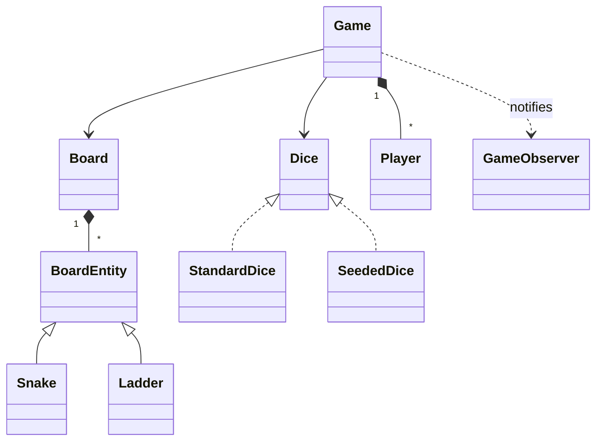

# 40 — Snake & Ladder (LLD Interview Walkthrough)

> **Why this problem?** It's the smallest *complete* LLD problem — entities, randomness, multiple players, win conditions, extensibility. The trap is that it *feels* easy, so candidates skip the requirements phase and start coding `Math.random()`. The senior signal is to slow down and design it like a real product: **board entities are polymorphic** (`Snake` and `Ladder` are both `BoardEntity`), the **dice is a Strategy** (testable, deterministic in tests), and **players take turns through a clean queue**. Same template applies to Ludo, Monopoly, Tic-Tac-Toe (next lesson), Carrom — any turn-based board game.

---

## 1. The Setup

> Interviewer: *"Design a Snake & Ladder game."*

The pitfall: candidates think "this is trivial" and produce a single 200-line `Game` class with `Math.random()` inline, a 2D array hard-coded with snake/ladder positions, and zero seams for testing. The interviewer's follow-ups ("add 2 dice", "add crocodiles that bite", "ensure exact 100 to win") then require rewriting everything.

The senior version: identify the variation points *before* coding. Dice rules, board entities, and turn order are all going to change. Each gets its own abstraction.

---

## 2. Requirements Clarification (Phase 1 — ~8 min)

### 2.1 Functional questions

| # | Question | Why it matters |
|---|---|---|
| Q1 | Board size — classic 10×10 (100 cells) or configurable? | Make it a constructor parameter |
| Q2 | Number of dice — single, double, configurable? | Dice as Strategy |
| Q3 | Snakes and ladders are fixed, randomized, or seeded? | Construction-time policy |
| Q4 | Number of players? | Circular queue |
| Q5 | Win condition — first to reach exactly the last cell, or first to *reach or pass*? | Affects "overshoot" handling |
| Q6 | Bonus roll on a 6? Three 6s in a row = miss next turn? | Turn-rules become their own object |
| Q7 | Can two players occupy the same cell? | "Bite" rule — landing on opponent sends them home |
| Q8 | Game over when first player wins or do we play out for all positions? | Affects loop |
| Q9 | Allow undo / replay? | Memento or event-sourced state |

### 2.2 Non-functional

- **Determinism in tests** — `Math.random()` ruins unit tests. Inject a seeded dice.
- **Observability** — for debugging, every move should be loggable / replayable.

### 2.3 The scope lock

> *"OK, scoping: 10×10 board (1..100). One six-sided die (we'll cover multi-dice as extension). A configurable list of snakes and ladders at construction time. 2 to 4 players in a circular turn queue. Win condition: first to reach exactly 100 — overshoot bounces back. Bonus roll on 6 (player rolls again). No 'land-on-opponent bites you' today — that's an extension. Game ends when first player wins."*

---

## 3. Entity Modeling (Phase 2 — ~5 min)

### The polymorphism insight

```
Snake and Ladder are NOT different concepts.
They are both "if you land on cell X, you move to cell Y."
Snake:  X > Y  (slide down)
Ladder: X < Y  (climb up)

Both implement the SAME interface: BoardEntity { start, end }.
The Board doesn't need to know which is which — just call entity.end.
```

Most candidates make `Snake` and `Ladder` siblings of `Game` with separate maps. The senior model has one `Map<number, BoardEntity>` keyed by start cell.

### Entities

| Entity | Role | Notes |
|---|---|---|
| `Game` | Orchestrator — runs turns until a winner | Holds board, players, dice |
| `Board` | Cells 1..N + jump map | `Map<startCell, BoardEntity>` |
| `BoardEntity` (abstract) | `Snake \| Ladder \| Crocodile \| …` | Single `applyTo(pos)` returns landing cell |
| `Snake` / `Ladder` | Concrete jumps | Validate start vs end direction |
| `Dice` (Strategy) | `roll(): number` | Pluggable randomness |
| `Player` | Has name, position, missed-turns counter | |
| `TurnQueue` | Round-robin turn order | Skip players with missed turns |
| `GameObserver` | Listens to move/win events | |

---

## 4. UML (Phase 3 — ~5 min)

```
┌──────────────────────┐
│        Game          │
│  - board             │
│  - players           │
│  - dice              │
│  - turn              │
│  + play()            │
└──────────┬───────────┘
           │ owns
           ▼
┌──────────────────────┐     ┌──────────────────────┐
│       Board          │     │  «interface» Dice    │
│  - size              │     │  + roll(): number    │
│  - entities: Map     │     └──────────▲───────────┘
│    <int, BoardEntity>│                │
│  + landingFor(p):    │      StandardDice  / DoubleDice / SeededDice
│       BoardEntity?   │
└──────────┬───────────┘
           │
           ▼
┌──────────────────────┐
│ «abstract»           │
│  BoardEntity         │
│  + start, end        │
│  + applyTo(p): int   │  (returns end if start matches)
└──────────▲───────────┘
           │
   ┌───────┴────────┐
   │                │
 Snake            Ladder
 (start > end)    (start < end)

┌──────────────────────┐
│       Player         │
│  - name, position    │
│  - missedTurns       │
│  - consecutiveSixes  │
└──────────────────────┘

«Observer»  GameObserver  (moved, snakeBit, ladderClimbed, won)
```



---

## 5. Design Patterns Chosen (Phase 4 — ~3 min)

| Pattern | Where | Why |
|---|---|---|
| **Strategy** | `Dice` (`StandardDice` / `DoubleDice` / `SeededDice`) | Pluggable randomness — also makes tests deterministic |
| **Polymorphism** | `BoardEntity` with `Snake` / `Ladder` subclasses | `Board` doesn't branch on type — adding `Crocodile` is one new class |
| **Observer** | `GameObserver` for events | Logging, UI, replay all subscribe |
| **Singleton** | *Deliberately NOT used.* Each `Game` is independent. | Multiple games can run in parallel (tournament) |
| **Template Method** *(extension)* | `Game.runTurn()` with hooks `beforeRoll`, `afterMove` for rule variants | |

> **Pattern restraint moment:** plenty of LLD tutorials sprinkle in Singleton everywhere. Don't. A game is an instance of a session — turning it into a process-wide singleton means you can't run two games simultaneously, can't unit-test in parallel, and can't simulate a tournament. Use Singleton only when there's actually exactly one of the thing per process.

---

## 6. TypeScript Code (Phase 5 — ~20 min)

### 6.1 Dice strategy (testable randomness)

```typescript
export interface Dice {
  roll(): number;     // sum of all dice on this roll
  sides(): number;    // for display / 6-bonus checks; usually 6
}

export class StandardDice implements Dice {
  constructor(private n: number = 1, private faces: number = 6) {}
  roll(): number {
    let sum = 0;
    for (let i = 0; i < this.n; i++) sum += 1 + Math.floor(Math.random() * this.faces);
    return sum;
  }
  sides(): number { return this.faces; }
}

// Deterministic — drives the unit tests
export class SeededDice implements Dice {
  private i = 0;
  constructor(private rolls: number[], private faces: number = 6) {}
  roll(): number {
    const v = this.rolls[this.i % this.rolls.length];
    this.i++;
    return v;
  }
  sides(): number { return this.faces; }
}
```

### 6.2 Board entities — the polymorphism

```typescript
export abstract class BoardEntity {
  constructor(public readonly start: number, public readonly end: number) {
    if (start === end) throw new Error("Entity must move the player");
  }
  // Called by Board.landingFor — return the cell the player ends up on
  applyTo(_position: number): number { return this.end; }
  abstract kind(): string;
}

export class Snake extends BoardEntity {
  constructor(head: number, tail: number) {
    super(head, tail);
    if (tail >= head) throw new Error("Snake must go DOWN");
  }
  kind() { return "SNAKE"; }
}

export class Ladder extends BoardEntity {
  constructor(bottom: number, top: number) {
    super(bottom, top);
    if (top <= bottom) throw new Error("Ladder must go UP");
  }
  kind() { return "LADDER"; }
}
```

### 6.3 Board

```typescript
export class Board {
  // start cell → entity rooted there
  private entities = new Map<number, BoardEntity>();

  constructor(public readonly size: number = 100, entities: BoardEntity[] = []) {
    for (const e of entities) this.addEntity(e);
  }

  addEntity(e: BoardEntity): void {
    if (e.start < 1 || e.start > this.size) throw new Error(`Entity start out of bounds`);
    if (e.end   < 1 || e.end   > this.size) throw new Error(`Entity end out of bounds`);
    if (this.entities.has(e.start))         throw new Error(`Cell ${e.start} already has an entity`);
    this.entities.set(e.start, e);
  }

  // After moving, returns the entity at that cell (if any) — null otherwise
  landingFor(position: number): BoardEntity | null {
    return this.entities.get(position) ?? null;
  }
}
```

> **Single line worth defending:** `if (this.entities.has(e.start)) throw …`. You can't have a snake *and* a ladder rooted at the same cell — they'd contradict each other. Encoding this constraint at construction prevents a class of bugs.

### 6.4 Player

```typescript
export class Player {
  public position = 0;        // off-board until first roll lands on 1+
  public consecutiveSixes = 0;
  public missedTurns = 0;

  constructor(public readonly name: string) {}
}
```

### 6.5 Game (with Observer events)

```typescript
export interface GameObserver {
  onRoll(player: Player, roll: number): void;
  onMove(player: Player, from: number, to: number): void;
  onEntity(player: Player, entity: BoardEntity, from: number, to: number): void;
  onTurnSkipped(player: Player, reason: string): void;
  onWin(player: Player): void;
}

export class Game {
  private players: Player[];
  private observers: GameObserver[] = [];
  private winner: Player | null = null;

  constructor(
    private board: Board,
    private dice: Dice,
    players: string[],
  ) {
    if (players.length < 2 || players.length > 4) {
      throw new Error("Need 2-4 players");
    }
    this.players = players.map(n => new Player(n));
  }

  addObserver(o: GameObserver) { this.observers.push(o); }

  // Run one turn for one player; returns true if game ended
  private runTurn(p: Player): boolean {
    if (p.missedTurns > 0) {
      p.missedTurns--;
      this.fire(o => o.onTurnSkipped(p, "Penalty"));
      return false;
    }

    const roll = this.dice.roll();
    this.fire(o => o.onRoll(p, roll));

    // 3-sixes-in-a-row penalty
    if (roll === this.dice.sides()) {
      p.consecutiveSixes++;
      if (p.consecutiveSixes === 3) {
        this.fire(o => o.onTurnSkipped(p, "Three 6s in a row — roll voided"));
        p.consecutiveSixes = 0;
        return false;
      }
    } else {
      p.consecutiveSixes = 0;
    }

    // Movement with overshoot-bounce
    const target = p.position + roll;
    let landing: number;
    if (target > this.board.size) {
      // Bounce back (e.g. on a 1-100 board, 99 + roll 5 = 104 → 100 − (104−100) = 96)
      landing = this.board.size - (target - this.board.size);
    } else {
      landing = target;
    }
    const from = p.position;
    p.position = landing;
    this.fire(o => o.onMove(p, from, landing));

    // Apply snake/ladder
    const entity = this.board.landingFor(landing);
    if (entity) {
      const after = entity.applyTo(landing);
      p.position = after;
      this.fire(o => o.onEntity(p, entity, landing, after));
    }

    if (p.position === this.board.size) {
      this.winner = p;
      this.fire(o => o.onWin(p));
      return true;
    }

    // Bonus roll on a 6 — but a winning roll ends regardless
    if (roll === this.dice.sides()) return this.runTurn(p);
    return false;
  }

  play(): Player {
    let i = 0;
    while (!this.winner) {
      const p = this.players[i % this.players.length];
      this.runTurn(p);
      i++;
      if (i > 10_000) throw new Error("Game stuck — likely a misconfigured board");
    }
    return this.winner;
  }

  private fire(fn: (o: GameObserver) => void) { this.observers.forEach(fn); }
}
```

> **Why the recursive bonus-roll call?** A player gets another turn after a 6, *unless* it was the third in a row. Recursing into `runTurn(p)` keeps the rule local. The `i > 10_000` guard is a senior-grade safety against pathologic boards (e.g., a snake at every cell — infinite play).

### 6.6 Driver

```typescript
const board = new Board(100, [
  new Ladder(3, 22),
  new Ladder(8, 30),
  new Ladder(28, 84),
  new Snake(17, 4),
  new Snake(54, 19),
  new Snake(99, 41),
]);

class ConsoleObserver implements GameObserver {
  onRoll(p, r)   { console.log(`${p.name} rolled ${r}`); }
  onMove(p, f, t){ console.log(`  → moved ${f} → ${t}`); }
  onEntity(p, e, f, t) { console.log(`  ${e.kind()}: ${f} → ${t}`); }
  onTurnSkipped(p, r)  { console.log(`  (skip: ${r})`); }
  onWin(p)             { console.log(`*** ${p.name} WINS ***`); }
}

const game = new Game(board, new StandardDice(), ["Alice", "Bob"]);
game.addObserver(new ConsoleObserver());
const winner = game.play();
console.log("Winner:", winner.name);
```

### 6.7 Tests — deterministic via `SeededDice`

```typescript
// Verify ladder behavior
const b = new Board(100, [new Ladder(3, 22)]);
const g = new Game(b, new SeededDice([3, 1, 1]), ["A", "B"]);
// A rolls 3 → lands on 3 → ladder → 22
// B rolls 1
// A rolls 1 → would be 23
```

This is why we made `Dice` a Strategy: zero `Math.random()` flakiness in tests.

---

## 7. Extension Follow-Ups (Phase 6 — ~5 min)

### 7.1 "Add 2 dice."
`new StandardDice(2)` — already supported. No code change. The bonus-roll-on-max-dice rule may need tweaking (do you award a bonus only on double-6? on any total of 12?). Either way, it's a constructor knob, not a rewrite.

### 7.2 "Add a Crocodile that bites — sends player back to 0."
```typescript
class Crocodile extends BoardEntity {
  constructor(public readonly at: number) { super(at, 0); /* allow end < start, no other rule */ }
  kind() { return "CROCODILE"; }
}
```
Wait — our `Snake` enforces `start > end > 0`. We'd loosen that or define `Crocodile` directly extending `BoardEntity` with `end = 0`. **No change to `Board` or `Game`** — that's the polymorphism payoff.

### 7.3 "Exact-finish rule — landing past 100 means you stay put."
Replace the bounce-back math:
```typescript
if (target > this.board.size) {
  // Stay put — no move
  this.fire(o => o.onMove(p, p.position, p.position));
  return false;
}
```
Or better: extract the overshoot policy into its own Strategy (`BounceBackStrategy` vs `StayPutStrategy`). The interviewer asking for it is exactly the variation point that justifies a Strategy.

### 7.4 "Multi-player on one cell — second arrival sends first back to 0."
After applying entity in `runTurn`, scan the other players for `p.position === landing`. If found, set their position to 0 and emit `onBite`. The Board doesn't change; the rule lives in `Game`.

### 7.5 "Undo last roll / replay the game."
Two options:
- **Memento**: snapshot positions before each turn into a stack; undo pops.
- **Event sourcing**: persist the seeded dice sequence; replay reconstructs every state deterministically. This is exactly why the dice is a Strategy with a seedable variant.

### 7.6 "Game variants — Ludo, Trouble, Sorry."
These share the same backbone (board + dice + players + turn queue + entities). Variants differ in entity types (safe zones, home cells, takeoff rules). With the polymorphic `BoardEntity` and pluggable `Dice` + `OvershootStrategy`, ~70% of Ludo's mechanics drop in without touching the Game class.

---

## 8. Real-World Production Notes

- **Mobile games** (Ludo King, Ludo Club) — server-authoritative. The client rolls visually for UX, but the *real* roll happens on the server with a cryptographically-seeded RNG to prevent cheating. The same `Dice` Strategy abstraction applies — server has `ServerRng`, client has `AnimatedDice` that synchronizes with the server's outcome.
- **Replay & spectate** — implemented exactly via event sourcing as in 7.5.
- **Tournament mode** — multiple `Game` instances running in parallel. Reason #1 to never make `Game` a Singleton.

---

## 9. Interview Questions (with answers)

**Q1. Why one `BoardEntity` hierarchy instead of separate `Snake` and `Ladder` maps?**
Because the Board's job is "given a position, where does the player end up?" — that's one polymorphic call. Two maps means two lookups, two branches, and the addition of `Crocodile` or `Teleporter` means a third map, a third branch. With one `Map<number, BoardEntity>`, adding a new entity type is one new class — no Board change. This is Open/Closed in micro.

**Q2. Why is `Dice` an interface rather than a class with a `seed` field?**
Three reasons. (a) **Test determinism**: `SeededDice` returns a pre-canned sequence, making every test reproducible. (b) **Variants**: `StandardDice(2)` for two-dice variants, `LoadedDice` for cheat-detection tests, `SyncedDice` for client-server games. (c) **Single Responsibility**: `Dice` should know how to roll; it shouldn't carry seeding logic, animation hooks, network synchronization, etc. Polymorphism gives you free composition.

**Q3. Walk me through what happens when a player rolls a 6 on cell 97.**
Position is 97, roll is 6 → target 103 → overshoot → bounce back to `100 − (103−100) = 97`. No actual movement. `onMove(p, 97, 97)`. No entity at 97 (assume), so no entity event. They didn't win, but they rolled a 6 → bonus turn (recursive call). If the bonus rolls a 3, target 100 → win → `onWin`. If exactly 6 again, that's two-in-a-row; another bonus. Three 6s in a row → roll voided, turn ends.

**Q4. (Trap) The `Game.play()` method has a guard `if (i > 10_000) throw`. Why? Isn't that just paranoia?**
It catches misconfigured boards. Example: snake at every multiple of 5, ladder at every multiple of 4 — depending on dice, a player may bounce around indefinitely. Without the guard, a misconfig hangs the process. The guard turns it into a fast, traceable failure with a stack trace pointing at exactly the bad board config. Real production code is *full* of these "this should never happen but if it does, fail loudly" guards. Bug-bait if you forget them.

**Q5. Could `Snake` validate its direction (`tail < head`) in `Board.addEntity` instead of in the `Snake` constructor?**
You could, but that scatters the invariant. The invariant "snakes go down, ladders go up" is intrinsic to *what those classes are*, not to where they live. Putting it in the constructor means **you can never construct an invalid Snake**, period — every `new Snake(…)` in the system is safe. Putting it in `Board.addEntity` means you can construct a broken `Snake` and pass it around for a while before it fails. **Encapsulate invariants where the type is defined.**

**Q6. (Senior-level) The current design recurses into `runTurn` on a bonus 6. Could that cause a stack overflow?**
In theory, yes — `roll = 6` repeatedly until you hit a non-6 unwinds the stack. In practice: V8's default stack is ~10K frames and three consecutive 6s aborts the chain anyway, so we cap at 3 levels deep per turn. Still — for a *defensive* engineer, rewriting the bonus loop as a `while (roll === maxFace && p.consecutiveSixes < 3)` iteration is the right call. Worth mentioning to interviewers: *"it works but I'd convert it to a loop in real code."* That's senior signal.

---

## 10. The Cheat-Sheet (last-minute revision)

```
Big idea:  Snakes and Ladders are SIBLINGS of BoardEntity.
           Dice is a Strategy — testable, swappable.
           Game is per-session, not a Singleton.

Patterns:
  Strategy → Dice (StandardDice / SeededDice / DoubleDice)
  Poly     → BoardEntity (Snake / Ladder / Crocodile)
  Observer → GameObserver
  (Optional) Memento — undo; Template Method — rule variants

Flow per turn:
  if missedTurns > 0: skip
  roll = dice.roll()
  if roll == max: consecutiveSixes++ (3 in a row → skip)
  target = pos + roll
  if target > size: bounce (or stay, depending on policy)
  pos = target
  entity = board.landingFor(pos)
  if entity: pos = entity.end
  if pos == size: WIN
  if roll == max and not 3-in-a-row: bonus turn (recurse / loop)

Traps:
  - Math.random() inline (kills tests; use Dice strategy)
  - Snake & Ladder as siblings of Game (use BoardEntity polymorphism)
  - Game as Singleton (kills parallel games and tests)
  - No safety guard for stuck games (add max-iters)
  - Invariants in Board.addEntity instead of Snake/Ladder constructors

Tests:
  Use SeededDice to drive deterministic move sequences.
```

You now have the template for any **turn-based board game**: Tic-Tac-Toe (lesson 41), Ludo, Monopoly, Chess at the high level (the *move legality* is a different problem). The constants are: `Board` + `Players in a queue` + `Move source (dice / human input) as Strategy` + `Entities/Rules as polymorphism` + `Observer for events`.
