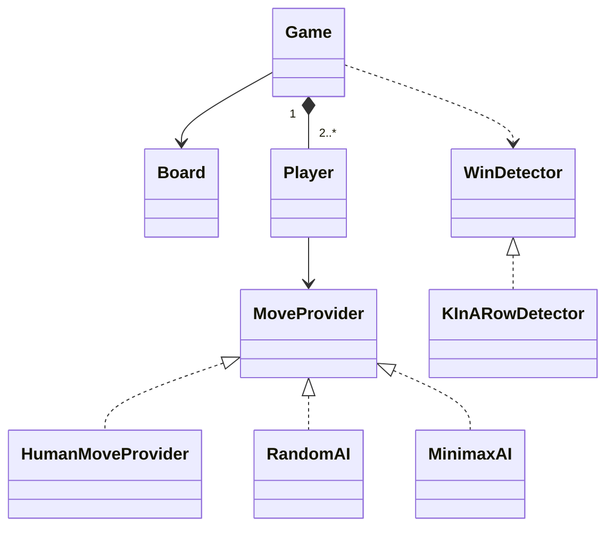

# 41 — Tic Tac Toe (LLD Interview Walkthrough)

> **Why this problem?** It's the *AI player* lesson of the LLD canon. Tic Tac Toe is small, so the focus shifts off of entities and onto **algorithm pluggability**: humans, random AI, and minimax AI all participate through the same `MoveProvider` interface. It's also the right place to generalize **K-in-a-row** detection so the same code plays 3×3 Tic Tac Toe, 7×6 Connect Four, and 15×15 Gomoku.

---

## 1. The Setup

> Interviewer: *"Design a Tic Tac Toe game."*

The traps:

1. Hard-coded `winningCombinations: number[][]` for the 8 lines on a 3×3 board. Works for 3×3, dies on 4×4 or NxN.
2. `if (currentPlayer === X) playerX.move(); else playerO.move();` — branches everywhere. Senior version: a single `MoveProvider` interface; humans and AIs are both implementations.
3. No clear `Game` state machine — `gameOver` flag flipped here and there. Senior version: explicit `IN_PROGRESS → WON / DRAW` outcome.

If you write a clean *N×N* board with a K-in-a-row detector and a pluggable AI within 25 minutes, you've nailed it.

---

## 2. Requirements Clarification (Phase 1 — ~8 min)

### 2.1 Functional questions

| # | Question | Why it matters |
|---|---|---|
| Q1 | Fixed 3×3 or configurable N×N? | Hard-coded vs general win detector |
| Q2 | Standard "3 in a row" or K-in-a-row (K configurable)? | Generalizes to Connect Four / Gomoku |
| Q3 | Two players only or N players with distinct marks? | Player list, not pair |
| Q4 | Both human, both AI, or mixed? | Move source as Strategy |
| Q5 | AI difficulty levels — random, heuristic, minimax? | Strategy variants |
| Q6 | Allow undo / takeback? | Memento pattern |
| Q7 | Single match or best-of-N? | Wraps Game in a Match/Tournament |
| Q8 | Detect draw early when no win is possible? | Optional optimization |
| Q9 | Where does input come from — CLI, web socket, REST? | Pluggable input port |

### 2.2 Non-functional

- AI must respond within ~100ms even at 4×4 — bounds the search depth.
- Deterministic AI for tests (same board → same move).

### 2.3 The scope lock

> *"OK, scoping: configurable N×N board (default 3×3) with K-in-a-row win rule (default K = N). Exactly 2 players. Move source is a `MoveProvider` per player — we'll implement `HumanMoveProvider` (CLI), `RandomAI`, and `MinimaxAI` (with depth cutoff). Outcomes: WON / DRAW. Undo via Memento for the extension section. Match wraps multiple games for best-of-N. Done."*

---

## 3. Entity Modeling (Phase 2 — ~5 min)

### The two key insights

```
1. The "current player" is just an index into a players[] list.
   No branching on color/symbol — same code drives 2-player or 10-player.

2. Move source is a STRATEGY per player. Humans and AIs are
   indistinguishable from the Game's perspective — they both
   implement MoveProvider.chooseMove(board, mark): Position.
```

### Entities

| Entity | Role | Notes |
|---|---|---|
| `Game` | Orchestrates turns, asks for moves, detects end | Returns `Outcome` |
| `Board` | N×N grid of `Mark` cells | Immutable-friendly: returns new state on play |
| `Mark` | `X / O / EMPTY` | Enum or symbol |
| `Player` | Carries `name` + `mark` + `MoveProvider` | |
| `Position` | `(row, col)` | Value object |
| `MoveProvider` | Strategy returning a `Position` | Humans / AIs |
| `WinDetector` | Strategy returning the winning mark (or null) | K-in-a-row impl is generic |
| `Outcome` | `IN_PROGRESS / WON(mark) / DRAW` | |
| `GameObserver` | Optional, for UI/log | |
| `BoardMemento` | Snapshot for undo | |

---

## 4. UML (Phase 3 — ~5 min)

```
┌──────────────────────┐
│        Game          │
│  - board             │
│  - players[]         │
│  - currentIndex      │
│  - winDetector       │
│  + play(): Outcome   │
└──────────┬───────────┘
           │
           ▼
┌──────────────────────┐      ┌──────────────────────┐
│        Board         │      │  «interface»         │
│  - n, k              │      │  MoveProvider        │
│  - cells: Mark[][]   │      │  + choose(board,mark)│
│  + play(pos, mark)   │      └──────────▲───────────┘
│  + isFull()          │                 │
│  + cellsUsed()       │     ┌───────────┼───────────┐
└──────────────────────┘     │           │           │
                          Human       RandomAI    MinimaxAI

┌──────────────────────┐      ┌──────────────────────┐
│ «interface»          │      │       Player         │
│  WinDetector         │      │  - name, mark        │
│  + winner(board):    │      │  - provider          │
│      Mark?           │      └──────────────────────┘
└──────────▲───────────┘
           │
    KInARowDetector

┌──────────────────────┐
│       Outcome        │  tagged union — IN_PROGRESS / WON(mark) / DRAW
└──────────────────────┘
```



---

## 5. Design Patterns Chosen (Phase 4 — ~3 min)

| Pattern | Where | Why |
|---|---|---|
| **Strategy** | `MoveProvider` (Human / RandomAI / MinimaxAI) | Players are pluggable; same Game runs human-vs-AI, AI-vs-AI |
| **Strategy** | `WinDetector` (`KInARowDetector`) | Generalizes the win condition for any N, K |
| **State / Outcome** | `Outcome` tagged union | Clean game-over signaling, no flag soup |
| **Memento** | `BoardMemento` for undo | Snapshot/restore — natural fit |
| **Observer** | `GameObserver` | UI, replay, telemetry |
| **Template Method** *(optional)* | `Game.play()` with hooks before/after each move | Variant rules (e.g., "X must always start") |

> **Pattern restraint:** No Singleton. No Factory. The problem doesn't have variation in object *construction* — only in *behavior* (move source, win rule). Reaching for Factory here would be cargo-culting.

---

## 6. TypeScript Code (Phase 5 — ~25 min)

### 6.1 Marks, positions, outcomes

```typescript
export enum Mark { EMPTY = " ", X = "X", O = "O" }

export class Position {
  constructor(public readonly row: number, public readonly col: number) {}
  key(): string { return `${this.row},${this.col}`; }
}

export type Outcome =
  | { kind: "IN_PROGRESS" }
  | { kind: "WON"; mark: Mark }
  | { kind: "DRAW" };
```

### 6.2 Board

```typescript
export class Board {
  private cells: Mark[][];
  private used = 0;

  constructor(public readonly n: number = 3) {
    this.cells = Array.from({ length: n }, () => Array(n).fill(Mark.EMPTY));
  }

  size(): number { return this.n; }
  cellsUsed(): number { return this.used; }
  isFull(): boolean { return this.used === this.n * this.n; }
  at(p: Position): Mark { return this.cells[p.row][p.col]; }

  isLegal(p: Position): boolean {
    return p.row >= 0 && p.row < this.n &&
           p.col >= 0 && p.col < this.n &&
           this.cells[p.row][p.col] === Mark.EMPTY;
  }

  play(p: Position, mark: Mark): void {
    if (!this.isLegal(p)) throw new Error(`Illegal move at ${p.key()}`);
    if (mark === Mark.EMPTY) throw new Error(`Cannot place EMPTY`);
    this.cells[p.row][p.col] = mark;
    this.used++;
  }

  // Undo support (used by AI rollout and Memento)
  undo(p: Position): void {
    if (this.cells[p.row][p.col] === Mark.EMPTY) throw new Error(`Nothing to undo at ${p.key()}`);
    this.cells[p.row][p.col] = Mark.EMPTY;
    this.used--;
  }

  emptyPositions(): Position[] {
    const out: Position[] = [];
    for (let r = 0; r < this.n; r++)
      for (let c = 0; c < this.n; c++)
        if (this.cells[r][c] === Mark.EMPTY) out.push(new Position(r, c));
    return out;
  }

  // Pretty-print
  toString(): string {
    return this.cells.map(row => row.join(" | ")).join("\n" + "-".repeat(this.n * 4 - 3) + "\n");
  }
}
```

### 6.3 WinDetector — generalized K-in-a-row

```typescript
export interface WinDetector {
  // Returns the winning mark if any, else null
  winner(board: Board, lastMove?: Position): Mark | null;
}

export class KInARowDetector implements WinDetector {
  constructor(private k: number) {
    if (k < 2) throw new Error("k must be >= 2");
  }

  // 4 directions: → ↓ ↘ ↙ (the other 4 are mirrors)
  private readonly directions: Array<[number, number]> = [
    [0, 1], [1, 0], [1, 1], [1, -1],
  ];

  // Fast path — if a move was just played, only check lines through it
  winner(board: Board, lastMove?: Position): Mark | null {
    if (lastMove) return this.checkAt(board, lastMove);
    // Full scan (rare — only called when not supplied)
    for (let r = 0; r < board.size(); r++) {
      for (let c = 0; c < board.size(); c++) {
        const w = this.checkAt(board, new Position(r, c));
        if (w) return w;
      }
    }
    return null;
  }

  private checkAt(board: Board, p: Position): Mark | null {
    const mark = board.at(p);
    if (mark === Mark.EMPTY) return null;
    for (const [dr, dc] of this.directions) {
      let count = 1;
      // Extend in (dr, dc)
      let r = p.row + dr, c = p.col + dc;
      while (this.inBounds(board, r, c) && board.at(new Position(r, c)) === mark) {
        count++; r += dr; c += dc;
      }
      // Extend in (-dr, -dc)
      r = p.row - dr; c = p.col - dc;
      while (this.inBounds(board, r, c) && board.at(new Position(r, c)) === mark) {
        count++; r -= dr; c -= dc;
      }
      if (count >= this.k) return mark;
    }
    return null;
  }

  private inBounds(board: Board, r: number, c: number): boolean {
    return r >= 0 && r < board.size() && c >= 0 && c < board.size();
  }
}
```

> **The big-O point.** Naïve "iterate every possible line" is O(N²·K). Our "check only through the last move" is O(K · 4) ≈ O(K) per move. On a 15×15 Gomoku board that's the difference between 900 ops and 5 ops per move.

### 6.4 MoveProvider — humans & AIs

```typescript
export interface MoveProvider {
  choose(board: Board, mark: Mark): Position;
}

// CLI human — in real life this would await user input through a port
export class ScriptedHuman implements MoveProvider {
  private idx = 0;
  constructor(private moves: Position[]) {}
  choose(_: Board, __: Mark): Position {
    if (this.idx >= this.moves.length) throw new Error("Ran out of scripted moves");
    return this.moves[this.idx++];
  }
}

export class RandomAI implements MoveProvider {
  choose(board: Board, _: Mark): Position {
    const opts = board.emptyPositions();
    return opts[Math.floor(Math.random() * opts.length)];
  }
}

// Minimax with depth cutoff. Optimal for 3x3; reasonable for 4x4 with depth ~6.
export class MinimaxAI implements MoveProvider {
  constructor(
    private detector: WinDetector,
    private maxDepth: number = 8,
  ) {}

  choose(board: Board, mark: Mark): Position {
    const opp = mark === Mark.X ? Mark.O : Mark.X;
    let bestScore = -Infinity;
    let bestMove: Position = board.emptyPositions()[0];
    for (const p of board.emptyPositions()) {
      board.play(p, mark);
      const score = this.minimax(board, p, false, mark, opp, 1);
      board.undo(p);
      if (score > bestScore) { bestScore = score; bestMove = p; }
    }
    return bestMove;
  }

  // Returns score from `me`'s perspective: +∞ win, -∞ loss, 0 draw, with depth-discount
  private minimax(
    board: Board, lastMove: Position,
    maximizing: boolean,
    me: Mark, them: Mark,
    depth: number,
  ): number {
    const winner = this.detector.winner(board, lastMove);
    if (winner === me) return 1000 - depth;       // prefer wins SOONER
    if (winner === them) return depth - 1000;     // prefer losses LATER
    if (board.isFull()) return 0;
    if (depth >= this.maxDepth) return 0;          // depth cutoff for big boards

    const player = maximizing ? me : them;
    let best = maximizing ? -Infinity : Infinity;
    for (const p of board.emptyPositions()) {
      board.play(p, player);
      const score = this.minimax(board, p, !maximizing, me, them, depth + 1);
      board.undo(p);
      best = maximizing ? Math.max(best, score) : Math.min(best, score);
    }
    return best;
  }
}
```

> **The depth-discount trick** — `1000 - depth` for wins, `depth - 1000` for losses. Without it, the AI sees all wins as equal and may dawdle. With it, a win in 2 plies beats a win in 4 plies, so the AI plays the *shortest* winning path. Same for losses (delay as long as possible — "make it work hard for it").

### 6.5 Player

```typescript
export class Player {
  constructor(
    public readonly name: string,
    public readonly mark: Mark,
    public readonly provider: MoveProvider,
  ) {}
}
```

### 6.6 Memento (for undo)

```typescript
export class BoardMemento {
  // Snapshot of board state — stored by Game/Caretaker
  constructor(public readonly cells: Mark[][], public readonly used: number) {}
}

export function snapshot(board: Board): BoardMemento {
  const cells = (board as any).cells.map((row: Mark[]) => [...row]);
  return new BoardMemento(cells, board.cellsUsed());
}

export function restore(board: Board, m: BoardMemento): void {
  (board as any).cells = m.cells.map(row => [...row]);
  (board as any).used = m.used;
}
```

> **The `as any` is a smell** — we're reaching past `private`. In real code, `Board` should expose `getMemento()` / `restore(memento)` methods. Q in the interview section drills on this.

### 6.7 Game

```typescript
export interface GameObserver {
  onMove(player: Player, p: Position, board: Board): void;
  onEnd(outcome: Outcome): void;
}

export class Game {
  private currentIndex = 0;
  private observers: GameObserver[] = [];
  private history: { player: Player; pos: Position }[] = [];

  constructor(
    private board: Board,
    private players: [Player, Player],
    private detector: WinDetector,
  ) {
    if (players[0].mark === players[1].mark) throw new Error("Players must have different marks");
  }

  addObserver(o: GameObserver) { this.observers.push(o); }

  play(): Outcome {
    while (true) {
      const p = this.players[this.currentIndex];
      const move = p.provider.choose(this.board, p.mark);
      if (!this.board.isLegal(move)) {
        throw new Error(`${p.name} returned illegal move ${move.key()}`);
      }
      this.board.play(move, p.mark);
      this.history.push({ player: p, pos: move });
      this.observers.forEach(o => o.onMove(p, move, this.board));

      const winner = this.detector.winner(this.board, move);
      if (winner) {
        const out: Outcome = { kind: "WON", mark: winner };
        this.observers.forEach(o => o.onEnd(out));
        return out;
      }
      if (this.board.isFull()) {
        const out: Outcome = { kind: "DRAW" };
        this.observers.forEach(o => o.onEnd(out));
        return out;
      }
      this.currentIndex = 1 - this.currentIndex;
    }
  }

  // Undo last full turn (one move; if you want to undo to "your last move",
  // call twice — once for opponent, once for yours)
  undo(): boolean {
    const last = this.history.pop();
    if (!last) return false;
    this.board.undo(last.pos);
    this.currentIndex = 1 - this.currentIndex;
    return true;
  }
}
```

### 6.8 Driver

```typescript
const board = new Board(3);
const detector = new KInARowDetector(3);

const x = new Player("Alice (X)", Mark.X, new MinimaxAI(detector));
const o = new Player("Bob (random)", Mark.O, new RandomAI());

class ConsoleObserver implements GameObserver {
  onMove(p, pos, board) { console.log(`${p.name} → ${pos.key()}\n${board.toString()}\n`); }
  onEnd(out) { console.log("Result:", out); }
}

const game = new Game(board, [x, o], detector);
game.addObserver(new ConsoleObserver());
game.play();
```

A 3×3 MinimaxAI vs RandomAI ends in the MinimaxAI winning or drawing — never losing. Run it a dozen times to verify.

### 6.9 Same code, different game — Connect Four

```typescript
// Connect Four = 7-wide × 6-tall board, K=4. Gravity adds a constraint
// (you can only play in the lowest empty cell of a column) — that's a
// move-validity rule layered on top of MoveProvider.
const c4 = new Board(7);            // simplified — pretend 7×7 for the demo
const c4d = new KInARowDetector(4); // K=4
// Then plug in any MoveProvider — Human / Random / Minimax with deeper depth.
```

The point: we wrote *one* generic `KInARowDetector` and we get Tic Tac Toe, Connect Four, Gomoku, with no code changes — only different `N` and `K`.

---

## 7. Extension Follow-Ups (Phase 6 — ~5 min)

### 7.1 "Add alpha-beta pruning to minimax."
Pass `alpha` and `beta` parameters down the recursion. At a maximizing node: `alpha = max(alpha, score)`; if `alpha >= beta`, return early (the opponent will never let us reach here). Cuts the search tree by orders of magnitude — minimax on 4×4 goes from ~10⁹ nodes to ~10⁶.

### 7.2 "Add an iterative-deepening time-bounded AI."
Run minimax depth 1, then 2, then 3, etc., keeping the best move found so far. Stop when a time budget (e.g., 100ms) expires. Standard chess-engine technique — gives the AI *anytime* behavior.

### 7.3 "Implement undo properly without reaching into `Board.private`."
Add `getMemento(): BoardMemento` and `restore(m: BoardMemento): void` methods to `Board`. The Memento becomes a true public contract; `Game` calls these. The current `as any` was a teaching smell — pointing it out in interview = senior signal.

### 7.4 "Network multiplayer."
Replace `HumanMoveProvider` with `WebSocketMoveProvider` that waits for an opponent's move from a server. The game loop, board, detector — all unchanged. Same trick as the ATM's `BankService` interface — the network boundary lives behind a Strategy. **Open/Closed.**

### 7.5 "Play 3D tic tac toe — 4×4×4 with K=4."
Generalize `Position` to N-dimensional coordinates. `KInARowDetector` extends to enumerate directions in 3D (now 13 instead of 4 — main axes + face diagonals + space diagonal). The algorithm is the same shape — only the directions array grows.

### 7.6 "Tournament — round-robin of AIs to rank them."
Wrap `Game` in a `Tournament` class that pits every AI against every other AI, both as X and as O, computes win/loss/draw rates. Each `Game` is a fresh instance — *this is why we said no Singleton in lesson 40*. The same restraint pays off here.

---

## 8. Real-World Production Notes

- **Solved game** — Tic Tac Toe (3×3) is fully solved: optimal play always leads to a draw. Minimax with depth 9 explores the whole tree (~9! = 362,880 leaves; pruned to ~26,830 with alpha-beta). Fast enough that you don't need any cleverness on 3×3.
- **Connect Four** is also solved (1988 — first player wins with perfect play if starting in the middle column).
- **Gomoku / Five-in-a-row** is solved for the standard 15×15 board with free opening — first player wins. Production engines use threat-space search, transposition tables, and deep neural networks (AlphaZero-style).
- **Mobile games** — same architecture pattern as Snake & Ladder: server-authoritative, client renders, server runs the AI. The `MoveProvider` interface lets the same Game class run on both ends.

---

## 9. Interview Questions (with answers)

**Q1. Why is `MoveProvider` a strategy rather than `Game.askPlayer(player) { if (player.isHuman) … else … }`?**
Because the *Game* shouldn't know how a move is sourced. Humans use a CLI today, a touchscreen tomorrow, a WebSocket the day after. AIs come in random, minimax, and alpha-beta flavors. With `MoveProvider`, the Game loop is a single line — `p.provider.choose(board, mark)` — and **every new player type is a new class, no Game change**. That's Open/Closed.

**Q2. Why pass `lastMove` to `WinDetector.winner()` instead of always scanning the whole board?**
Because the only line that *could* have changed is one passing through the just-played cell. Checking only those lines is O(K) per move instead of O(N²·K). On 3×3 the difference is negligible, but the same code on 15×15 Gomoku is 100× faster. Same algorithm, same correctness, but ready to scale up.

**Q3. Walk me through the depth-discount in minimax. Why `1000 - depth` instead of just `1000`?**
Without the discount, the AI sees "win in 2 moves" and "win in 8 moves" as equal — both score `1000`. So when multiple wins exist, it picks arbitrarily and may "dawdle" by playing non-winning moves that *eventually* lead to a win. The discount makes the search prefer faster wins. The symmetric "prefer-later-losses" `depth - 1000` makes the AI delay losing — practical because the opponent might make a mistake in the meantime.

**Q4. The Memento implementation uses `as any` to read `Board.cells`. Why is that a smell, and what's the senior fix?**
`as any` defeats TypeScript's encapsulation — any caller can now mutate `cells` directly, breaking `used`. The senior fix: `Board.getMemento()` returns a snapshot the Board owns; `Board.restore(m)` accepts one. Both are first-class public methods. The Memento pattern says "**snapshot is owned by the originator (Board), held by the caretaker (Game)**" — `as any` violates the originator's encapsulation. *Mentioning this in an interview = senior signal.*

**Q5. Could you swap `KInARowDetector` for a faster algorithm for large boards?**
Yes. For very large boards (Gomoku-scale), you'd precompute a *threat table* — for each direction, a sliding window of K cells. Each move updates only the windows passing through that cell. There's also bitboard tricks where the entire board is encoded as two 64-bit ints (one per player) and "K in a row in direction X" becomes a bitmask shift + AND — branch-free, ~10ns per check. The point: `WinDetector` is an interface, so any of these can drop in without touching `Game`.

**Q6. (Trap) Two players, both human, sit at the same machine. Doesn't the Game implicitly trust them not to play out of turn?**
Yes — the Game owns `currentIndex` and only asks the current player's provider. A naughty `HumanMoveProvider` couldn't play on the wrong turn even if it tried — it's never called. The `isLegal` check on `Board` catches illegal moves *within* a turn. The trust model is: **the Game decides whose turn it is; the provider decides what move that player makes**. Clean separation — even malicious providers can't break invariants.

---

## 10. The Cheat-Sheet (last-minute revision)

```
Big idea:  Move source is a Strategy (Human / RandomAI / MinimaxAI).
           Win detection is a Strategy (K-in-a-row generalizes to
           Connect Four / Gomoku / NxN).
           Game decides whose turn, provider decides which move.

Patterns:
  Strategy → MoveProvider, WinDetector
  Memento  → BoardMemento for undo
  Observer → GameObserver
  Outcome  → tagged union (no flag soup)

Algorithm cores:
  KInARowDetector:
    For the last-played cell, scan 4 directions (→ ↓ ↘ ↙),
    counting consecutive same-mark cells both ways.
    O(K) per move.
  Minimax:
    win = +1000-depth ; loss = depth-1000 ; draw = 0
    Depth cutoff for big boards.
    Alpha-beta as an extension.

Flow per turn:
  player = players[currentIndex]
  move   = player.provider.choose(board, player.mark)
  if !board.isLegal(move) throw
  board.play(move, mark)
  winner = detector.winner(board, move)
  if winner: WON
  elif board.isFull(): DRAW
  else: currentIndex = 1 - currentIndex; continue

Traps:
  - Hard-coded 8 winning lines (won't scale past 3×3)
  - if/else on isHuman (use MoveProvider)
  - "gameOver" boolean (use Outcome tagged union)
  - Math.random() everywhere (inject via Strategy)
  - Reaching past Board.private for undo (use Memento properly)
  - Minimax without depth discount (AI dawdles)

Generalizes to:
  Connect Four (N=7×6, K=4)
  Gomoku       (N=15×15, K=5)
  3D Tic Tac Toe (N×N×N, K=N)
  Misère TTT (loser is whoever gets K in a row — negate scores)
```

You've now done two consecutive games (40, 41). Together they form your template for any **turn-based game**: `Board` + `Players` + `MoveSource as Strategy` + `WinDetector as Strategy` + `Outcome as enum` + `Memento for undo` + `Observer for events`. Memorize that pattern — half of Phase 7 is variations on it.
