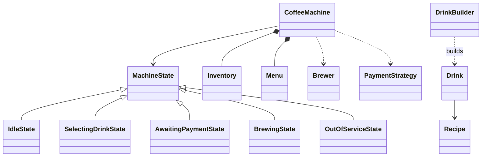

# 42 — Coffee Vending Machine (LLD Interview Walkthrough)

> **Why this problem?** On the surface it looks like a smaller ATM, but two new ideas make it interview-rich: **multi-resource inventory** (water + beans + milk + sugar, each consumed in different quantities per drink) and a **recipe model** (Espresso, Cappuccino, Latte differ only in quantities of the same ingredients). It's also the first place in Phase 7 to deploy **Builder** properly — custom drinks (extra shot, oat milk, no sugar) compose fluently. The State pattern returns as the spine.

---

## 1. The Setup

> Interviewer: *"Design a coffee vending machine."*

Three traps to avoid:

1. **Hard-coded drinks** — `class Espresso { brew() { … } }`, `class Latte { brew() { … } }`, etc. Adding a flat white = new class + new branches everywhere. Senior version: one `Recipe` parameterized by ingredients.
2. **Per-ingredient checks scattered through code** — `if (water < 50) … if (beans < 10) …`. Senior version: a single `Inventory.canConsume(recipe)` / `consume(recipe)` atomic op.
3. **No "preparing" state** — payment succeeds, then somewhere in the same call we brew, dispense, and return to idle. If brewing fails mid-way, ingredients are partly consumed and the user has paid. Senior version: explicit `BREWING` state with compensation on failure.

---

## 2. Requirements Clarification (Phase 1 — ~8 min)

### 2.1 Functional questions

| # | Question | Why it matters |
|---|---|---|
| Q1 | What drinks — fixed menu or fully customizable (Starbucks-style)? | Recipe vs Builder |
| Q2 | What ingredients — coffee beans / water / milk / sugar / hot chocolate / tea leaves? | Inventory entity |
| Q3 | Payment methods — coins / card / UPI / contactless / app QR? | Payment Strategy |
| Q4 | Multiple sizes (Small / Medium / Large)? | Recipe scales by size |
| Q5 | What if an ingredient runs out mid-brew (e.g., water tank drains)? | Hardware failure + compensation |
| Q6 | Auto-clean cycle? Out-of-service mode? | Extra state |
| Q7 | Loyalty / membership integration? | External service |
| Q8 | How to refill — manual by operator, or scheduled? | Admin commands |
| Q9 | Display ingredient levels / "out of milk" alerts? | Observer port |

### 2.2 Non-functional

- **Atomicity** — two simultaneous orders must not both pass the "do we have enough beans?" check and then both consume. (Same atomic-CAS story as the ATM dispense.)
- **Telemetry** — modern vending machines (BMS coffee, Bevi) phone home with ingredient levels and fault codes. Plan for it.
- **Fail-safe** — if brewing fails after payment, money must be auto-refunded.

### 2.3 The scope lock

> *"OK, scoping: 5 ingredients (water, beans, milk, sugar, chocolate). Fixed menu of recipes (Espresso, Cappuccino, Latte, HotChocolate) PLUS a 'Custom' option using a Builder. 3 sizes that scale a recipe's quantities by a factor. 3 payment methods (Coins / Card / UPI). States: IDLE → SELECTING_DRINK → AWAITING_PAYMENT → BREWING → DISPENSING → IDLE (with OUT_OF_SERVICE as override). On ingredient runout mid-brew: compensating refund + alert. Observer for low-ingredient alerts. No loyalty today — extension."*

---

## 3. Entity Modeling (Phase 2 — ~5 min)

### The recipe insight

```
Recipe = a Map<Ingredient, quantity-needed>
         (Espresso = { beans: 10g, water: 30ml })
         (Cappuccino = { beans: 10g, water: 30ml, milk: 70ml })
         (Latte = { beans: 10g, water: 30ml, milk: 150ml })

Drink (custom) = a Recipe assembled via Builder
         e.g., "double espresso with oat milk and no sugar"

Same ingredients, different quantities, one Recipe type. No need for
Espresso/Cappuccino subclasses — they're DATA, not types.
```

This is the *Strategy-vs-data* judgment call: **when variants differ only in numbers, model them as data, not classes**. Save classes for differences in *behavior*.

### Entities

| Entity | Role | Notes |
|---|---|---|
| `CoffeeMachine` | The state-machine host | Singleton, owns hardware + inventory |
| `MachineState` (abstract) | Idle / SelectingDrink / AwaitingPayment / Brewing / OutOfService | State pattern |
| `Ingredient` | Enum: WATER / BEANS / MILK / SUGAR / CHOCOLATE | |
| `Inventory` | Atomic check-and-consume over a `Map<Ingredient, qty>` | |
| `Recipe` | `Map<Ingredient, qty>` + size multipliers | Pure data |
| `Drink` | A Recipe + a name + a price | |
| `DrinkBuilder` | Fluent API to compose custom drinks | Builder pattern |
| `Menu` | Catalog of named drinks | |
| `Order` | A selected Drink + Size + Payment ref | |
| `PaymentStrategy` | Coins / Card / UPI | |
| `Brewer` | Hardware port to actually brew (mockable) | |
| `MachineObserver` | Low-ingredient / fault alerts | |

---

## 4. UML (Phase 3 — ~5 min)

```
┌─────────────────────────┐
│     CoffeeMachine       │
│  - state: MachineState  │
│  - inventory            │
│  - menu                 │
│  - brewer               │
│  + selectDrink(name)    │
│  + buildCustom(): bld   │
│  + pay(amount, mode)    │
│  + cancel()             │
└───────────┬─────────────┘
            │ uses
            ▼
┌─────────────────────────┐
│ «abstract» MachineState │
└───────────▲─────────────┘
            │
  ┌─────────┼──────────┬──────────────────┬──────────────────┐
  │         │          │                  │                  │
 Idle  Selecting  AwaitingPayment    Brewing            OutOfService

┌─────────────────────────┐    ┌─────────────────────────┐
│      Inventory          │    │       Recipe            │
│  - levels: Map<I, qty>  │    │  - needs: Map<I, qty>   │
│  + canConsume(recipe)   │    │  - basePrice            │
│  + consume(recipe)      │    │  + scaled(size): Recipe │
│  + refill(i, qty)       │    └─────────────────────────┘
└─────────────────────────┘                  ▲
                                             │
                                       owned by Drink

┌─────────────────────────┐    ┌─────────────────────────┐
│      DrinkBuilder       │    │ «interface» Brewer      │
│  + base(name)           │    │  + brew(recipe): void   │
│  + addShot()            │    └─────────────────────────┘
│  + milk(type)           │
│  + sugar(spoons)        │    «interface» PaymentStrategy
│  + size(s)              │      Coins / Card / UPI
│  + build(): Drink       │
└─────────────────────────┘    «Observer» MachineObserver
```



---

## 5. Design Patterns Chosen (Phase 4 — ~3 min)

| Pattern | Where | Why |
|---|---|---|
| **State** | `CoffeeMachine` | Same reasoning as ATM — explicit states beat flag soup |
| **Builder** | `DrinkBuilder` for custom drinks | Fluent composition; required-step ordering enforced |
| **Strategy** | `PaymentStrategy` | Coin / Card / UPI are independent variants |
| **Strategy / Interface** | `Brewer` | Real hardware vs mocks |
| **Observer** | `MachineObserver` | Low-ingredient alerts, fault telemetry |
| **Singleton** | `CoffeeMachine` | One machine per process; allow per-test reset |
| **Recipes as data** | (deliberate non-pattern) | Variants that differ only in numbers — not classes |

> **Subtle judgment moment:** A textbook "Espresso vs Latte = subclasses" tutorial pushes you toward overuse of inheritance. Modeling them as *data* (`Recipe`) is cleaner. Be ready to defend this choice in interview — Q3 below.

---

## 6. TypeScript Code (Phase 5 — ~25 min)

### 6.1 Ingredients, sizes, payment modes

```typescript
export enum Ingredient {
  WATER = "WATER", BEANS = "BEANS", MILK = "MILK",
  SUGAR = "SUGAR", CHOCOLATE = "CHOCOLATE",
}

export enum Size { SMALL = "SMALL", MEDIUM = "MEDIUM", LARGE = "LARGE" }
export const SIZE_FACTOR: Record<Size, number> = { SMALL: 1.0, MEDIUM: 1.5, LARGE: 2.0 };

export enum PaymentMode { COINS = "COINS", CARD = "CARD", UPI = "UPI" }
```

### 6.2 Recipe + Drink (data, not classes)

```typescript
export class Recipe {
  // The base recipe — size factor applied at consume-time
  constructor(
    public readonly needs: Map<Ingredient, number>,   // ingredient → grams/ml
    public readonly basePrice: number,                // base cost
  ) {}

  // Returns a NEW recipe scaled to the requested size
  scaled(size: Size): Recipe {
    const k = SIZE_FACTOR[size];
    const scaled = new Map<Ingredient, number>();
    for (const [i, q] of this.needs) scaled.set(i, Math.round(q * k));
    return new Recipe(scaled, Math.round(this.basePrice * k));
  }
}

export class Drink {
  constructor(
    public readonly name: string,
    public readonly recipe: Recipe,
  ) {}
}
```

### 6.3 Inventory — atomic check-and-consume

```typescript
export class Inventory {
  private levels = new Map<Ingredient, number>();
  private observers: MachineObserver[] = [];

  // Construct from current stock
  constructor(initial: Map<Ingredient, number>) {
    for (const [i, q] of initial) this.levels.set(i, q);
  }

  // Read-only snapshot for display
  snapshot(): Map<Ingredient, number> { return new Map(this.levels); }

  addObserver(o: MachineObserver) { this.observers.push(o); }

  // Atomic — either all required ingredients are present or none are consumed
  canFulfill(recipe: Recipe): boolean {
    for (const [i, need] of recipe.needs) {
      if ((this.levels.get(i) ?? 0) < need) return false;
    }
    return true;
  }

  consume(recipe: Recipe): void {
    if (!this.canFulfill(recipe)) {
      throw new Error("Insufficient ingredients");
    }
    for (const [i, need] of recipe.needs) {
      const newLevel = (this.levels.get(i) ?? 0) - need;
      this.levels.set(i, newLevel);
      if (newLevel < 20) this.fireLow(i, newLevel);
    }
  }

  refill(i: Ingredient, qty: number): void {
    const cur = this.levels.get(i) ?? 0;
    this.levels.set(i, cur + qty);
  }

  // Compensating top-up if a brew failed mid-way
  restore(partialConsumed: Map<Ingredient, number>): void {
    for (const [i, q] of partialConsumed) this.refill(i, q);
  }

  private fireLow(i: Ingredient, level: number): void {
    this.observers.forEach(o => o.onLowIngredient(i, level));
  }
}
```

> **Why is `canFulfill` separate from `consume`?** Because we check first to give the user a clean "out of milk, please choose another drink" message *before* even asking for payment. The State machine reads this to decide what's available in the menu.

### 6.4 Menu

```typescript
export class Menu {
  private drinks = new Map<string, Drink>();

  add(d: Drink): void { this.drinks.set(d.name, d); }
  get(name: string): Drink {
    const d = this.drinks.get(name);
    if (!d) throw new Error(`Unknown drink: ${name}`);
    return d;
  }
  all(): Drink[] { return [...this.drinks.values()]; }

  availableNow(inv: Inventory): Drink[] {
    return this.all().filter(d => inv.canFulfill(d.recipe));
  }
}

// Convenience: seed the menu with classics
export function classicMenu(): Menu {
  const m = new Menu();
  m.add(new Drink("Espresso",   new Recipe(new Map([[Ingredient.BEANS, 10], [Ingredient.WATER, 30]]),                                    50)));
  m.add(new Drink("Cappuccino", new Recipe(new Map([[Ingredient.BEANS, 10], [Ingredient.WATER, 30], [Ingredient.MILK, 70]]),             80)));
  m.add(new Drink("Latte",      new Recipe(new Map([[Ingredient.BEANS, 10], [Ingredient.WATER, 30], [Ingredient.MILK, 150]]),           100)));
  m.add(new Drink("HotChoc",    new Recipe(new Map([[Ingredient.CHOCOLATE, 25], [Ingredient.WATER, 50], [Ingredient.MILK, 80], [Ingredient.SUGAR, 5]]), 90)));
  return m;
}
```

### 6.5 DrinkBuilder — Builder pattern with fluent API

```typescript
export class DrinkBuilder {
  private base: Drink | null = null;
  private extras = new Map<Ingredient, number>();
  private size: Size = Size.MEDIUM;
  private milkOverride: Ingredient | null = null;
  private sugarSpoons = 0;
  private shots = 1;

  base_(d: Drink): this { this.base = d; return this; }
  size_(s: Size): this { this.size = s; return this; }
  addShot(): this { this.shots++; return this; }
  sugar(spoons: number): this { this.sugarSpoons = spoons; return this; }
  oatMilk(): this { /* placeholder — would use Ingredient.OAT_MILK in extended menu */ return this; }
  build(): Drink {
    if (!this.base) throw new Error("DrinkBuilder needs a base drink");
    const merged = new Map(this.base.recipe.needs);
    // Extra shots = extra beans + water (proportional)
    if (this.shots > 1) {
      const extra = this.shots - 1;
      merged.set(Ingredient.BEANS, (merged.get(Ingredient.BEANS) ?? 0) + extra * 10);
      merged.set(Ingredient.WATER, (merged.get(Ingredient.WATER) ?? 0) + extra * 30);
    }
    if (this.sugarSpoons > 0) {
      merged.set(Ingredient.SUGAR, (merged.get(Ingredient.SUGAR) ?? 0) + this.sugarSpoons * 5);
    }
    const customRecipe = new Recipe(merged, this.base.recipe.basePrice + (this.shots - 1) * 30);
    return new Drink(
      `Custom(${this.base.name}, x${this.shots}, sugar=${this.sugarSpoons})`,
      customRecipe.scaled(this.size),
    );
  }
}
```

> **Why Builder, not a 6-arg constructor?** Two reasons. (a) **Readability** — `new Drink(base, shots=2, sugar=1, size=LARGE, …)` is unreadable; `base_(latte).size_(LARGE).addShot().sugar(1).build()` is self-documenting. (b) **Optional defaults** — most knobs aren't set most of the time; Builder makes that natural. Strict GoF Builder also lets you forbid invalid combinations (`build()` validates), which a constructor doesn't.

### 6.6 Payment strategy & Brewer interface

```typescript
export interface PaymentStrategy {
  charge(amount: number): boolean;
  refund(amount: number): void;
}

export class CoinPayment   implements PaymentStrategy { charge(a) { return true; } refund(a) {} }
export class CardPayment   implements PaymentStrategy { charge(a) { return true; } refund(a) {} }
export class UpiPayment    implements PaymentStrategy { charge(a) { return true; } refund(a) {} }

export interface Brewer {
  brew(recipe: Recipe): void;  // throws on hardware failure
}

export class StandardBrewer implements Brewer {
  brew(recipe: Recipe): void {
    // Simulate ~real-world: occasionally fails on a stuck nozzle, etc.
    // (For deterministic tests, a separate StubBrewer is used.)
  }
}
```

### 6.7 The State pattern — machine states

```typescript
export interface MachineObserver {
  onLowIngredient(i: Ingredient, level: number): void;
  onFault(reason: string): void;
  onComplete(orderId: string): void;
}

export abstract class MachineState {
  constructor(protected machine: CoffeeMachine) {}
  selectDrink(_: string, __: Size): void { this.illegal("selectDrink"); }
  payAndBrew(_: PaymentMode): void { this.illegal("payAndBrew"); }
  cancel(): void { this.machine.reset(); }
  protected illegal(action: string): void {
    this.machine.notice(`"${action}" not allowed in ${this.constructor.name}`);
  }
}

export class IdleState extends MachineState {
  selectDrink(name: string, size: Size): void {
    const base = this.machine.menu().get(name);
    const scaled = new Drink(base.name, base.recipe.scaled(size));
    if (!this.machine.inventory().canFulfill(scaled.recipe)) {
      this.machine.notice(`Out of ingredients for ${name}`);
      return;
    }
    this.machine.setPendingDrink(scaled);
    this.machine.setState(new AwaitingPaymentState(this.machine));
    this.machine.notice(`Selected ${scaled.name} — please pay ₹${scaled.recipe.basePrice}`);
  }
}

export class AwaitingPaymentState extends MachineState {
  payAndBrew(mode: PaymentMode): void {
    const drink = this.machine.pendingDrink()!;
    const pay = this.machine.paymentFor(mode);
    if (!pay.charge(drink.recipe.basePrice)) {
      this.machine.notice("Payment failed");
      return;
    }
    this.machine.setState(new BrewingState(this.machine));
    this.machine.brewNow(drink, pay);
  }
}

export class BrewingState extends MachineState {
  // No user input handled — the machine is working
}

export class OutOfServiceState extends MachineState {
  selectDrink(_: string, __: Size): void {
    this.machine.notice("Out of service");
  }
}
```

### 6.8 CoffeeMachine — façade tying it all together

```typescript
export class CoffeeMachine {
  private static instance: CoffeeMachine | null = null;
  static getInstance(deps: MachineDeps): CoffeeMachine {
    if (!CoffeeMachine.instance) CoffeeMachine.instance = new CoffeeMachine(deps);
    return CoffeeMachine.instance;
  }

  private state: MachineState;
  private pending: Drink | null = null;
  private orderSeq = 1;
  private observers: MachineObserver[] = [];

  private constructor(private deps: MachineDeps) {
    this.state = new IdleState(this);
    this.deps.inventory.addObserver({
      onLowIngredient: (i, lvl) => this.observers.forEach(o => o.onLowIngredient(i, lvl)),
      onFault: () => {},
      onComplete: () => {},
    });
  }

  // Public API delegates to current state
  selectDrink(name: string, size: Size = Size.MEDIUM): void { this.state.selectDrink(name, size); }
  payAndBrew(mode: PaymentMode): void { this.state.payAndBrew(mode); }
  cancel(): void { this.state.cancel(); }
  customDrink(): DrinkBuilder { return new DrinkBuilder(); }

  // For Custom — accept a fully-built Drink and validate inventory
  selectCustom(d: Drink): void {
    if (!(this.state instanceof IdleState)) { this.notice("Already busy"); return; }
    if (!this.deps.inventory.canFulfill(d.recipe)) { this.notice("Out of ingredients"); return; }
    this.pending = d;
    this.setState(new AwaitingPaymentState(this));
    this.notice(`Selected ${d.name} — please pay ₹${d.recipe.basePrice}`);
  }

  // Used by State classes
  menu()        { return this.deps.menu; }
  inventory()   { return this.deps.inventory; }
  brewer()      { return this.deps.brewer; }
  paymentFor(m: PaymentMode): PaymentStrategy { return this.deps.payments[m]; }

  pendingDrink(): Drink | null { return this.pending; }
  setPendingDrink(d: Drink) { this.pending = d; }
  setState(s: MachineState) { this.state = s; }
  addObserver(o: MachineObserver) { this.observers.push(o); }

  notice(msg: string) { console.log(`[Machine] ${msg}`); }
  reset() { this.pending = null; this.state = new IdleState(this); this.notice("Idle"); }

  // The actual brewing — runs in BrewingState
  brewNow(d: Drink, pay: PaymentStrategy): void {
    const consumed = new Map<Ingredient, number>();
    try {
      // 1) Reserve ingredients atomically
      this.deps.inventory.consume(d.recipe);
      for (const [i, q] of d.recipe.needs) consumed.set(i, q);

      // 2) Brew
      this.deps.brewer.brew(d.recipe);

      // 3) Success
      const id = `O-${this.orderSeq++}`;
      this.observers.forEach(o => o.onComplete(id));
      this.notice(`Enjoy your ${d.name}!`);
    } catch (e) {
      // Compensating: restore inventory + refund
      this.deps.inventory.restore(consumed);
      pay.refund(d.recipe.basePrice);
      this.observers.forEach(o => o.onFault((e as Error).message));
      this.notice(`Brew failed: ${(e as Error).message}. Refunded.`);
    } finally {
      this.reset();
    }
  }
}

export interface MachineDeps {
  inventory: Inventory;
  menu: Menu;
  brewer: Brewer;
  payments: Record<PaymentMode, PaymentStrategy>;
}
```

### 6.9 Driver

```typescript
const inv = new Inventory(new Map([
  [Ingredient.WATER, 500],
  [Ingredient.BEANS, 200],
  [Ingredient.MILK, 400],
  [Ingredient.SUGAR, 100],
  [Ingredient.CHOCOLATE, 150],
]));

const machine = CoffeeMachine.getInstance({
  inventory: inv,
  menu: classicMenu(),
  brewer: new StandardBrewer(),
  payments: {
    [PaymentMode.COINS]: new CoinPayment(),
    [PaymentMode.CARD]:  new CardPayment(),
    [PaymentMode.UPI]:   new UpiPayment(),
  },
});

machine.addObserver({
  onLowIngredient(i, l) { console.log(`[ALERT] ${i} = ${l}`); },
  onFault(r)            { console.log(`[FAULT] ${r}`); },
  onComplete(id)        { console.log(`[DONE] Order ${id}`); },
});

// Standard order
machine.selectDrink("Latte", Size.LARGE);
machine.payAndBrew(PaymentMode.UPI);

// Custom order via Builder
const espresso = machine.menu().get("Espresso");
const custom = machine.customDrink()
  .base_(espresso)
  .size_(Size.LARGE)
  .addShot()
  .sugar(1)
  .build();
machine.selectCustom(custom);
machine.payAndBrew(PaymentMode.CARD);
```

---

## 7. Extension Follow-Ups (Phase 6 — ~5 min)

### 7.1 "What if the brewer fails mid-cycle (e.g., water clog)?"
Already handled — the `brewNow` `try/catch` calls `inventory.restore(consumed)` and `pay.refund(amount)`. The compensation is a **Saga** in miniature: every external action has an inverse. In a real machine, the dispense nozzle has a sensor — actual partial dispense is impossible because the brewer aborts before consuming all the water. The software model mirrors this contract.

### 7.2 "Add a Mocha and a Flat White."
Two new lines in `classicMenu()`. **No code changes** elsewhere — recipes are data. This is the payoff of "data over types" for variants that differ only in quantities.

### 7.3 "Loyalty integration — 10th drink free."
Add a `LoyaltyService` interface called between `selectDrink` and payment. It returns a multiplier on price (0 means free). `AwaitingPaymentState` reads `drink.recipe.basePrice * loyalty.multiplier(userId)`. The machine doesn't need to know how loyalty is computed — DIP.

### 7.4 "Periodic auto-clean cycle."
Add `CleaningState`. A scheduled job (or button press) calls `machine.startCleaning()` only from `IdleState`. While cleaning, all `selectDrink` actions show "Cleaning in progress (45s remaining)". State-machine clarity makes this drop-in.

### 7.5 "Multi-cup orders (a tray of 4 lattes)."
Validate the inventory against `4 × recipe.needs` atomically before any consumption. A `MultiOrder` wraps N `Drink`s but submits a *single* `Inventory.consume` call. Critical: don't loop "consume one drink, brew, consume next" — if the 3rd fails, the user got 2 lattes and lost their money. **Atomic all-or-nothing semantics.**

### 7.6 "Telemetry — phone home with ingredient levels every minute."
Add a `TelemetryObserver` that subscribes to `onLowIngredient` and *also* polls `inventory.snapshot()` on a timer. Pushes to a central MQTT topic. The machine code doesn't know about telemetry. **Observer + DIP, again the same pair**.

---

## 8. Real-World Production Notes

- **Real machines** — Saeco, Jura, Nespresso Professional. They expose telemetry via OPC-UA or MQTT, and modern ones run **embedded Linux** with a recipe engine very close to what we built. The "recipe as data" pattern is universal in the espresso industry.
- **Predictive maintenance** — by tracking ingredient consumption rate, the machine forecasts refills and alerts the operator before runout. That's just our `MachineObserver` plumbed into a forecasting service.
- **Coffee chains (Starbucks Mobile Order)** use the same model but at fleet scale — every store's machines report inventory; the app reroutes the user to a store that has the ingredients for their custom drink.
- **A famous bug** — Folgers/Bunn machines in 2018 leaked customer payment data due to default OS images. Lesson: even in "device" LLD, the security perimeter must be designed in, not bolted on.

---

## 9. Interview Questions (with answers)

**Q1. Why is `consume()` separate from `canFulfill()` instead of one atomic `tryConsume()`?**
Three reasons. (a) **UX timing**: we want to check availability *before* asking for payment, so we can show "out of milk" without taking money. (b) **Read-only callers**: the menu uses `canFulfill` to filter what's available right now — no mutation involved. (c) **Composition**: a multi-drink order calls `canFulfill` once over the merged recipe and then `consume` once — without separation, you can't do all-or-nothing across multiple drinks. Note that we still validate inside `consume()` to catch races — `canFulfill → consume` isn't atomic across two threads, so the second check inside `consume` is the safety net.

**Q2. Why are Espresso, Cappuccino, Latte instances of `Drink` rather than subclasses?**
Because they don't differ in *behavior* — only in numbers (ingredient quantities and price). Subclasses would add zero methods and prevent runtime menu updates ("today's special: Hazelnut Latte"). A subclass-per-drink design also forces "what's a Mocha?" to become a code deploy. Modeling them as data lets recipes ship as configuration, A/B test, or even fetch from a server. **Use subclasses for behavior, data for parameters.**

**Q3. Why a Builder for custom drinks instead of a 7-arg constructor?**
(a) Most knobs aren't set most of the time — Builder makes defaulting natural. (b) Fluent API reads like natural language: `base_(latte).size_(LARGE).addShot().sugar(1).build()`. (c) Builder can enforce ordering and combinatorial constraints in `build()` — "you can't add a shot to a HotChocolate" — that a constructor can't. (d) Adding a new knob (`oatMilk()`) is one new method; with a constructor you'd break every call site. Net: Builder is *the* pattern for objects with many optional fields.

**Q4. Walk me through the failure path when the brewer throws mid-brew.**
We're inside `brewNow`. `inventory.consume(recipe)` has already run, so ingredients are debited. `brewer.brew(recipe)` throws (clog, sensor fault). Catch block runs: (1) `inventory.restore(consumed)` puts the ingredients back. (2) `pay.refund(amount)` reverses the charge — implementation-defined: for coins, the coin return chute opens; for card, a reverse auth fires. (3) `MachineObserver.onFault` notifies (telemetry, store manager). (4) `finally { reset() }` returns the machine to Idle. This is a compensating-transaction sequence — same shape as ATM dispense failure.

**Q5. What if two users start a transaction simultaneously? The state is held inside a Singleton.**
A *single physical machine* serves one user at a time — there's only one nozzle, one keypad. So `CoffeeMachine`'s state mutex is the queue itself. The state machine refuses every action that isn't legal in the current state ("Already busy"). In a *test environment* where you may want to instantiate multiple logical machines (e.g., one per test), the Singleton becomes a problem — Q discussed in lesson 41 / 40. For this problem, the device-as-Singleton is correct because the *physical resource* is a singleton.

**Q6. (Trap) Should `Recipe` know how to brew itself (`recipe.brew(brewer)`)?**
No — same trap family as `Vehicle.park()` in the parking lot. Recipes are data; brewing is *a side effect performed on a brewer using the recipe as input*. Putting `brew` on the recipe couples it to a `Brewer` interface and pulls hardware concerns into a data type. The State machine drives brewing; the `Brewer` does it; the recipe is the *what*, not the *how*.

---

## 10. The Cheat-Sheet (last-minute revision)

```
Big idea:   Recipe = data (Map<Ingredient, qty>). Drinks differ in
            numbers, not behavior — no subclass-per-drink.
            Inventory has atomic check-and-consume.
            State machine drives the flow; Builder makes custom orders fluent.

Patterns:
  State    → Idle / Selecting / AwaitingPayment / Brewing / OutOfService
  Builder  → DrinkBuilder fluent API (size, shots, sugar, etc.)
  Strategy → PaymentStrategy (Coins / Card / UPI), Brewer interface
  Observer → MachineObserver (low ingredient, fault, complete)
  Singleton→ CoffeeMachine (physical device)
  DIP      → Brewer, PaymentStrategy as interfaces

Flow:
  selectDrink(name, size)
    → check Inventory.canFulfill(recipe)
    → set Pending, → AwaitingPaymentState
  payAndBrew(mode)
    → payment.charge(amount)
    → → BrewingState
    → Inventory.consume(recipe)
    → brewer.brew(recipe)
    catch: Inventory.restore + payment.refund
    finally: reset to Idle

Custom drinks:
  builder.base_(latte).size_(LARGE).addShot().sugar(1).build()
  → returns a Drink with merged recipe
  → selectCustom(drink) goes through the same payment flow

Traps:
  - Subclass per drink (variants differ only in numbers — use data)
  - canFulfill conflated with consume (use both, atomically inside consume)
  - 7-arg constructor for custom drinks (use Builder)
  - Brewer or PaymentGateway as concrete dependency (use interface)
  - No "brewing" state (a brew failure leaves the machine inconsistent)
  - Brew without compensation (refund + ingredient restore is mandatory)

Real-world parallels:
  Saeco / Jura / Nespresso Professional — same recipe model.
  Starbucks Mobile Order — fleet-scale recipe + inventory.
```

You now have the playbook for any **device with multi-resource consumption**: 3D printers (filament + power + time), medical dispensers (drugs + saline), juice bars, smoothie kiosks. The ingredients change; the shape — Inventory + Recipe + State machine + Compensating saga — stays put.
