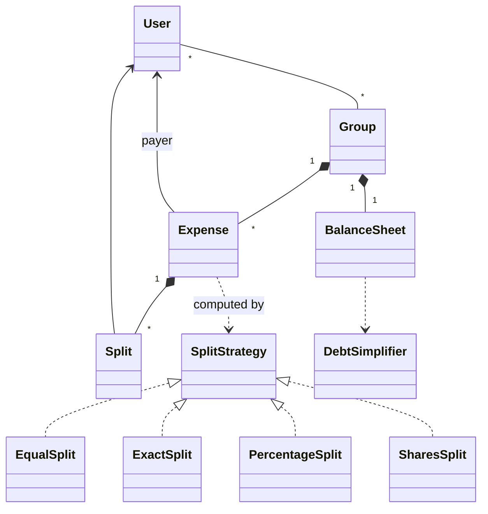

# 43 — Splitwise (LLD Interview Walkthrough)

> **Why this problem?** Total tonal shift from the device problems (Parking Lot → Coffee Vending). No hardware, no state machine, no concurrency. Splitwise is the **algorithm + ledger** problem of the LLD canon. The two interview-decisive questions: (1) "given Equal / Exact / Percentage / Shares splits, model them cleanly without if/else explosions" and (2) "given a tangled web of debts, what's the minimum number of payments to settle?" — that second one is a *real graph algorithm*, and most candidates have never thought about it. Master both and you've got the template for any debt/credit/ledger product: Splitwise, Khatabook, Settle Up, internal expense apps.

---

## 1. The Setup

> Interviewer: *"Design Splitwise."*

The traps:

1. Trying to track each expense forever and "look it up" when settling. The senior insight: keep a *running balance sheet* `balances: Map<userId, Map<userId, amount>>`, and every expense just updates it. The full expense history is for audit/UI — not for arithmetic.
2. Splits as `if (type === EQUAL) … else if (type === EXACT) …`. Senior version: `SplitStrategy` interface with one method.
3. Skipping debt simplification entirely. If you bring it up unprompted — *"by the way, we can reduce N² potential transactions to at most N−1 settlements with this greedy max-flow style algorithm"* — you instantly look like a senior.

---

## 2. Requirements Clarification (Phase 1 — ~8 min)

### 2.1 Functional questions

| # | Question | Why it matters |
|---|---|---|
| Q1 | One-on-one expenses, group expenses, or both? | Group entity |
| Q2 | Which split types — Equal, Exact (per-person amounts), Percentage, Shares? | Strategy variants |
| Q3 | Can the payer be split-on too (i.e. payer paid for everyone *including* themselves)? | Standard yes; subtle modeling |
| Q4 | Can users be in multiple groups? | Many-to-many |
| Q5 | Should we show *simplified* debts or raw pairwise debts? | Two distinct views |
| Q6 | Allow editing or deleting past expenses? | Audit log + balance recompute |
| Q7 | Multi-currency? | Currency on Expense, conversion rates |
| Q8 | Settle-up flow — record a payment from one user to another? | Settlement is just a special "Expense" with reversed direction |
| Q9 | Activity feed / notifications? | Observer pattern |

### 2.2 Non-functional

- **Correctness over speed** — money math must be **exact** (no floats), and any expense edit must produce a consistent ledger.
- **Concurrency** — two users adding expenses to the same group must not lose updates. (DB-level row locking on the balance sheet.)
- **Auditability** — full expense history is the source of truth; the balance sheet is a *derivable cache*.

### 2.3 The scope lock

> *"OK, scoping: Users, Groups, Expenses. 4 split types — Equal, Exact, Percentage, Shares — via `SplitStrategy`. Per-user pairwise balance sheet. Settle-up modeled as a reverse expense. Debt simplification on demand (it's expensive — we don't run it on every add). Single currency for now; multi-currency in extensions. Activity feed via Observer. No edit/delete today — extension. Money stored as integer paise to avoid float bugs."*

---

## 3. Entity Modeling (Phase 2 — ~5 min)

### The key insight — the balance sheet is the source of arithmetic truth

```
For pairwise balances, we keep:
  balances: Map<userId, Map<userId, amount>>

Convention: balances[A][B] = +X means "A owes B X"
            balances[B][A] = -X (the opposite view)

We update both sides on every expense to keep the data symmetric.
That way "what's the net between A and B?" is O(1):
  balances[A].get(B) ?? 0

When summing across the group, A's NET balance is:
  sum over all B of balances[A][B]
  positive = A is in debt (owes net)
  negative = A is owed net
```

Storing it this way means:
- O(1) "what does A owe B?"
- O(N) "what is A's net position in the group?"
- O(N²) full snapshot of the group

That's the right time-vs-space trade for a system whose dominant queries are "show me my dashboard" (per-user) and "show me the group" (group-scoped).

### Entities

| Entity | Role | Notes |
|---|---|---|
| `User` | A person | id, name, email |
| `Group` | A collection of users sharing expenses | Roomies, Goa trip, etc. |
| `Expense` | One spending event | payer + total + splits |
| `Split` | One participant's share | userId + amount |
| `SplitStrategy` | How to compute splits | Equal / Exact / Percentage / Shares |
| `BalanceSheet` | The ledger | `Map<userId, Map<userId, amount>>` |
| `DebtSimplifier` | Algorithm to minimize transactions | Greedy or max-flow |
| `Settlement` | A payment between two users | Modeled as an inverse Expense |
| `ActivityObserver` | Notifications, feed | |
| `Money` (value type) | **Integer paise** | Never use floats for money |

---

## 4. UML (Phase 3 — ~5 min)

```
┌──────────────┐        ┌──────────────┐
│    User      │        │    Group     │
│  id, name    │◄──────►│  id, name    │
└──────────────┘  many  │  members[]   │
                        └──────┬───────┘
                               │ 1..*
                               ▼
                         ┌──────────────┐
                         │   Expense    │
                         │  - id        │
                         │  - payer     │
                         │  - amount    │   (integer paise)
                         │  - splits[]  │
                         │  - createdAt │
                         └──────┬───────┘
                                │
                                ▼
                         ┌──────────────┐
                         │    Split     │
                         │  user, amount│
                         └──────────────┘
                                ▲
                                │ produced by
                                │
        ┌────────────────────────┴───────────────────────┐
        │              «interface»                       │
        │            SplitStrategy                       │
        │  + computeSplits(payer, total, inputs):Split[] │
        └─────▲────────▲────────▲────────▲───────────────┘
              │        │        │        │
            Equal    Exact   Percent   Shares

┌──────────────────────────────────┐    ┌──────────────────────────────────┐
│         BalanceSheet             │    │      DebtSimplifier              │
│  Map<userId,Map<userId,amount>>  │───►│  + simplify(balances): Txn[]     │
│  + recordExpense(expense)        │    │   (greedy max-flow style)        │
│  + netBalanceOf(userId)          │    └──────────────────────────────────┘
│  + pairwise(a, b)                │
└──────────────────────────────────┘

«Observer»  ActivityObserver  (expense-added, settled, alert)
```



---

## 5. Design Patterns Chosen + The Algorithm (Phase 4 — ~3 min)

| Pattern | Where | Why |
|---|---|---|
| **Strategy** | `SplitStrategy` (Equal / Exact / Percentage / Shares) | Each split mode is an independent algorithm |
| **Observer** | `ActivityObserver` | Activity feed, push notifications, email |
| **Value Object** | `Money` (int paise) | Avoid float bugs |
| **Repository-ish** | `BalanceSheet` | Derived state with a clean API |
| **Strategy** *(algorithm)* | `DebtSimplifier` (Greedy or Min-Cash-Flow) | Pluggable: greedy is fast & near-optimal, optimal needs DP |

### The debt-simplification algorithm — the senior moment

Suppose net positions after all expenses:
```
Alice:  +100  (owes net)
Bob:    -200  (owed net)
Carol:  -100  (owed net)
Dave:   +200  (owes net)
                ──── sum is always 0
```

Pairwise debts might be: Alice→Bob 50, Alice→Carol 50, Dave→Bob 150, Dave→Carol 50. That's **4 transactions**. After simplification: Alice→Bob 100, Dave→Carol 100, Dave→Bob 100. That's **3 transactions** — still 3 here, but for larger groups the savings are huge.

**The greedy algorithm (Min-Cash-Flow):**

```
1. Compute every user's NET balance.
2. Put debtors (net > 0) in a max-heap. Put creditors (net < 0) in a max-heap of absolute amounts.
3. While both heaps non-empty:
     pop the biggest debtor D and biggest creditor C
     pay = min(D, |C|)
     emit Txn(D → C, pay)
     update remaining amounts; push back if non-zero
4. Total transactions ≤ N − 1. (In practice often much less.)
```

This is **not optimal** in the worst case (the optimal version is NP-hard — equivalent to subset-sum). But the greedy gets close enough for all practical Splitwise-sized groups, and it's O(N log N) — fast enough to run on every "Simplify" button press.

---

## 6. TypeScript Code (Phase 5 — ~25 min)

### 6.1 Money — integer paise, never float

```typescript
// Money in PAISE (smallest unit). 100 paise = ₹1.
// All math is integer. Display layer converts back to ₹.
export type Money = number;

export const rupees = (r: number): Money => Math.round(r * 100);
export const toRupees = (p: Money): string => (p / 100).toFixed(2);
```

> **Why this matters.** `0.1 + 0.2 !== 0.3` in JavaScript. Use integer paise everywhere. The display layer is the *only* place floats are tolerated, and only for formatting.

### 6.2 User, Group

```typescript
export class User {
  constructor(
    public readonly id: string,
    public readonly name: string,
    public readonly email: string,
  ) {}
}

export class Group {
  public balanceSheet: BalanceSheet;
  public expenses: Expense[] = [];
  private observers: ActivityObserver[] = [];

  constructor(
    public readonly id: string,
    public readonly name: string,
    public readonly members: User[],
  ) {
    this.balanceSheet = new BalanceSheet(members.map(m => m.id));
  }

  addObserver(o: ActivityObserver) { this.observers.push(o); }

  addExpense(e: Expense): void {
    this.expenses.push(e);
    this.balanceSheet.recordExpense(e);
    this.observers.forEach(o => o.onExpenseAdded(e));
  }

  // Settle-up = reverse expense: A pays B back X → A's debt to B drops by X.
  settle(from: User, to: User, amount: Money): Expense {
    const settlement = new Expense(
      `S-${Date.now()}`,
      to,                   // the receiver is the "payer" of the reverse expense
      amount,
      [new Split(from, amount)], // the sender takes the full split
      "Settlement",
    );
    this.addExpense(settlement);
    return settlement;
  }
}
```

### 6.3 Split & Expense

```typescript
export class Split {
  constructor(public readonly user: User, public readonly amount: Money) {}
}

export class Expense {
  constructor(
    public readonly id: string,
    public readonly payer: User,
    public readonly amount: Money,        // total in paise
    public readonly splits: Split[],
    public readonly description: string = "",
    public readonly createdAt: Date = new Date(),
  ) {
    const total = splits.reduce((s, x) => s + x.amount, 0);
    if (total !== amount) {
      throw new Error(`Splits sum (${total}) ≠ amount (${amount})`);
    }
  }
}
```

> **The invariant check in the constructor is non-negotiable.** Bugs that violate "splits sum equals total" silently corrupt every balance forever. Fail loudly at construction time.

### 6.4 Split strategies

```typescript
export interface SplitStrategy {
  // Returns splits whose amounts sum to `amount`.
  // `inputs` carries per-strategy params (exact amounts, percentages, share counts).
  computeSplits(amount: Money, participants: User[], inputs?: Record<string, number>): Split[];
}

// EQUAL — divide evenly. Handles remainder by spreading paise across participants.
export class EqualSplit implements SplitStrategy {
  computeSplits(amount: Money, participants: User[]): Split[] {
    const n = participants.length;
    const base = Math.floor(amount / n);
    const remainder = amount - base * n;            // 0 ≤ remainder < n
    // First `remainder` participants get one extra paisa each
    return participants.map((u, i) =>
      new Split(u, base + (i < remainder ? 1 : 0))
    );
  }
}

// EXACT — caller specifies amount for each participant (in paise)
export class ExactSplit implements SplitStrategy {
  // inputs: { [userId]: amount in paise }
  computeSplits(amount: Money, participants: User[], inputs: Record<string, number>): Split[] {
    const splits = participants.map(u => new Split(u, inputs[u.id] ?? 0));
    const sum = splits.reduce((s, x) => s + x.amount, 0);
    if (sum !== amount) throw new Error(`Exact splits sum (${sum}) ≠ total (${amount})`);
    return splits;
  }
}

// PERCENTAGE — caller specifies percentage for each. Sum must be 100.
export class PercentageSplit implements SplitStrategy {
  // inputs: { [userId]: percentage e.g. 25 for 25% }
  computeSplits(amount: Money, participants: User[], inputs: Record<string, number>): Split[] {
    const sumP = Object.values(inputs).reduce((s, x) => s + x, 0);
    if (sumP !== 100) throw new Error(`Percentages sum to ${sumP}, not 100`);
    // Compute raw amounts; distribute rounding remainder
    const raw = participants.map(u => Math.floor((amount * (inputs[u.id] ?? 0)) / 100));
    const remainder = amount - raw.reduce((s, x) => s + x, 0);
    return participants.map((u, i) =>
      new Split(u, raw[i] + (i < remainder ? 1 : 0))
    );
  }
}

// SHARES — caller gives share counts (e.g., 1, 2, 3); split proportionally
export class SharesSplit implements SplitStrategy {
  // inputs: { [userId]: shareCount e.g. 2 means "two shares" }
  computeSplits(amount: Money, participants: User[], inputs: Record<string, number>): Split[] {
    const shares = participants.map(u => inputs[u.id] ?? 0);
    const totalShares = shares.reduce((s, x) => s + x, 0);
    if (totalShares === 0) throw new Error(`Total shares must be > 0`);
    const raw = shares.map(s => Math.floor((amount * s) / totalShares));
    const remainder = amount - raw.reduce((s, x) => s + x, 0);
    return participants.map((u, i) =>
      new Split(u, raw[i] + (i < remainder ? 1 : 0))
    );
  }
}
```

> **The remainder trick:** when splitting ₹100 three ways, you can't give each exactly ₹33.33. Integer math gives 3333 paise each = ₹99.99 → 1 paisa unaccounted for. We spread the remainder across the first K participants. This guarantees exact sums and is fair *on average* across many expenses.

### 6.5 BalanceSheet — the ledger

```typescript
export class BalanceSheet {
  // balances[a][b] = +X means "a owes b X paise"
  private balances = new Map<string, Map<string, Money>>();

  constructor(memberIds: string[]) {
    for (const id of memberIds) this.balances.set(id, new Map());
  }

  pairwise(a: string, b: string): Money {
    return this.balances.get(a)?.get(b) ?? 0;
  }

  // After an expense by P for participants {p1, p2, p3}:
  //   each participant (other than P) owes P their split.
  recordExpense(e: Expense): void {
    for (const s of e.splits) {
      if (s.user.id === e.payer.id) continue;          // payer doesn't owe themselves
      this.adjust(s.user.id, e.payer.id, s.amount);    // debtor → creditor
    }
  }

  // owe: u1 → u2 by `delta`. Negative delta reverses.
  private adjust(u1: string, u2: string, delta: Money): void {
    const cur12 = this.balances.get(u1)!.get(u2) ?? 0;
    const cur21 = this.balances.get(u2)!.get(u1) ?? 0;
    // We net both directions to keep the sheet collapsed
    const net = cur12 - cur21 + delta;
    this.balances.get(u1)!.delete(u2);
    this.balances.get(u2)!.delete(u1);
    if (net > 0)      this.balances.get(u1)!.set(u2, net);
    else if (net < 0) this.balances.get(u2)!.set(u1, -net);
  }

  netBalanceOf(userId: string): Money {
    // Positive = this user owes net. Negative = this user is owed net.
    let net = 0;
    const owes = this.balances.get(userId);
    if (owes) for (const v of owes.values()) net += v;
    for (const [other, m] of this.balances) {
      if (other === userId) continue;
      const x = m.get(userId);
      if (x) net -= x;
    }
    return net;
  }

  allEdges(): Array<{ from: string; to: string; amount: Money }> {
    const out: Array<{ from: string; to: string; amount: Money }> = [];
    for (const [from, m] of this.balances) {
      for (const [to, amt] of m) {
        if (amt > 0) out.push({ from, to, amount: amt });
      }
    }
    return out;
  }
}
```

### 6.6 DebtSimplifier — the algorithm

```typescript
export interface Settlement { from: string; to: string; amount: Money; }

export class DebtSimplifier {
  // Greedy: pop biggest debtor and biggest creditor; settle min(|d|, |c|).
  simplify(memberIds: string[], sheet: BalanceSheet): Settlement[] {
    // 1) Compute net balance per user
    const net = new Map<string, number>();
    for (const id of memberIds) net.set(id, sheet.netBalanceOf(id));

    // 2) Split into debtors (owes) and creditors (owed)
    type Entry = { id: string; amt: number };
    const debtors:  Entry[] = []; // amt > 0
    const creditors: Entry[] = []; // amt > 0 (we store as absolute)
    for (const [id, n] of net) {
      if (n > 0) debtors.push({ id, amt: n });
      else if (n < 0) creditors.push({ id, amt: -n });
    }

    // 3) Two-pointer greedy
    const out: Settlement[] = [];
    debtors.sort((a, b) => b.amt - a.amt);
    creditors.sort((a, b) => b.amt - a.amt);
    let i = 0, j = 0;
    while (i < debtors.length && j < creditors.length) {
      const d = debtors[i], c = creditors[j];
      const pay = Math.min(d.amt, c.amt);
      out.push({ from: d.id, to: c.id, amount: pay });
      d.amt -= pay; c.amt -= pay;
      if (d.amt === 0) i++;
      if (c.amt === 0) j++;
    }
    return out;
  }
}
```

> **Algorithmic note.** This greedy is **not** the *minimum-cardinality* settlement (that's NP-hard). It's *near-optimal in practice* — at most `N−1` transactions, often far fewer for typical Splitwise groups. For interview purposes, mention both: "I'm using greedy max-flow style; the optimal solution is NP-hard (subset-sum reduction)."

### 6.7 Activity feed (Observer)

```typescript
export interface ActivityObserver {
  onExpenseAdded(e: Expense): void;
  onSettled(s: Settlement): void;
}

export class ConsoleFeed implements ActivityObserver {
  onExpenseAdded(e: Expense) {
    console.log(`[ACTIVITY] ${e.payer.name} paid ₹${toRupees(e.amount)} for "${e.description}" (split ${e.splits.length} ways)`);
  }
  onSettled(s: Settlement) {
    console.log(`[ACTIVITY] settle ${s.from} → ${s.to} ₹${toRupees(s.amount)}`);
  }
}
```

### 6.8 Driver

```typescript
const alice = new User("u1", "Alice", "alice@x.com");
const bob   = new User("u2", "Bob",   "bob@x.com");
const carol = new User("u3", "Carol", "carol@x.com");
const dave  = new User("u4", "Dave",  "dave@x.com");

const trip = new Group("g1", "Goa Trip", [alice, bob, carol, dave]);
trip.addObserver(new ConsoleFeed());

// 1) Alice paid ₹4000 for the hotel — equal split among all 4
const eq = new EqualSplit();
trip.addExpense(new Expense(
  "E-1", alice, rupees(4000),
  eq.computeSplits(rupees(4000), [alice, bob, carol, dave]),
  "Hotel",
));

// 2) Bob paid ₹2400 for taxis — exact split: Bob 600, Carol 600, Dave 1200
const ex = new ExactSplit();
trip.addExpense(new Expense(
  "E-2", bob, rupees(2400),
  ex.computeSplits(rupees(2400), [bob, carol, dave], { u2: rupees(600), u3: rupees(600), u4: rupees(1200) }),
  "Taxis",
));

// 3) Carol paid ₹1500 for dinner — percentage split: Carol 50%, Alice 25%, Dave 25%
const pc = new PercentageSplit();
trip.addExpense(new Expense(
  "E-3", carol, rupees(1500),
  pc.computeSplits(rupees(1500), [carol, alice, dave], { u3: 50, u1: 25, u4: 25 }),
  "Dinner",
));

// 4) Show pairwise debts
console.log("Pairwise:", trip.balanceSheet.allEdges());

// 5) Simplify and print settlements
const simplifier = new DebtSimplifier();
const txns = simplifier.simplify([alice, bob, carol, dave].map(u => u.id), trip.balanceSheet);
console.log("Simplified:", txns);

// 6) Settle one of them — Alice pays Bob what's owed
const settle = txns.find(t => t.from === "u1");
if (settle) trip.settle(alice, bob, settle.amount);
```

Run this and you'll see ~6 pairwise edges collapse to ≤3 settlements.

---

## 7. Extension Follow-Ups (Phase 6 — ~5 min)

### 7.1 "Multi-currency expenses."
Add `currency` to `Expense`. Store balances in a *base currency* (the group's home currency), converting at expense creation using a fetched FX rate. Persist both: the original amount and the converted amount. This is what real Splitwise does. The trick: the FX rate at creation is the contract — later rate changes don't retroactively modify past balances. (Same as accounting double-entry.)

### 7.2 "Edit / delete past expenses."
Don't mutate. **Append a reversing entry** (debit the old, credit the new) — same as accounting. The balance sheet is then trivially recomputable by replaying all events. This is **event sourcing** in miniature. If you mutate in place, audit-trail and concurrency become hellish.

### 7.3 "Settle up records — show 'You paid Bob ₹500 on Mar 12'."
Settlements are already `Expense`s in our model — they participate in the same feed. The UI just renders them with a different icon/label.

### 7.4 "Activity feed across N devices."
Promote `ActivityObserver` to an event bus (Kafka, SNS). Each device subscribes. Same interface, different transport. (You've heard this song before — Parking Lot lesson 35's "scale display board" answer is identical in shape.)

### 7.5 "What if N is huge — say a 10K-person company-wide kitty?"
- The balance sheet is sparse — most pairs of people never transact. Use a `Map` (as we do), not a 2D array.
- The simplifier is O(N log N). 10K = 130K operations. Fast.
- Pre-aggregate within sub-groups (departments). Settle within department first, then cross-department.

### 7.6 "Concurrency — two users on the same group add expenses simultaneously."
The `BalanceSheet.adjust` reads then writes. In a single-process JS model, the event loop serializes. In a DB-backed real system, wrap `recordExpense` in a transaction with row-level locks on the two affected balance rows. Or use **optimistic concurrency** — read a version number, write a CAS update; retry on conflict. Same pattern as everywhere else in distributed LLD.

---

## 8. Real-World Production Notes

- **Splitwise** runs the simplify algorithm in the background only when the user clicks "Simplify Debts". The default view shows raw pairwise — because some users *want* to settle directly with the person they actually owed money to (not a stranger the algorithm chose). UX > theoretical optimality.
- **Currency rates** — Splitwise uses a snapshotted rate per expense (fetched once, never refetched). This is the same idea as how Stripe charges are denominated.
- **The optimal version is NP-hard** — equivalent to the subset-sum problem. Greedy is the industry standard.
- **A well-known bug class** — *float drift*. Add 100 expenses of ₹0.10 each and you'll get ₹9.999999… if you use floats. Always integer paise. Splitwise's storage is in cents/paise, exactly like in our code.
- **Khatabook** (Indian shopkeeper app) is the same data model under a different UX — a shopkeeper's ledger is just a one-way balance sheet (every customer owes the shopkeeper; settlements are inbound payments).

---

## 9. Interview Questions (with answers)

**Q1. Why store balances as `Map<userId, Map<userId, amount>>` instead of a list of `(from, to, amount)` records?**
Because the dominant query — "what's the net between A and B?" — must be O(1). A list forces a linear scan over every record for every read. The double-map gives O(1) reads and O(1) writes. The cost is keeping both sides synchronized; we do that by netting in `adjust` (we never store both `A→B` and `B→A` simultaneously). The full expense history is still kept separately for audit — but it's not the *source* of arithmetic truth, just the *source* of *history*.

**Q2. Walk me through what happens when Alice pays ₹3000 split equally among Alice, Bob, Carol.**
`EqualSplit.computeSplits(3000_00, [Alice, Bob, Carol])` returns three splits of 1000_00 each. The `Expense` is created and validates: 1000 × 3 = 3000 ✓. `recordExpense` iterates `splits`: skip Alice (she's the payer), then for Bob: `adjust(Bob → Alice, 1000_00)`; for Carol: `adjust(Carol → Alice, 1000_00)`. After this, `balances[Bob][Alice] = 1000_00` and `balances[Carol][Alice] = 1000_00`. `netBalanceOf(Alice) = -2000_00` (owed). `netBalanceOf(Bob) = +1000_00` (owes). The whole flow is ~6 map operations.

**Q3. Why is each split type a separate class instead of a method on `Expense`?**
Each algorithm has different inputs: exact split needs per-user amounts; percentage needs percentages summing to 100; shares needs share counts. Encoding all of them as methods on `Expense` makes the API a switch-on-type. With a `SplitStrategy` interface, adding a new split mode ("by-item" for a shared grocery bill) is one new class. Same Open/Closed reasoning as everywhere else. Bonus: each strategy *validates its own inputs* in `computeSplits` — a percentage strategy enforces "sum is 100" right at the source.

**Q4. The debt simplifier is greedy. What's the optimal version, and why don't we use it?**
The optimal *minimum-number-of-transactions* version is NP-hard — equivalent to subset-sum (the set of "zero-summing subsets" you can match exactly equals the savings). The greedy "biggest debtor pays biggest creditor" runs in O(N log N) and produces at most N−1 transactions — usually much less. For Splitwise-scale groups (≤ 50 people), the difference between greedy and optimal is rarely more than 1–2 settlements; the user-facing benefit of optimal isn't worth the algorithmic cost. The pluggable `DebtSimplifier` lets you swap in an exhaustive search for tiny groups if you wanted.

**Q5. How do you handle the rounding error when splitting ₹10 three ways?**
₹10 = 1000 paise; 1000 / 3 = 333 each, remainder 1. We spread the remainder across the first K participants — so split is `[334, 333, 333]` paise. Sum: 1000 ✓. Over many expenses across the same group, this is fair on average (each member gets the "extra paisa" roughly 1/N of the time). The lesson here: **never use floats for money; always reconcile remainders explicitly**. This is the #1 most common bug in fintech LLD.

**Q6. (Trap) Should `User` have a `balance` field?**
No. Balance is a *derived* quantity — it's a function of all the expenses in all the groups the user belongs to. Putting it on `User` means every expense write has to update it, and any bug results in `User.balance` drifting from the truth. Keep the source of truth in `BalanceSheet`, and treat `User` as immutable identity. The same trap as `Vehicle.park()` or `Member.borrow()` in earlier lessons — entities should not carry state that's better held as a relationship.

---

## 10. The Cheat-Sheet (last-minute revision)

```
Big idea:  Source of arithmetic truth = BalanceSheet (Map<u, Map<u, money>>)
           Source of history truth   = Expense list
           Money is INTEGER PAISE, never float.
           Splits are a Strategy. Debt simplification is a graph algorithm.

Patterns:
  Strategy (split)   → Equal / Exact / Percentage / Shares
  Strategy (simplify)→ Greedy / Optimal (NP-hard alternative)
  Observer          → ActivityObserver (feed, notifications)
  Value Object      → Money (paise)
  (NOT used)        → Singleton, Factory, State machine — they don't fit

Balance update on expense:
  for split in expense.splits:
      if split.user == payer: continue
      adjust(split.user → payer, split.amount)
  adjust collapses both directions:
      net = bal[u1][u2] - bal[u2][u1] + delta
      if net > 0: bal[u1][u2] = net
      else:       bal[u2][u1] = -net

Simplification (greedy):
  1. net[u] = sum over v of bal[u][v] − sum over v of bal[v][u]
  2. debtors  = users with net > 0
     creditors = users with net < 0
  3. sort both by abs(amt) descending
  4. while both non-empty:
        pay = min(top debtor, top creditor)
        emit txn(debtor → creditor, pay)
        decrement both
  Result: ≤ N−1 transactions. NP-hard to truly minimize.

Rounding:
  base = floor(amount / n); rem = amount − base*n
  first `rem` participants get `base + 1`, others get `base`.
  Always: sum of splits == amount, exactly.

Edits / deletes:
  Append reversing entry (don't mutate). Event sourcing in miniature.

Traps:
  - Floats for money (use paise)
  - `User.balance` field (balance is derived, not owned)
  - Walking expense list to compute "what does A owe B" (use the sheet)
  - if/else on split type (use SplitStrategy)
  - Forgetting the rounding remainder (splits stop summing to total)
  - Mutating past expenses on edit (use reversing entries)

Generalizes to: Khatabook, Settle Up, internal expense apps, any
peer-to-peer credit/debit ledger, microtransaction wallets.
```

You now have the playbook for any **ledger / debt** problem: Splitwise, Khatabook, employee expense reimbursement, internal company "team kitty", in-game currency exchange, any p2p IOU system. The shape — `Strategy for split modes + double-map balance sheet + greedy graph simplification + integer money + event-sourced edits` — is invariant.
