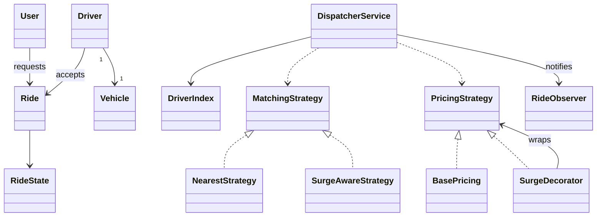

# 44 — Cab Booking System / Uber-Ola (LLD Interview Walkthrough)

> **Why this problem?** It's the **capstone problem of Phase 7** — it pulls together everything from the previous lessons: a state machine on `Ride` (lesson 39's ATM idea), a matching dispatcher with pluggable strategy (lesson 38's elevator scheduler), surge pricing as a Strategy *decorated* over base pricing (lessons 22 + 26 paying off), real-time location updates via Observer (lesson 27), and concurrency control on driver acceptance (lesson 37's seat-lock). Master this and you've finished the device/system tier of LLD; only logger/rate-limiter/cache problems remain.

---

## 1. The Setup

> Interviewer: *"Design a cab booking system like Uber or Ola."*

The senior framing in one sentence: *"This is a matching problem on a stream of `RideRequest`s against a stream of `Driver` locations, with a pluggable matching policy, a pluggable pricing policy that includes a surge decorator, and a state machine on each `Ride`."*

The interviewer will then watch how you handle the four moments that decide the interview:

1. **Driver discovery at scale** — you cannot scan a million drivers per request. You need a **spatial index** (grid, geohash, or quadtree).
2. **Surge pricing** — how do you avoid one giant `if (demand > supply) priceMultiplier = 2`? Use a Strategy *decorator*.
3. **The race when two riders pick the same driver** — see lesson 37 (movie-ticket seat locking). It's the same primitive.
4. **The state machine** — `REQUESTED → MATCHED → DRIVER_ARRIVING → IN_RIDE → COMPLETED / CANCELLED` (and each cancellation reason is different).

---

## 2. Requirements Clarification (Phase 1 — ~10 min)

### 2.1 Functional questions

| # | Question | Why it matters |
|---|---|---|
| Q1 | Cab types — Mini / Sedan / SUV / Auto / Bike / Pool? | Affects matching filter + pricing |
| Q2 | Surge pricing? When does it kick in — demand/supply ratio, time of day, weather? | Pricing strategy decorator |
| Q3 | Live driver locations — how often do drivers ping? | Affects index update strategy |
| Q4 | What if no driver accepts? | Auto-cancel + alternate matching |
| Q5 | Cancellation rules — by rider before pickup, by driver, mid-ride? | State machine + fees |
| Q6 | Payment — pay-on-app, cash, wallet, split-fare? | Strategy + post-ride flow |
| Q7 | Scheduled rides (book for 7 AM tomorrow)? | Separate flow / queue |
| Q8 | Multi-stop trips? | Route entity, fare calculation |
| Q9 | Ratings, reviews? | Post-ride entities |
| Q10 | Real-time tracking for the rider? | Live location pushes via Observer |

### 2.2 Non-functional

- **Latency** — driver match must complete in <3 seconds (industry standard).
- **Scale** — at peak: ~1M concurrent drivers globally, ~10M ride requests/hour.
- **Geography** — drivers are NOT uniformly distributed; you can't iterate all of them.
- **Concurrency** — when 5 riders request near each other, the dispatcher must not assign the same driver to two of them.

### 2.3 The scope lock

> *"OK, scoping: Mini / Sedan / SUV / Auto cab types. Surge pricing as a multiplier strategy when (demand/supply) > 1.5 in a region. Drivers ping their location every ~10s; we maintain a spatial index for fast nearest-driver queries. State machine on Ride: REQUESTED → MATCHED → DRIVER_ARRIVING → IN_RIDE → COMPLETED, with CANCELLED as a possible end-state from any pre-IN_RIDE state. Driver-acceptance lock prevents double assignment (same primitive as seat-lock in lesson 37). 3 payment methods. Scheduled rides + multi-stop + pool as extensions."*

---

## 3. Entity Modeling (Phase 2 — ~5 min)

### Two big mental models

**A. The dispatcher is a streaming-join engine.**
On one side a stream of ride requests; on the other a stream of driver-location pings; the dispatcher joins them by proximity + cab-type filters. That's the abstraction worth holding in your head — everything else is plumbing.

**B. The spatial index is the *whole* scale story.**
Without it, every ride request runs O(D) over all drivers. With a grid/geohash/quadtree, it's O(K) where K is drivers in the relevant cell — usually 5–20.

### Entities

| Entity | Role | Notes |
|---|---|---|
| `User` | Rider profile | |
| `Driver` | Driver + their car | Owns `currentLocation`, `status: AVAILABLE/ON_TRIP/OFFLINE` |
| `Location` | `(lat, lng)` value object | |
| `Vehicle` | Type + plate + capacity | (sub-types not needed — data) |
| `Ride` | A trip from A→B | State machine |
| `RideRequest` | What the rider submits | |
| `RideState` | enum + transitions | |
| `DriverIndex` | Spatial index over drivers | Pluggable: Grid / Geohash / Quadtree |
| `MatchingStrategy` | Decides which driver gets the request | NearestAvailable / SurgeAware / Pool |
| `PricingStrategy` | Computes fare | Base + per-km + per-min + surge (decorator) |
| `RideObserver` | Live updates (rider/driver app, ops dashboard) | |
| `DispatcherService` | Orchestrator | Singleton |
| `DriverAcceptanceLock` | Avoid double-assignment | Same primitive as seat-lock |

---

## 4. UML (Phase 3 — ~5 min)

```
┌─────────────────────┐     ┌─────────────────────┐
│       User          │     │       Driver        │
│  - id, name         │     │  - id, name         │
│  - homeLocation     │     │  - vehicle          │
└─────────────────────┘     │  - location         │
                            │  - status           │
                            └─────────┬───────────┘
                                      │ 1
                                      ▼
                              ┌──────────────┐
                              │   Vehicle    │
                              │  type, plate │
                              └──────────────┘

┌──────────────────────────────────────────┐
│           DispatcherService              │  ◀── Singleton
│  - drivers: Map<id, Driver>              │
│  - driverIndex: DriverIndex (spatial)    │
│  - rides: Map<id, Ride>                  │
│  - matchingStrategy                      │
│  - pricingStrategy                       │
│  + requestRide(request): Ride            │
│  + driverAccept(rideId, driverId)        │
│  + updateDriverLocation(d, loc)          │
└─────────────────────┬────────────────────┘
                      │
            uses ┌────┴─────┐ uses
                 ▼          ▼
        ┌────────────────┐  ┌────────────────────────┐
        │  «interface»   │  │  «interface»           │
        │ MatchingStrat. │  │  PricingStrategy       │
        │ + match(req,   │  │  + price(req): money   │
        │   index)       │  └─────────▲──────────────┘
        └───────▲────────┘            │
                │                     │
   Nearest / SurgeAware / Pool   BasePricing
                                    ▲
                                    │ wraps (Decorator)
                                    │
                              SurgeDecorator

┌──────────────────────┐
│        Ride          │
│  - rider, driver     │
│  - source, dest      │
│  - state             │ ─── REQUESTED → MATCHED →
│  - fare              │     DRIVER_ARRIVING → IN_RIDE →
│  - waypoints[]       │     COMPLETED / CANCELLED
└──────────────────────┘

«Observer»  RideObserver  (state change, location ping, fare update)
```



---

## 5. Design Patterns Chosen + Algorithms (Phase 4 — ~3 min)

| Pattern | Where | Why |
|---|---|---|
| **State** | `Ride` lifecycle | Each state allows different actions; cancellation logic differs by state |
| **Strategy** | `MatchingStrategy` (Nearest / SurgeAware / Pool) | Big variation axis |
| **Strategy + Decorator** | `PricingStrategy` (BasePricing wrapped by SurgeDecorator wrapped by CouponDecorator) | The dream use case for Decorator |
| **Observer** | `RideObserver` | Live updates to rider/driver app + ops dashboard |
| **Singleton** | `DispatcherService` | One coordinator per process/region |
| **Spatial index** | `GridIndex` (or geohash/quadtree) | The whole "Uber scale" story |
| **Lock + TTL** | `DriverAcceptanceLock` | Prevents double-assignment — exactly the seat-lock from lesson 37 |

### Why Decorator for surge pricing

Without Decorator:
```typescript
class Pricing {
  compute(req) {
    let p = base(req);
    if (isSurgeRegion(req.from)) p *= surgeMultiplier(req.from);
    if (req.couponCode)          p *= (1 - couponDiscount(req.couponCode));
    if (req.isLoyaltyMember)     p -= loyaltyCredit(req.user);
    return p;
  }
}
```
Five years from now this is a 600-line method. With Decorator:
```typescript
const pricing = new CouponDecorator(new SurgeDecorator(new BasePricing()));
pricing.price(req);
```
Each decorator is one focused class; you compose them per region/customer. **Open/Closed.**

### Why a spatial index

A naive `drivers.find(d => distance(d.location, request.location) < 2km)` is O(D). At Uber scale (~1M drivers), that's a million distance calculations per request. Spatial index = O(K) per query where K = drivers in the relevant cell. For a 500m × 500m grid in a dense city, K ≈ 10. **Five orders of magnitude faster.**

---

## 6. TypeScript Code (Phase 5 — ~30 min)

### 6.1 Enums + value types

```typescript
export enum CabType { MINI = "MINI", SEDAN = "SEDAN", SUV = "SUV", AUTO = "AUTO" }

export enum DriverStatus { OFFLINE = "OFFLINE", AVAILABLE = "AVAILABLE", ON_TRIP = "ON_TRIP" }

export enum RideState {
  REQUESTED        = "REQUESTED",
  MATCHED          = "MATCHED",          // driver accepted, en route to pickup
  DRIVER_ARRIVED   = "DRIVER_ARRIVED",   // at pickup, waiting for rider
  IN_RIDE          = "IN_RIDE",
  COMPLETED        = "COMPLETED",
  CANCELLED_RIDER  = "CANCELLED_RIDER",
  CANCELLED_DRIVER = "CANCELLED_DRIVER",
  CANCELLED_SYSTEM = "CANCELLED_SYSTEM", // no driver accepted in time
}

export class Location {
  constructor(public readonly lat: number, public readonly lng: number) {}
}

// Haversine distance, km — approximation good enough for matching
export function distanceKm(a: Location, b: Location): number {
  const R = 6371;
  const toRad = (d: number) => d * Math.PI / 180;
  const dLat = toRad(b.lat - a.lat);
  const dLng = toRad(b.lng - a.lng);
  const h = Math.sin(dLat/2)**2 +
            Math.cos(toRad(a.lat))*Math.cos(toRad(b.lat))*Math.sin(dLng/2)**2;
  return 2 * R * Math.asin(Math.sqrt(h));
}
```

### 6.2 Driver + Vehicle + User

```typescript
export class Vehicle {
  constructor(
    public readonly type: CabType,
    public readonly plate: string,
    public readonly capacity: number,
  ) {}
}

export class Driver {
  public location: Location;
  public status: DriverStatus = DriverStatus.OFFLINE;
  public rating: number = 4.8;

  constructor(
    public readonly id: string,
    public readonly name: string,
    public readonly vehicle: Vehicle,
    initial: Location,
  ) {
    this.location = initial;
  }
}

export class User {
  constructor(public readonly id: string, public readonly name: string) {}
}
```

### 6.3 RideRequest + Ride (with State machine)

```typescript
export class RideRequest {
  constructor(
    public readonly id: string,
    public readonly rider: User,
    public readonly pickup: Location,
    public readonly drop: Location,
    public readonly cabType: CabType,
    public readonly requestedAt: Date = new Date(),
  ) {}

  estimatedKm(): number { return distanceKm(this.pickup, this.drop); }
}

export class Ride {
  public state: RideState = RideState.REQUESTED;
  public driver: Driver | null = null;
  public fareEstimate: number = 0;
  public finalFare: number | null = null;
  public completedAt: Date | null = null;

  constructor(
    public readonly id: string,
    public readonly request: RideRequest,
  ) {}

  // Encapsulated transitions
  matchTo(driver: Driver): void {
    if (this.state !== RideState.REQUESTED) {
      throw new Error(`Cannot match in state ${this.state}`);
    }
    this.driver = driver;
    this.state = RideState.MATCHED;
  }

  driverArrived(): void {
    if (this.state !== RideState.MATCHED) throw new Error(`Illegal: ${this.state} → DRIVER_ARRIVED`);
    this.state = RideState.DRIVER_ARRIVED;
  }

  startRide(): void {
    if (this.state !== RideState.DRIVER_ARRIVED) throw new Error(`Illegal: ${this.state} → IN_RIDE`);
    this.state = RideState.IN_RIDE;
  }

  complete(finalFare: number): void {
    if (this.state !== RideState.IN_RIDE) throw new Error(`Illegal: ${this.state} → COMPLETED`);
    this.finalFare = finalFare;
    this.completedAt = new Date();
    this.state = RideState.COMPLETED;
  }

  cancel(by: "RIDER" | "DRIVER" | "SYSTEM"): void {
    if (this.state === RideState.IN_RIDE || this.state === RideState.COMPLETED) {
      throw new Error(`Cannot cancel a ride that is ${this.state}`);
    }
    this.state =
      by === "RIDER"  ? RideState.CANCELLED_RIDER  :
      by === "DRIVER" ? RideState.CANCELLED_DRIVER :
                        RideState.CANCELLED_SYSTEM;
  }
}
```

### 6.4 Spatial index — a simple grid

```typescript
// Each cell is ~500m × 500m at the equator. Tune for your city.
const CELL_DEG = 0.005;

function cellKey(loc: Location): string {
  const lat = Math.floor(loc.lat / CELL_DEG);
  const lng = Math.floor(loc.lng / CELL_DEG);
  return `${lat}:${lng}`;
}

export interface DriverIndex {
  upsert(driver: Driver): void;
  remove(driverId: string): void;
  nearby(loc: Location, radiusKm: number): Driver[];
}

export class GridIndex implements DriverIndex {
  // cellKey → set of driverIds; driverId → cellKey (for cheap removal)
  private cellToDrivers = new Map<string, Set<string>>();
  private driverToCell = new Map<string, string>();
  private byId = new Map<string, Driver>();

  upsert(d: Driver): void {
    const oldCell = this.driverToCell.get(d.id);
    const newCell = cellKey(d.location);
    if (oldCell === newCell) {
      this.byId.set(d.id, d);   // just refresh
      return;
    }
    if (oldCell) this.cellToDrivers.get(oldCell)?.delete(d.id);
    if (!this.cellToDrivers.has(newCell)) this.cellToDrivers.set(newCell, new Set());
    this.cellToDrivers.get(newCell)!.add(d.id);
    this.driverToCell.set(d.id, newCell);
    this.byId.set(d.id, d);
  }

  remove(driverId: string): void {
    const cell = this.driverToCell.get(driverId);
    if (cell) this.cellToDrivers.get(cell)?.delete(driverId);
    this.driverToCell.delete(driverId);
    this.byId.delete(driverId);
  }

  // Returns drivers whose cell is within ⌈radius/cellSize⌉ cells of the query
  nearby(loc: Location, radiusKm: number): Driver[] {
    // Convert radius (km) to degrees roughly — coarse but fine for matching
    const radiusDeg = radiusKm / 111;
    const cellRadius = Math.ceil(radiusDeg / CELL_DEG);
    const centerLat = Math.floor(loc.lat / CELL_DEG);
    const centerLng = Math.floor(loc.lng / CELL_DEG);
    const out: Driver[] = [];
    for (let dlat = -cellRadius; dlat <= cellRadius; dlat++) {
      for (let dlng = -cellRadius; dlng <= cellRadius; dlng++) {
        const key = `${centerLat + dlat}:${centerLng + dlng}`;
        const ids = this.cellToDrivers.get(key);
        if (!ids) continue;
        for (const id of ids) {
          const d = this.byId.get(id);
          if (d && distanceKm(d.location, loc) <= radiusKm) out.push(d);
        }
      }
    }
    return out;
  }
}
```

> **Why a grid first instead of a geohash or quadtree?** Grid is the simplest spatial index that ships — uniform cell size, O(1) insert/move, O(K) query. Geohash adds string-based hierarchical prefixes for distributed sharding. Quadtree adapts cell size to density. *For an LLD interview, ship the grid and mention the others as scale-ups.* That sequence — simple correct → mention advanced — is senior signaling.

### 6.5 MatchingStrategy

```typescript
export interface MatchingStrategy {
  match(req: RideRequest, index: DriverIndex): Driver | null;
}

export class NearestAvailableStrategy implements MatchingStrategy {
  constructor(private searchRadiusKm: number = 3) {}

  match(req: RideRequest, index: DriverIndex): Driver | null {
    const candidates = index.nearby(req.pickup, this.searchRadiusKm)
      .filter(d => d.status === DriverStatus.AVAILABLE && d.vehicle.type === req.cabType);
    if (candidates.length === 0) return null;
    // Lowest distance
    return candidates.reduce((best, d) =>
      distanceKm(d.location, req.pickup) < distanceKm(best.location, req.pickup) ? d : best
    );
  }
}

// More advanced: factor rating and acceptance rate. Skipped for brevity.
```

### 6.6 PricingStrategy — Base + Surge Decorator

```typescript
export interface PricingStrategy {
  price(req: RideRequest): number;
}

const PER_KM: Record<CabType, number> = {
  MINI: 12, SEDAN: 16, SUV: 22, AUTO: 8,
};
const BASE_FARE: Record<CabType, number> = {
  MINI: 40, SEDAN: 60, SUV: 100, AUTO: 25,
};

export class BasePricing implements PricingStrategy {
  price(req: RideRequest): number {
    return Math.round(BASE_FARE[req.cabType] + PER_KM[req.cabType] * req.estimatedKm());
  }
}

// Decorator — multiplier based on demand/supply in the pickup region
export class SurgeDecorator implements PricingStrategy {
  constructor(
    private inner: PricingStrategy,
    private demandSupplyRatio: (loc: Location) => number,
  ) {}

  price(req: RideRequest): number {
    const r = this.demandSupplyRatio(req.pickup);
    const mult = r > 1.5 ? Math.min(r, 3.0) : 1.0;   // cap at 3x
    return Math.round(this.inner.price(req) * mult);
  }
}

// Another decorator example
export class CouponDecorator implements PricingStrategy {
  constructor(private inner: PricingStrategy, private discountPct: number) {}
  price(req: RideRequest): number {
    return Math.round(this.inner.price(req) * (1 - this.discountPct / 100));
  }
}
```

> **Composition is just nesting:** `new CouponDecorator(new SurgeDecorator(new BasePricing(), demand), 10)` gives base → surge → 10% coupon, in that order. Each decorator is replaceable. To run a 100%-coupon "first ride free" — wrap the same chain with a fixed `(p) => 0` decorator. **The pricing engine is open for new pricing rules without changing existing classes.**

### 6.7 DriverAcceptanceLock — same primitive as seat-lock

```typescript
type LockRec = { rideId: string; expiresAt: number };

export class DriverAcceptanceLock {
  private locks = new Map<string, LockRec>();   // driverId → lock
  constructor(private ttlMs: number = 30_000) {}

  // Try to reserve a driver for a ride. Returns true if acquired.
  tryAcquire(driverId: string, rideId: string): boolean {
    const now = Date.now();
    const rec = this.locks.get(driverId);
    if (rec && rec.expiresAt > now && rec.rideId !== rideId) return false;
    this.locks.set(driverId, { rideId, expiresAt: now + this.ttlMs });
    return true;
  }

  release(driverId: string): void { this.locks.delete(driverId); }
}
```

### 6.8 DispatcherService — the orchestrator

```typescript
export interface RideObserver {
  onRideStateChanged(ride: Ride): void;
  onFareEstimated(ride: Ride, fare: number): void;
}

export class DispatcherService {
  private static instance: DispatcherService | null = null;
  static getInstance(
    matching: MatchingStrategy = new NearestAvailableStrategy(),
    pricing: PricingStrategy = new BasePricing(),
  ): DispatcherService {
    if (!DispatcherService.instance)
      DispatcherService.instance = new DispatcherService(matching, pricing);
    return DispatcherService.instance;
  }

  private drivers = new Map<string, Driver>();
  private index: DriverIndex = new GridIndex();
  private rides = new Map<string, Ride>();
  private locks = new DriverAcceptanceLock();
  private observers: RideObserver[] = [];
  private rideSeq = 1;

  private constructor(
    private matching: MatchingStrategy,
    private pricing: PricingStrategy,
  ) {}

  addObserver(o: RideObserver) { this.observers.push(o); }
  setMatching(m: MatchingStrategy) { this.matching = m; }
  setPricing(p: PricingStrategy)   { this.pricing  = p; }

  // --- Driver side ---
  driverOnline(d: Driver): void {
    d.status = DriverStatus.AVAILABLE;
    this.drivers.set(d.id, d);
    this.index.upsert(d);
  }

  driverOffline(d: Driver): void {
    d.status = DriverStatus.OFFLINE;
    this.drivers.set(d.id, d);
    this.index.remove(d.id);
  }

  updateDriverLocation(driverId: string, loc: Location): void {
    const d = this.drivers.get(driverId);
    if (!d) return;
    d.location = loc;
    if (d.status === DriverStatus.AVAILABLE) this.index.upsert(d);
  }

  // --- Rider side ---
  requestRide(req: RideRequest): Ride {
    const ride = new Ride(`R-${this.rideSeq++}`, req);
    ride.fareEstimate = this.pricing.price(req);
    this.observers.forEach(o => o.onFareEstimated(ride, ride.fareEstimate));
    this.rides.set(ride.id, ride);

    // Match
    const driver = this.matching.match(req, this.index);
    if (!driver) {
      ride.cancel("SYSTEM");
      this.fireState(ride);
      return ride;
    }

    // Try to lock the driver for this ride
    if (!this.locks.tryAcquire(driver.id, ride.id)) {
      // Someone else got them — try again with the next nearest (production code retries with backoff)
      ride.cancel("SYSTEM");
      this.fireState(ride);
      return ride;
    }

    // Notify driver app — driver has e.g. 15s to confirm
    // (In real code: emit a "RideOffer" event; driver accepts via driverAccept())
    // For this LLD demo, auto-accept:
    this.driverAccept(ride.id, driver.id);
    return ride;
  }

  driverAccept(rideId: string, driverId: string): void {
    const ride = this.rides.get(rideId);
    const driver = this.drivers.get(driverId);
    if (!ride || !driver) throw new Error("Unknown ride/driver");
    if (driver.status !== DriverStatus.AVAILABLE) throw new Error("Driver not available");

    ride.matchTo(driver);
    driver.status = DriverStatus.ON_TRIP;
    this.index.remove(driverId);          // remove from pool while on trip
    this.fireState(ride);
  }

  driverArrived(rideId: string): void {
    const r = this.rides.get(rideId);
    if (!r) throw new Error(`Unknown ride ${rideId}`);
    r.driverArrived();
    this.fireState(r);
  }

  startRide(rideId: string): void {
    const r = this.rides.get(rideId);
    if (!r) throw new Error(`Unknown ride ${rideId}`);
    r.startRide();
    this.fireState(r);
  }

  completeRide(rideId: string, actualKm: number): void {
    const r = this.rides.get(rideId);
    if (!r) throw new Error(`Unknown ride ${rideId}`);
    // Recompute fare using actual distance — pricing chain still applies
    const adjustedReq = new RideRequest(
      r.request.id, r.request.rider, r.request.pickup, r.request.drop, r.request.cabType,
    );
    (adjustedReq as any).estimatedKm = () => actualKm;
    const finalFare = this.pricing.price(adjustedReq);
    r.complete(finalFare);

    // Return driver to pool
    if (r.driver) {
      r.driver.status = DriverStatus.AVAILABLE;
      this.locks.release(r.driver.id);
      this.index.upsert(r.driver);
    }
    this.fireState(r);
  }

  cancelByRider(rideId: string): void {
    const r = this.rides.get(rideId);
    if (!r) throw new Error(`Unknown ride ${rideId}`);
    r.cancel("RIDER");
    if (r.driver) {
      r.driver.status = DriverStatus.AVAILABLE;
      this.locks.release(r.driver.id);
      this.index.upsert(r.driver);
    }
    this.fireState(r);
  }

  private fireState(r: Ride) { this.observers.forEach(o => o.onRideStateChanged(r)); }
}
```

### 6.9 Driver

```typescript
const dispatcher = DispatcherService.getInstance(
  new NearestAvailableStrategy(3),
  new SurgeDecorator(new BasePricing(), () => 1.0), // no surge initially
);

dispatcher.addObserver({
  onRideStateChanged(r) { console.log(`[Ride ${r.id}] ${r.state}`); },
  onFareEstimated(r, f) { console.log(`[Ride ${r.id}] estimate ₹${f}`); },
});

// 3 drivers come online
const d1 = new Driver("D-1", "Anil", new Vehicle(CabType.MINI, "KA-01-1234", 4), new Location(12.97, 77.59));
const d2 = new Driver("D-2", "Sara", new Vehicle(CabType.SEDAN, "KA-01-5678", 4), new Location(12.98, 77.60));
const d3 = new Driver("D-3", "Imran", new Vehicle(CabType.MINI, "KA-02-9999", 4), new Location(13.00, 77.65));
dispatcher.driverOnline(d1);
dispatcher.driverOnline(d2);
dispatcher.driverOnline(d3);

// Rider requests a Mini
const ayush = new User("U-1", "Ayush");
const ride  = dispatcher.requestRide(new RideRequest(
  "Q-1", ayush, new Location(12.975, 77.595), new Location(12.95, 77.55), CabType.MINI,
));

// Lifecycle
dispatcher.driverArrived(ride.id);
dispatcher.startRide(ride.id);
dispatcher.completeRide(ride.id, 6.4);

// Swap pricing to "surge x2 in this region" for the next ride
dispatcher.setPricing(new SurgeDecorator(new BasePricing(), () => 2.0));
```

---

## 7. Extension Follow-Ups (Phase 6 — ~5 min)

### 7.1 "Pool / shared rides."
A `PoolMatchingStrategy` matches incoming requests against ongoing pool-eligible rides. The match adds the new rider to the existing ride as a *second leg*. Fare splits proportionally to distance. The state machine on `Ride` gains a `waypoints[]` and the strategy considers detour cost vs base fare savings. Modeled as a multi-stop trip with multiple riders.

### 7.2 "Scheduled rides — book at 7AM tomorrow."
A `ScheduledRequestQueue` keyed by time. A scheduler fires `requestRide()` ~10 minutes before pickup time. Everything downstream (matching, pricing, state machine) is unchanged — it's still a regular ride from the dispatcher's POV. Decoupling scheduling from matching is the senior shape; mixing them is the common trap.

### 7.3 "Real-time tracking for the rider."
Every driver location ping fires a `RideObserver.onDriverLocation(ride, location)` for the active ride. On the client, a `WebSocketObserver` pushes pings to the rider's app. Same pattern as everything else; only the transport changes.

### 7.4 "What's the ETA calculation?"
Out of scope for LLD — that's a routing service. But the design accommodates it cleanly: `RoutingService.eta(from, to)` is an interface; injection point is the dispatcher; concrete impl could be Mapbox / Google Directions / your own OSRM.

### 7.5 "Geosharding — Uber-scale dispatch across cities."
Each city/region has its own `DispatcherService` instance. A `Router` at the edge picks the dispatcher by pickup `Location → cityId`. Inter-region rides (taxi between cities) are rare and can be handled by a different flow. **Promote `DispatcherService` from a Singleton to a per-region instance kept in a registry.** Same step as elevator lesson 38's "multi-building" extension.

### 7.6 "Driver doesn't accept within 15 seconds."
The current code auto-accepts; production has a real offer-and-acceptance flow. Implementation: `requestRide` emits `RideOffer` to the matched driver, releases the lock if no `driverAccept` within 15s, and retries with the next-best match. Cap the retries (3) — if all fail, `cancel("SYSTEM")` and tell the rider. This is the classic *offer-with-timeout* pattern.

---

## 8. Real-World Production Notes

- **Uber's H3** — Uber publishes a hexagonal grid system called H3 (now open source). Hexagons have the nice property that all neighbors are equidistant from the center, which makes "expand my search radius" simpler than with squares. Conceptually the same as our grid; better packing properties.
- **Surge calibration** — real surge isn't `demand/supply > 1.5 ? 2x : 1x`. It's a continuous function, regenerated every 1–5 minutes per H3 cell, tied to a goal completion rate. Same Strategy interface, vastly more complex impl behind it.
- **Driver acceptance economics** — Uber tracks driver acceptance rate; low rate degrades match priority. Adds another input to `MatchingStrategy`. Add it as another scoring term, not a special case.
- **Disney-style "no-fault" cancellation tolerance** — production systems give riders 2 minutes of free cancellation, then a fee. Modeled cleanly via the state machine — only `CANCELLED_RIDER` from a `MATCHED` state when `now - matchedAt < 120s` is free.

---

## 9. Interview Questions (with answers)

**Q1. The naive matching is O(D). How does the grid index change the complexity, and what does a real production system use?**
Naive scan: for every ride request, compute distance to all D drivers — O(D) per request. With a grid indexed at ~500m cells, we only check drivers in the 3×3 cells around the pickup — average K drivers in dense urban areas is 10–30, even at peak. So O(K) per request. At Uber scale, that's the difference between matching in 50ms and 50s. In production, Uber uses H3 hexagonal grids (open-sourced); Google Maps uses S2 cells. Both are hierarchical, allowing multi-resolution queries — "give me drivers in this 500m cell; if none, expand to 1km; etc."

**Q2. Walk me through what happens when two ride requests arrive simultaneously and both nearest-match the same driver.**
Request R1 enters `requestRide`, matches driver D. Acquires `DriverAcceptanceLock` for (D, R1). Returns success path. Request R2 enters, matches D too (the index still shows D as available — the index update is a separate transaction). Tries to acquire (D, R2) — fails because (D, R1) holds it. R2 falls back: in our toy code, cancels with `SYSTEM`; in production, retries with the next-best driver. Same primitive as the movie-ticket seat-lock from lesson 37 — TTL-based mutual exclusion. In a distributed system, swap the in-memory `Map` for Redis `SET NX PX`.

**Q3. Why is surge pricing a Decorator and not just a flag on `BasePricing`?**
Three reasons. (a) **Composition**: you want surge AND coupon AND loyalty discount in the same ride. With decorators they chain — `new CouponDecorator(new SurgeDecorator(new BasePricing()))`. Adding a 4th rule = one new class. With flags inside `BasePricing`, you grow a god method. (b) **Conditional application**: surge applies only in certain regions/times. With a Decorator, you simply don't wrap when surge is off. (c) **Testability**: each decorator can be tested in isolation against `MockPricing` returning a known fare. This is the *textbook* Decorator use case — vary the price calculation along multiple independent axes.

**Q4. Where does the state machine on `Ride` make a real difference vs a `status: string` field?**
`status: string` lets you set any value at any time. You can `ride.status = "COMPLETED"` from `REQUESTED` and skip every check. The state machine in `Ride.startRide` / `Ride.complete` / `Ride.cancel` *enforces legal transitions* — call `startRide` from `REQUESTED` and it throws. That eliminates a whole class of "ride status corruption" bugs at the source. The cancellation paths are also state-aware: cancelling a `REQUESTED` ride is free; cancelling a `MATCHED` ride incurs a fee 2 min after match; cancelling an `IN_RIDE` ride throws (you can't cancel a ride in progress, you complete it early). All those rules become "if/elif" soup without a state machine.

**Q5. The dispatcher is a Singleton. Doesn't that kill scaling?**
At single-process scope, the Singleton is fine — one coordinator per machine. The scaling story is *geosharding*: promote `DispatcherService` to per-region, kept in a `Map<regionId, DispatcherService>` (a registry). Each region's instance is responsible for its drivers and rides. Cross-region requests (rare) are routed by a top-level router. This is the same step as the elevator system going from per-building to per-fleet. **Singleton ≠ unscalable; Singleton ≠ "only one ever."** Singleton means "one of these per process / per scope" — and the scope can be region-local.

**Q6. (Trap) Should the dispatcher store the driver location index in `this.index`, or should that live in an external Redis?**
For this LLD interview, in-memory `GridIndex` is the right answer — the test harness, the algorithm, the API. In production, the index lives in something like Redis with geo commands (`GEOADD`, `GEORADIUS`), or a specialized in-memory database. The crucial thing the design got right: **`DriverIndex` is an interface, so swapping the in-memory grid for a Redis-backed grid is one new class, zero changes to dispatcher.** That's the value of the abstraction — *not* that grids beat Redis, but that we don't *need* to choose now.

---

## 10. The Cheat-Sheet (last-minute revision)

```
Big idea:  Dispatcher = streaming join (rider stream ⋈ driver-location stream)
           Spatial index is the entire scale story — O(K) not O(D)
           Surge / coupons / loyalty = decorators over BasePricing
           Driver acceptance = same TTL lock primitive as seat-lock

Patterns:
  State    → Ride lifecycle (REQUESTED → MATCHED → DRIVER_ARRIVED →
             IN_RIDE → COMPLETED / CANCELLED_{RIDER|DRIVER|SYSTEM})
  Strategy → MatchingStrategy (Nearest / SurgeAware / Pool)
  Strategy → PricingStrategy (BasePricing)
  Decorator→ SurgeDecorator, CouponDecorator wrap PricingStrategy
  Observer → RideObserver (state changes, driver-loc pushes)
  Singleton→ DispatcherService (per-region; Map<regionId, dispatcher>)
  Lock+TTL → DriverAcceptanceLock (lesson 37 seat-lock primitive)
  Spatial  → Grid index (production: H3 / S2 / Redis GEO)

Flow:
  requestRide(req)
    → ride.fareEstimate = pricing.price(req)        (decorator chain)
    → driver = matching.match(req, index)
    → lock.tryAcquire(driver, ride)
    → driverAccept(ride, driver)                   (driver app confirms)
        → ride.matchTo(driver)
        → driver.status = ON_TRIP, remove from index
    driverArrived(ride)   → DRIVER_ARRIVED
    startRide(ride)       → IN_RIDE
    completeRide(ride)    → fare = pricing.price(adjustedReq)
                            driver returns to index, lock released
  cancelByRider(ride)     → CANCELLED_RIDER, release lock + index

Spatial index:
  upsert(driver):
    cellKey = floor(lat/CELL)+":"+floor(lng/CELL)
    move driver between cellSets, cache cellKey
  nearby(loc, radiusKm):
    enumerate cells in ⌈radius/cell⌉ × ⌈radius/cell⌉
    return drivers passing exact distance test

Traps:
  - O(D) driver scan (use spatial index)
  - Surge as a boolean inside BasePricing (use Decorator)
  - status: string (use state machine)
  - Double-assignment race (use TTL lock)
  - Putting ETA in dispatcher (it's a routing-service concern)
  - Forgetting to remove driver from index when on-trip
  - Forgetting to put them back on completion

Generalizes to: food delivery (Swiggy/Zomato), delivery (Dunzo/Porter),
                bike share, scooter share, drone dispatch — same shape:
                matching engine + spatial index + state machine + Strategy + Decorator.
```

You've finished the device/system tier of Phase 7. **All four remaining problems (Notification Service, Logger Framework, Rate Limiter, Cache System) are infrastructure/library design** — smaller in scope but heavy on pattern density. They're where you put a bow on the curriculum.
