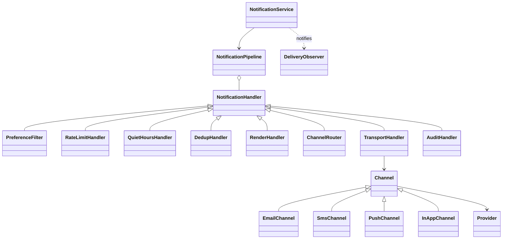

# 45 — Notification Service (LLD Interview Walkthrough)

> **Why this problem?** Phase 7's device/system tier is over. We're now in *infrastructure/library design* — same interview rigor, but the deliverable is a SDK or service used by many other teams, not a customer-facing app. Notification service is the **pattern-density poster child**: a notification gets enriched through a pipeline (preference resolution → rate limit → throttle → template render → channel routing → send → retry → audit), where every stage is a separate concern. The natural shape is **Chain of Responsibility** with **Strategy**, **Template Method**, **Builder**, and **Observer** all paying off in one design. Master this and you have the template for every middleware pipeline (Express, Koa, gRPC interceptors, AWS Lambda layers).

---

## 1. The Setup

> Interviewer: *"Design a notification service like AWS SNS / Firebase Cloud Messaging / OneSignal. Companies plug it in to send 50M notifications a day across email, SMS, push, in-app."*

The four moments that decide the interview:

1. **Pipeline architecture.** Most candidates write `class NotificationService { send(n) { validate(); checkPrefs(); rateLimit(); render(); pickChannel(); transport(); log(); } }` — a 200-line god method. Senior version: **Chain of Responsibility** where each handler does *one* thing and decides whether to continue, short-circuit, or fail.
2. **Channel abstraction.** Email, SMS, push, in-app — each has its own concrete transport (SendGrid, Twilio, FCM, WebSocket). The senior version: a `Channel` interface with `Strategy` per provider and a `Template Method` base class so common framing (rate limit, retry, audit) isn't re-implemented per channel.
3. **Retry + dedupe + idempotency.** The unsexy production stuff. Notifications double-fire on retry without dedup keys. The senior answer says "every notification has an `idempotencyKey`; the pipeline persists it before send; retries reuse it."
4. **Async via queue, not synchronous in-process.** At scale, the pipeline runs as a worker over a message queue, not in the caller's request thread. *Mentioning this without prompting is senior signaling.*

---

## 2. Requirements Clarification (Phase 1 — ~8 min)

### 2.1 Functional questions

| # | Question | Why it matters |
|---|---|---|
| Q1 | Channels — email / SMS / push / in-app / webhook / Slack? | Channel interface variations |
| Q2 | Templates — do we render server-side, or callers send rendered content? | Templating engine vs pass-through |
| Q3 | User preferences — opt-in/out per channel, quiet hours, language? | Preference resolution step |
| Q4 | Rate limits — per-user per-day caps? | Rate-limit handler in pipeline |
| Q5 | Bulk sends (1M users get the same template)? | Fan-out + batching strategy |
| Q6 | Scheduled notifications (send at 9 AM tomorrow)? | Scheduler |
| Q7 | Priority levels — critical (OTP) vs marketing? | Routing + bypass rules |
| Q8 | Multi-provider fail-over for the same channel (Twilio + Plivo for SMS)? | Channel-level retry strategy |
| Q9 | Delivery callbacks (webhook on delivered/opened/clicked)? | Observer/event emission |
| Q10 | Compliance — GDPR opt-out, DND registry, time-zone-aware quiet hours? | Hard-blocker handler |

### 2.2 Non-functional

- **Throughput**: 50M/day = ~600/s sustained, peaks ~5K/s.
- **Latency**: critical (OTP) must reach SMS provider in <500ms. Marketing can tolerate minutes.
- **Reliability**: every notification must be tried at least once; never lost on a crash.
- **Idempotency**: retries must not double-send.
- **Observability**: each notification's journey is reconstructable end-to-end.

### 2.3 The scope lock

> *"OK, scoping: 4 channels — EMAIL, SMS, PUSH, IN_APP. Server-side Mustache-style templating with named templates. Per-user channel preferences + quiet hours. Per-user daily rate limit. Pipeline as Chain of Responsibility: PreferenceFilter → RateLimit → QuietHours → DedupCheck → Render → ChannelRouter → Transport → AuditLogger. Async — the public API enqueues a job; workers run the pipeline. Idempotency keys mandatory. Retries with exponential backoff (3 attempts). One provider per channel today; multi-provider fail-over is an extension."*

---

## 3. Entity Modeling (Phase 2 — ~5 min)

### Two mental models

**A. A notification is data flowing through a pipeline of small handlers.**
Each handler can: pass it through, mutate it, short-circuit it, or fail it. Same pattern as Express middleware, AWS Lambda layers, gRPC interceptors. Once you internalize this, the rest is bookkeeping.

**B. The pipeline is configured per priority/channel.**
A `CRITICAL` OTP skips `QuietHours` and `RateLimit`. A `MARKETING` notification runs every handler. You compose different chains for different cases.

### Entities

| Entity | Role | Notes |
|---|---|---|
| `Notification` | The data flowing through | id, recipient, templateId, params, priority, channel, idempotencyKey |
| `Recipient` | Who's receiving | user id, email, phone, deviceTokens, prefs |
| `Preference` | Per-user channel/timezone/quiet-hours config | |
| `Template` | Named template with variables | `OTP_LOGIN`, `ORDER_DELIVERED`, etc. |
| `Channel` (abstract) | EMAIL / SMS / PUSH / IN_APP transport | Template Method |
| `Provider` (under Channel) | SendGrid, Twilio, FCM, WebSocket | Strategy under channel |
| `NotificationHandler` | One pipeline stage | Chain of Responsibility |
| `NotificationBuilder` | Fluent API to construct a notification | Builder |
| `NotificationPipeline` | Composed chain of handlers | |
| `RetryPolicy` | Exponential backoff with jitter | |
| `IdempotencyStore` | Tracks already-sent ids | Redis in prod |
| `RateLimitStore` | Per-user counters | Redis in prod (preview of lesson 47) |
| `AuditLog` | Every event of every notification | |
| `DeliveryObserver` | Webhook on delivered/opened | |

---

## 4. UML (Phase 3 — ~5 min)

```
┌────────────────────────┐
│   NotificationService  │  ◀── Singleton entrypoint
│  - pipeline            │
│  + send(notif)         │
│  + sendBulk(notifs)    │
└──────────┬─────────────┘
           │ uses
           ▼
┌────────────────────────┐
│  NotificationPipeline  │  Chain of Responsibility
│  - handlers[]          │
│  + execute(notif)      │
└──────────┬─────────────┘
           │
           ▼
┌──────────────────────────┐
│ «abstract» Handler       │
│  + handle(notif): Result │
│  + setNext(h)            │
└────────────▲─────────────┘
             │
   ┌─────────┼─────────┬───────────┬──────────┬────────────┬────────────┐
   │         │         │           │          │            │            │
 PrefFilter RateLimit QuietHours DedupCheck Renderer ChannelRouter Transport AuditLogger

┌────────────────────────┐
│   Notification         │
│  - id                  │
│  - recipient           │
│  - templateId          │
│  - params              │
│  - channel             │  EMAIL / SMS / PUSH / IN_APP
│  - priority            │  CRITICAL / TRANSACTIONAL / MARKETING
│  - idempotencyKey      │
│  - body (after render) │
└────────────────────────┘

┌─────────────────────┐      ┌─────────────────────┐
│  «abstract» Channel │      │ «interface» Provider│
│  + send(notif)      │      │ + send(notif)       │
│   (Template Method) │      └─────────▲───────────┘
└───────▲─────────────┘                │
        │                              │
   EmailChannel   SmsChannel      SendGridProvider / Twilio / FCM
   PushChannel    InAppChannel

«Observer» DeliveryObserver  (sent, delivered, opened, failed)
```



---

## 5. Design Patterns Chosen (Phase 4 — ~3 min)

| Pattern | Where | Why |
|---|---|---|
| **Chain of Responsibility** | `NotificationPipeline` of handlers | Each stage = focused class. Composable per priority/channel |
| **Strategy** | `Provider` per channel (SendGrid vs Twilio vs FCM) | Provider swappable without changing channel |
| **Template Method** | `Channel.send()` calls `render() → transport() → audit()` | Common framing across email/sms/push |
| **Builder** | `NotificationBuilder` | Many optional fields (priority, templateId, params, callback URL) |
| **Observer** | `DeliveryObserver` | Webhook on delivered/opened/failed |
| **Singleton** | `NotificationService` (per region/worker) | One entrypoint |
| **Decorator** *(optional)* | `RetryWrapper(provider)` | Layer retry policy without modifying provider |

> **The CoR justification call:** every handler is independently testable and reorderable. Want OTPs to skip rate limiting? Use a different chain composition. Adding compliance audit before transport? One new handler inserted at the right position. **The chain is configuration, not code.**

---

## 6. TypeScript Code (Phase 5 — ~30 min)

### 6.1 Core types

```typescript
export enum ChannelType { EMAIL = "EMAIL", SMS = "SMS", PUSH = "PUSH", IN_APP = "IN_APP" }
export enum Priority    { CRITICAL = "CRITICAL", TRANSACTIONAL = "TRANSACTIONAL", MARKETING = "MARKETING" }

export interface Preference {
  channels: Set<ChannelType>;
  quietHours: { startHour: number; endHour: number } | null;
  timezone: string;          // IANA tz, e.g. "Asia/Kolkata"
  dailyLimit: number;
}

export class Recipient {
  constructor(
    public readonly id: string,
    public readonly name: string,
    public readonly email: string | null,
    public readonly phone: string | null,
    public readonly deviceTokens: string[],
    public readonly preference: Preference,
  ) {}
}

export class Template {
  constructor(
    public readonly id: string,                          // "OTP_LOGIN"
    public readonly subject: string,                     // for email
    public readonly body: string,                        // "Your OTP is {{otp}}"
  ) {}
}
```

### 6.2 Notification + Builder

```typescript
export class Notification {
  public body: string = "";          // populated by RenderHandler
  public subject: string = "";
  public attempts: number = 0;

  constructor(
    public readonly id: string,
    public readonly recipient: Recipient,
    public readonly templateId: string,
    public readonly params: Record<string, string>,
    public readonly channel: ChannelType,
    public readonly priority: Priority,
    public readonly idempotencyKey: string,
    public readonly createdAt: Date = new Date(),
  ) {}
}

export class NotificationBuilder {
  private _id: string = "";
  private _recipient: Recipient | null = null;
  private _templateId: string = "";
  private _params: Record<string, string> = {};
  private _channel: ChannelType = ChannelType.EMAIL;
  private _priority: Priority = Priority.TRANSACTIONAL;
  private _idempotencyKey: string = "";

  id(v: string): this { this._id = v; return this; }
  to(r: Recipient): this { this._recipient = r; return this; }
  template(id: string, params: Record<string, string> = {}): this {
    this._templateId = id; this._params = params; return this;
  }
  via(c: ChannelType): this { this._channel = c; return this; }
  priority(p: Priority): this { this._priority = p; return this; }
  idempotencyKey(k: string): this { this._idempotencyKey = k; return this; }

  build(): Notification {
    if (!this._recipient) throw new Error("recipient required");
    if (!this._templateId) throw new Error("templateId required");
    if (!this._idempotencyKey) throw new Error("idempotencyKey required");
    return new Notification(
      this._id || `N-${Date.now()}-${Math.random().toString(36).slice(2, 7)}`,
      this._recipient, this._templateId, this._params,
      this._channel, this._priority, this._idempotencyKey,
    );
  }
}
```

> **Why an `idempotencyKey` is required.** Callers must pass a stable key (e.g., `order-1234-delivered-email`). On retry — by the network, the queue, the caller — the same key blocks duplicate sends. Make it *required* at the type level; don't put it in `Recipient` or compute a default. This is the *most overlooked* part of production notification systems.

### 6.3 Handler base + Result type

```typescript
export type HandlerResult =
  | { kind: "CONTINUE" }                       // pass to next
  | { kind: "DROP"; reason: string }           // gracefully skip (not an error)
  | { kind: "FAIL"; reason: string };          // hard failure

export abstract class NotificationHandler {
  protected next: NotificationHandler | null = null;

  setNext(h: NotificationHandler): NotificationHandler {
    this.next = h;
    return h;     // allows fluent chaining: a.setNext(b).setNext(c)
  }

  handle(n: Notification): HandlerResult {
    const r = this.process(n);
    if (r.kind !== "CONTINUE") return r;
    if (!this.next) return { kind: "CONTINUE" };
    return this.next.handle(n);
  }

  protected abstract process(n: Notification): HandlerResult;
}
```

> **The `DROP` vs `FAIL` distinction matters.** `DROP` means "the user prefers no SMS marketing" — that's *expected behavior*, not an error. `FAIL` means "Twilio returned 500." Lumping them together makes alerting noisy and gives you bad SLA metrics. Same idea as HTTP 200 with empty body vs 500.

### 6.4 Concrete handlers

```typescript
// 1. Honor preferences (channels + opt-out)
export class PreferenceFilter extends NotificationHandler {
  process(n: Notification): HandlerResult {
    if (n.priority === Priority.CRITICAL) return { kind: "CONTINUE" }; // OTP overrides prefs
    if (!n.recipient.preference.channels.has(n.channel)) {
      return { kind: "DROP", reason: `User opted out of ${n.channel}` };
    }
    return { kind: "CONTINUE" };
  }
}

// 2. Rate limit per user (we'll wire to a real store later)
export class RateLimitHandler extends NotificationHandler {
  constructor(private store: RateLimitStore) { super(); }
  process(n: Notification): HandlerResult {
    if (n.priority === Priority.CRITICAL) return { kind: "CONTINUE" };
    if (!this.store.consume(n.recipient.id, n.recipient.preference.dailyLimit)) {
      return { kind: "DROP", reason: "Daily rate limit reached" };
    }
    return { kind: "CONTINUE" };
  }
}

// 3. Quiet hours — buffer instead of send during user's night
export class QuietHoursHandler extends NotificationHandler {
  process(n: Notification): HandlerResult {
    if (n.priority === Priority.CRITICAL) return { kind: "CONTINUE" };
    const qh = n.recipient.preference.quietHours;
    if (!qh) return { kind: "CONTINUE" };
    const localHour = currentHourIn(n.recipient.preference.timezone);
    if (isInQuietHours(localHour, qh.startHour, qh.endHour)) {
      // In production: enqueue for the user's quiet-end time
      return { kind: "DROP", reason: "Quiet hours — deferred" };
    }
    return { kind: "CONTINUE" };
  }
}

// 4. Idempotency / dedup
export class DedupHandler extends NotificationHandler {
  constructor(private store: IdempotencyStore) { super(); }
  process(n: Notification): HandlerResult {
    if (this.store.seen(n.idempotencyKey)) {
      return { kind: "DROP", reason: "Duplicate idempotency key" };
    }
    this.store.mark(n.idempotencyKey);
    return { kind: "CONTINUE" };
  }
}

// 5. Render template into body
export class RenderHandler extends NotificationHandler {
  constructor(private templates: Map<string, Template>) { super(); }
  process(n: Notification): HandlerResult {
    const t = this.templates.get(n.templateId);
    if (!t) return { kind: "FAIL", reason: `Unknown template ${n.templateId}` };
    n.body    = this.interp(t.body, n.params);
    n.subject = this.interp(t.subject, n.params);
    return { kind: "CONTINUE" };
  }
  private interp(tpl: string, params: Record<string, string>): string {
    return tpl.replace(/\{\{(\w+)\}\}/g, (_, k) => params[k] ?? "");
  }
}

// 6. Pick the right channel impl
export class ChannelRouter extends NotificationHandler {
  constructor(private channels: Map<ChannelType, Channel>) { super(); }
  process(n: Notification): HandlerResult {
    if (!this.channels.has(n.channel)) {
      return { kind: "FAIL", reason: `No channel for ${n.channel}` };
    }
    return { kind: "CONTINUE" };
  }
}

// 7. Transport — call channel.send (with retry)
export class TransportHandler extends NotificationHandler {
  constructor(
    private channels: Map<ChannelType, Channel>,
    private retry: RetryPolicy,
  ) { super(); }

  process(n: Notification): HandlerResult {
    const ch = this.channels.get(n.channel)!;
    let lastErr: string = "";
    for (let attempt = 1; attempt <= this.retry.maxAttempts; attempt++) {
      n.attempts = attempt;
      try {
        ch.send(n);
        return { kind: "CONTINUE" };
      } catch (e) {
        lastErr = (e as Error).message;
        if (attempt < this.retry.maxAttempts) sleepSync(this.retry.backoffMs(attempt));
      }
    }
    return { kind: "FAIL", reason: `Transport failed: ${lastErr}` };
  }
}

// 8. Audit — always last, never short-circuits
export class AuditHandler extends NotificationHandler {
  constructor(private log: AuditLog) { super(); }
  process(n: Notification): HandlerResult {
    this.log.record({ notificationId: n.id, status: "SENT", at: new Date(), attempts: n.attempts });
    return { kind: "CONTINUE" };
  }
}
```

### 6.5 Channel — Template Method

```typescript
export interface DeliveryObserver {
  onSent(n: Notification): void;
  onFailed(n: Notification, reason: string): void;
}

export abstract class Channel {
  constructor(
    protected provider: Provider,
    protected observers: DeliveryObserver[] = [],
  ) {}

  // Template Method — common framing, hook for concrete steps
  send(n: Notification): void {
    this.validate(n);
    this.provider.send(n);     // the variation point
    this.observers.forEach(o => o.onSent(n));
  }

  protected abstract validate(n: Notification): void;   // hook
}

export interface Provider { send(n: Notification): void; }

// Concrete channels — only the validation differs
export class EmailChannel extends Channel {
  protected validate(n: Notification): void {
    if (!n.recipient.email) throw new Error("Recipient has no email");
    if (!n.body || !n.subject) throw new Error("Email needs subject and body");
  }
}

export class SmsChannel extends Channel {
  protected validate(n: Notification): void {
    if (!n.recipient.phone) throw new Error("Recipient has no phone");
    if (n.body.length > 160) throw new Error("SMS body > 160 chars");
  }
}

export class PushChannel extends Channel {
  protected validate(n: Notification): void {
    if (n.recipient.deviceTokens.length === 0) throw new Error("No device tokens");
  }
}

export class InAppChannel extends Channel {
  protected validate(_n: Notification): void { /* always valid */ }
}

// Concrete providers (Strategy)
export class SendGridProvider implements Provider {
  send(n: Notification): void { console.log(`[SendGrid] → ${n.recipient.email}: ${n.subject}`); }
}
export class TwilioProvider implements Provider {
  send(n: Notification): void { console.log(`[Twilio] → ${n.recipient.phone}: ${n.body}`); }
}
export class FcmProvider implements Provider {
  send(n: Notification): void { console.log(`[FCM] → ${n.recipient.deviceTokens.join(",")}: ${n.body}`); }
}
export class InAppProvider implements Provider {
  send(n: Notification): void { console.log(`[InApp] → user ${n.recipient.id}: ${n.body}`); }
}
```

### 6.6 Retry policy

```typescript
export interface RetryPolicy {
  maxAttempts: number;
  backoffMs(attempt: number): number;     // attempt: 1-indexed
}

export class ExponentialBackoff implements RetryPolicy {
  constructor(public maxAttempts: number = 3, private baseMs: number = 250, private capMs: number = 5000) {}
  backoffMs(attempt: number): number {
    const exp = Math.min(this.capMs, this.baseMs * 2 ** (attempt - 1));
    return Math.floor(Math.random() * exp);   // full jitter — recommended
  }
}
```

> **Full jitter** is the AWS-recommended retry strategy: pick a *uniformly random* delay in `[0, exp]` rather than `exp ± noise`. It spreads retries best when many clients fail simultaneously (a transient provider outage).

### 6.7 Stores (in-memory toys; real impl is Redis)

```typescript
export interface IdempotencyStore { seen(key: string): boolean; mark(key: string): void; }
export class InMemoryIdempotency implements IdempotencyStore {
  private set = new Set<string>();
  seen(k: string)  { return this.set.has(k); }
  mark(k: string)  { this.set.add(k); }
}

export interface RateLimitStore { consume(userId: string, dailyLimit: number): boolean; }
export class InMemoryRateLimit implements RateLimitStore {
  private counts = new Map<string, { day: string; count: number }>();
  consume(userId: string, dailyLimit: number): boolean {
    const today = new Date().toISOString().slice(0, 10);
    const rec = this.counts.get(userId);
    if (!rec || rec.day !== today) { this.counts.set(userId, { day: today, count: 1 }); return true; }
    if (rec.count >= dailyLimit) return false;
    rec.count++; return true;
  }
}
```

### 6.8 Audit log

```typescript
export interface AuditEntry { notificationId: string; status: string; at: Date; attempts: number; reason?: string; }
export class AuditLog {
  private entries: AuditEntry[] = [];
  record(e: AuditEntry) { this.entries.push(e); console.log("[AUDIT]", e); }
  forNotification(id: string): AuditEntry[] { return this.entries.filter(e => e.notificationId === id); }
}
```

### 6.9 Helpers

```typescript
function sleepSync(ms: number): void {
  // For demo only; real code is async
  const end = Date.now() + ms;
  while (Date.now() < end) { /* spin */ }
}
function currentHourIn(_tz: string): number {
  // Simplified — production uses Intl.DateTimeFormat / date-fns-tz
  return new Date().getHours();
}
function isInQuietHours(hour: number, start: number, end: number): boolean {
  if (start <= end) return hour >= start && hour < end;
  return hour >= start || hour < end;       // wraps midnight
}
```

### 6.10 Pipeline + Service

```typescript
export class NotificationPipeline {
  private head: NotificationHandler | null = null;
  private tail: NotificationHandler | null = null;

  append(h: NotificationHandler): this {
    if (!this.head) { this.head = h; this.tail = h; }
    else { this.tail!.setNext(h); this.tail = h; }
    return this;
  }

  execute(n: Notification): HandlerResult {
    if (!this.head) return { kind: "CONTINUE" };
    return this.head.handle(n);
  }
}

export class NotificationService {
  private static instance: NotificationService | null = null;
  static getInstance(pipeline: NotificationPipeline): NotificationService {
    if (!NotificationService.instance) NotificationService.instance = new NotificationService(pipeline);
    return NotificationService.instance;
  }

  private constructor(private pipeline: NotificationPipeline) {}

  send(n: Notification): HandlerResult {
    return this.pipeline.execute(n);
  }
  sendBulk(ns: Notification[]): HandlerResult[] {
    return ns.map(n => this.send(n));
  }
}
```

### 6.11 Driver — assembling the whole thing

```typescript
// Setup
const templates = new Map<string, Template>([
  ["OTP_LOGIN",       new Template("OTP_LOGIN", "Your OTP", "Your OTP is {{otp}}. Valid 5 min.")],
  ["ORDER_DELIVERED", new Template("ORDER_DELIVERED", "Order #{{orderId}} delivered", "Hi {{name}}, your order {{orderId}} has been delivered.")],
]);

const channels = new Map<ChannelType, Channel>([
  [ChannelType.EMAIL,  new EmailChannel(new SendGridProvider())],
  [ChannelType.SMS,    new SmsChannel(new TwilioProvider())],
  [ChannelType.PUSH,   new PushChannel(new FcmProvider())],
  [ChannelType.IN_APP, new InAppChannel(new InAppProvider())],
]);

const idempotency = new InMemoryIdempotency();
const rateLimit   = new InMemoryRateLimit();
const audit       = new AuditLog();
const retry       = new ExponentialBackoff(3, 200, 3000);

const pipeline = new NotificationPipeline()
  .append(new PreferenceFilter())
  .append(new RateLimitHandler(rateLimit))
  .append(new QuietHoursHandler())
  .append(new DedupHandler(idempotency))
  .append(new RenderHandler(templates))
  .append(new ChannelRouter(channels))
  .append(new TransportHandler(channels, retry))
  .append(new AuditHandler(audit));

const service = NotificationService.getInstance(pipeline);

// Use
const ayush = new Recipient(
  "U-1", "Ayush", "ayush@magnifi.ai", "+91-90000-00000", ["tok_abc"],
  {
    channels: new Set([ChannelType.EMAIL, ChannelType.PUSH]),
    quietHours: null,
    timezone: "Asia/Kolkata",
    dailyLimit: 50,
  },
);

const n = new NotificationBuilder()
  .to(ayush)
  .template("OTP_LOGIN", { otp: "473829" })
  .via(ChannelType.SMS)
  .priority(Priority.CRITICAL)
  .idempotencyKey("login-otp-u1-20260511T101500")
  .build();

console.log("Result 1:", service.send(n));
console.log("Result 2 (dup):", service.send(n));   // dropped — duplicate key
```

The second send is dropped because the idempotency key has been seen. That's the whole point.

---

## 7. Extension Follow-Ups (Phase 6 — ~5 min)

### 7.1 "Make the pipeline async — workers consume from a queue."
The public API `send()` enqueues to Kafka/SQS/Redis Streams instead of running the chain inline. A pool of worker processes pulls messages and runs the same pipeline. **The pipeline code is unchanged.** Only the entrypoint differs. This is the standard "service" architecture; in-process pipeline is the unit-test mode.

### 7.2 "Multi-provider fail-over for SMS."
A `FailoverProvider` wraps multiple concrete providers and tries each on failure: `new FailoverProvider([twilio, plivo, msg91])`. The Channel doesn't know — it sees a single Provider. **Composite + Strategy.** For latency-sensitive critical paths, a `RaceProvider` fires all in parallel and uses whichever delivers first; expensive in cost but optimal in latency.

### 7.3 "Bulk send — 1M users get the same daily-digest."
Add `sendBulk` that batches by (channel, template) and emits chunks of ~1000 to providers that support batch APIs (SendGrid, FCM). The pipeline runs once per recipient still (preferences differ per user). The win is at the **transport layer** — fewer HTTP round-trips. Throttle global send rate to honor provider QPS limits.

### 7.4 "A/B testing — 50% get template A, 50% get B."
A new handler `ExperimentRouter` inserted after `RenderHandler`. It hashes `(recipient.id, experimentId)` to a bucket and overrides the templateId. Experiment metadata is loaded from config. Audit log captures the bucket so analysis is trivial.

### 7.5 "Scheduled notifications — send at the user's 9 AM local time."
A `ScheduledJob` entity with `runAt` (instant) and the prebuilt `Notification`. A scheduler scans for due jobs every minute and feeds them into the regular pipeline. Time zones live in `Preference.timezone`; the scheduler converts "9 AM in user's tz" into a UTC instant at schedule time.

### 7.6 "Compliance — TRAI/DLT in India, GDPR in EU, CAN-SPAM in US."
A `ComplianceFilter` handler — region-aware, runs before `RenderHandler`. India SMS requires registered template IDs (DLT). EU requires explicit consent records. US marketing requires unsubscribe links. The handler reads a config keyed by recipient country and decides. *No legal logic in the channel or provider* — it's all funneled through one auditable handler.

---

## 8. Real-World Production Notes

- **Real systems**: AWS SNS, Firebase Cloud Messaging, OneSignal, Braze, Customer.io, Twilio Engagement Cloud. All run a pipeline very close to what we built. Most are queue-backed.
- **Critical vs marketing pipelines are usually separate.** OTPs go through a high-priority queue with fewer handlers; marketing goes through a low-priority queue with all the filters. Same code, different chain composition.
- **DLT compliance in India** — since 2020, SMS providers require pre-registered template IDs. Sending a raw "Your OTP is 4838" without a registered DLT template gets blocked at the carrier. Production notification services maintain a `dltTemplateId` per `Template` and route accordingly.
- **Webhooks for delivery callbacks** — providers (SendGrid, Twilio, FCM) call back with `delivered/opened/bounced/clicked`. A `WebhookReceiver` updates the audit log and fires `DeliveryObserver` events. Same Observer abstraction, async transport.
- **A famous outage** — Twitter's "blue checkmark" relaunch in 2023 hammered SendGrid with a million emails an hour. Their fix: aggressive batching + per-customer quotas. Both are pure pipeline-configuration changes — no code edits to the core service.

---

## 9. Interview Questions (with answers)

**Q1. Why is the pipeline a Chain of Responsibility instead of one big `send()` method with sequential calls?**
Three reasons. (a) **Composition**: critical OTPs skip `QuietHours` and `RateLimit`; marketing runs every handler. Different chains for different cases — easy to express by passing in different lists. (b) **Testability**: each handler is unit-testable in isolation against a mock notification. The big method requires mocking 8 dependencies for any single test. (c) **Open/Closed**: adding "compliance audit before transport" is a new handler inserted at the right position — zero changes to existing handlers. The big method requires editing the god class.

**Q2. Walk me through what happens when the same notification is sent twice (e.g., the caller's retry).**
First call: `send(n)` runs the pipeline. `DedupHandler.process` checks `IdempotencyStore.seen("login-otp-u1-…")` → false → calls `mark(key)` → returns `CONTINUE`. Pipeline continues to render, transport, audit. Second call (same key): `DedupHandler.process` sees the key → returns `DROP`. Pipeline halts. **No double-send.** Critically, this only works because `idempotencyKey` is *required* at the type level — if it were optional, a caller could pass `undefined` and the dedup logic would silently no-op.

**Q3. Why is `DROP` separate from `FAIL`?**
Because they have different semantics for ops and metrics. `DROP` is *expected*: the user opted out, the rate limit kicked in, the quiet-hours window is active. Lumping these into `FAIL` would make every alerting threshold misfire. A 10% drop rate on marketing is healthy (opt-outs); a 10% fail rate is a critical incident (provider down). Different signals — different paths through the audit log and the dashboard.

**Q4. The retry happens inside `TransportHandler` with synchronous backoff. What's wrong with that, and what's the senior version?**
Two problems. (a) **Blocking the worker**: a 5-second backoff means that worker can't process other notifications during the sleep. At scale, you starve throughput. (b) **Lost on restart**: an in-progress retry chain vanishes if the worker restarts. The senior version: on failure, the handler **re-enqueues** the notification with a delay (SQS `DelaySeconds`, Kafka via a delay topic, Redis sorted-set with score=`now()+delay`). The worker is free to process the next message; the retry comes back into the queue at its scheduled time. **At-least-once delivery + idempotency keys = exactly-once observable behavior.**

**Q5. Why is `Channel` a Template Method base and `Provider` a Strategy? Couldn't they be merged?**
They're orthogonal axes of variation. `Channel` (Email vs SMS vs Push) varies in *what's valid* — email needs a subject and an address; SMS needs a phone and ≤160 chars. `Provider` (SendGrid vs Twilio vs FCM) varies in *how to transport* — different HTTP APIs, auth, response schemas. Merging them gives a `class SendGridEmailChannel`, `class TwilioSmsChannel`, etc — and you can't try Plivo as an SMS provider without writing `PlivoSmsChannel` and duplicating validation. The split lets you compose `2 channels × 3 providers = 6 combinations` from 5 classes instead of 6.

**Q6. (Trap) The notification pipeline is in-process. Why is that wrong for scale, and what's the fix?**
The pipeline running inline in the API request thread means: (a) the API caller waits 200-500ms (template render + provider call) per send; (b) a failing provider blocks the API; (c) bulk sends create thundering herds against the API. The fix is **queue + workers**: `send()` enqueues the notification (sub-millisecond), workers consume and run the pipeline. The shape of the code doesn't change — only the entrypoint. This is the same lesson as everywhere else: "I designed it sync for clarity; production is async; the pipeline class is unchanged."

---

## 10. The Cheat-Sheet (last-minute revision)

```
Big idea:  Notification = data flowing through a Chain of Responsibility.
           Each stage is one focused handler (Preference, RateLimit,
           QuietHours, Dedup, Render, Router, Transport, Audit).
           Channels (Email/SMS/Push/InApp) are Template Methods;
           Providers (SendGrid/Twilio/FCM) are Strategies under them.
           Async pipeline = queue + workers + idempotency keys.

Patterns:
  Chain of Responsibility → pipeline of handlers
  Strategy               → Provider per channel
  Template Method        → Channel base validates → provider.send → audit
  Builder                → NotificationBuilder
  Observer               → DeliveryObserver (delivered/opened/failed)
  Singleton              → NotificationService (per worker)
  Decorator (optional)   → FailoverProvider / RaceProvider wraps Providers

Pipeline order:
  PreferenceFilter → RateLimit → QuietHours → Dedup → Render →
  ChannelRouter → Transport (with retry) → AuditLogger

Handler Result:
  CONTINUE — pass to next
  DROP     — graceful skip (opted out / quiet hours / duplicate)
  FAIL     — hard error (template missing / transport failure)

Idempotency:
  - REQUIRED on every notification at construction
  - Dedup handler short-circuits on repeated keys
  - On transport failure: re-enqueue with delay (don't sleep in worker)

Retry:
  Exponential backoff with FULL JITTER (random in [0, exp])
  Max 3 attempts (configurable per channel / per priority)

Critical-path overrides (CRITICAL priority):
  - Skip PreferenceFilter (OTPs go regardless of opt-out)
  - Skip RateLimit
  - Skip QuietHours

Async story:
  send() → enqueue (Kafka/SQS/Redis Streams)
  worker → pull → run pipeline → audit + ack
  re-enqueue with delay on FAIL (don't sleep)

Traps:
  - One giant send() method (use CoR)
  - Optional idempotencyKey (must be required at type level)
  - Confusing DROP with FAIL (different SLA metrics)
  - Synchronous in-process retry (blocks workers)
  - Channel + Provider as one class (multiplies combinations)
  - Compliance logic scattered in providers (use one handler)

Generalizes to:  Express/Koa/HTTP middleware, gRPC interceptors,
                 AWS Lambda layers, Apache Camel, GCP Eventarc — any
                 request/event pipeline. Same shape, different domain.
```

You now have the playbook for any **request pipeline / middleware system**. Phase 7 has only three left — Logger, Rate Limiter, Cache. They're each ~2/3 the size of this lesson; same level of pattern density but more algorithmic (LRU eviction, token bucket, async append buffers). They round out the curriculum.
