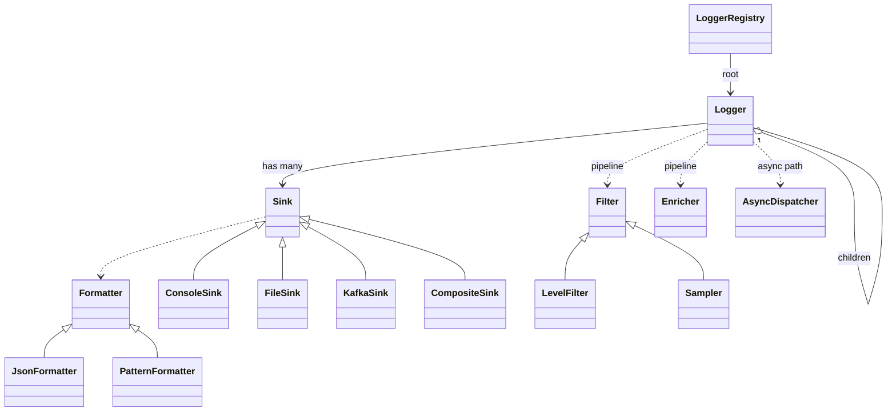

# 46 — Logger Framework (LLD Interview Walkthrough)

> **Why this problem?** It's the classic *LLD library* problem — what every developer has used: Log4j (Java), SLF4J + Logback, Python's `logging`, Go's `slog`, JavaScript's Winston / Pino. Designing it well teaches you four senior-level concerns: (1) **hierarchical loggers** with inherited config, (2) **multi-sink** (Composite) writing the same record to console + file + Kafka + Sentry, (3) **async append** to keep the application's hot path non-blocking, and (4) **structured vs string** logging. It also reuses Chain of Responsibility (level filter → enricher → formatter → sink) and Strategy (sinks, formatters), so it's a high-leverage problem after lesson 45.

---

## 1. The Setup

> Interviewer: *"Design a logging library that all our microservices will use."*

The candidate-killer mistakes:

1. `class Logger { log(level, msg) { console.log(msg); } }` — single-sink, hard-coded, synchronous. Misses every interesting design dimension.
2. No async story. At 100K logs/sec, every `fs.writeSync` blocks the event loop. The senior version says "writes go into a ring buffer; a background flusher drains it."
3. Treating "logger by name" as cosmetic. The senior insight is that loggers form a **hierarchy by dotted name** (`acme.payments.stripe`) and *child loggers inherit level and sinks from parents* until overridden. That's how Log4j and Python's `logging` actually work, and the interviewer is watching for it.
4. Stringly-typed log messages. Senior version: structured records (`{ level, msg, fields }`) that can be JSON-formatted for log aggregators (Datadog, Loki, Splunk) without parsing.

---

## 2. Requirements Clarification (Phase 1 — ~8 min)

### 2.1 Functional questions

| # | Question | Why it matters |
|---|---|---|
| Q1 | Log levels — TRACE / DEBUG / INFO / WARN / ERROR / FATAL? | Level enum + filtering |
| Q2 | Multiple sinks — console / file / network (HTTP / Kafka / Syslog) / Sentry? | Composite + Strategy |
| Q3 | Per-logger configuration — different services log at different levels? | Hierarchical loggers |
| Q4 | Async — should `logger.info()` be non-blocking? | Ring buffer + background flusher |
| Q5 | Structured fields (key=value) or just strings? | Both — JSON formatter |
| Q6 | Context propagation — request ID, user ID, trace ID flowing through logs? | MDC (Mapped Diagnostic Context) |
| Q7 | Sampling — drop 90% of DEBUG logs? | Sampler in chain |
| Q8 | File rotation — daily? by size? | RotatingFileSink |
| Q9 | Multi-process safety on file writes? | File-lock or per-process file |
| Q10 | Performance constraints — latency budget per log call? | Drives the async / buffered design |

### 2.2 Non-functional

- **Application-thread overhead** must be near-zero — ideally <1µs to enqueue.
- **Loss tolerance** — under buffer overflow, do we drop or block? (Configurable; default = drop, count drops.)
- **Configurability at runtime** — flip a service's log level from INFO to DEBUG without redeploying.

### 2.3 The scope lock

> *"OK, scoping: 6 levels (TRACE → FATAL). Hierarchical named loggers — `acme.payments.stripe` inherits from `acme.payments` from `acme` from root. Per-logger level and sinks, overridable. Multi-sink (Console / File / Kafka). JSON-structured records with optional MDC fields. Sync mode for tests, Async (ring buffer + flusher thread) for production. RotatingFileSink with daily rotation. Sampler optional in the chain. Runtime config-flip via a `setLevel` API on the registry. Concurrent log calls are safe."*

---

## 3. Entity Modeling (Phase 2 — ~5 min)

### Two big mental models

**A. Loggers form a tree by dotted name.**
```
root
├── acme
│   ├── acme.payments
│   │   ├── acme.payments.stripe
│   │   └── acme.payments.razorpay
│   └── acme.users
└── ...
```
Each logger has an *optional* level and a *list* of sinks. Resolution walks up the tree: if `acme.payments.stripe` has no level set, ask `acme.payments`, then `acme`, then root. Same for sinks (with optional override-or-append). This is how Log4j hierarchical config works.

**B. A log call is a record flowing through a pipeline.**
```
logger.info("Order paid", { orderId: 42 })
   → build LogRecord { level, msg, fields, mdc, ts }
   → level filter (drop if below configured)
   → sampler (drop if not sampled)
   → enricher (add hostname, app version)
   → for each sink: formatter.format(record) → sink.write(formatted)
       (sinks run via the async flusher in prod)
```

### Entities

| Entity | Role | Notes |
|---|---|---|
| `LogLevel` | TRACE / DEBUG / INFO / WARN / ERROR / FATAL | Ordered enum |
| `LogRecord` | One log event | level, msg, fields, mdc, ts, loggerName |
| `Logger` | Public entry point | named; has optional level and sinks |
| `LoggerRegistry` | Singleton — owns the tree | resolves config by walking up |
| `Sink` (abstract) | Output destination | ConsoleSink, FileSink, KafkaSink, … |
| `Formatter` (Strategy) | Render LogRecord → string/bytes | JsonFormatter, PatternFormatter |
| `Filter` (CoR) | Drop records that fail | LevelFilter, Sampler |
| `Enricher` | Add fields to every record | hostname, version, env |
| `AsyncDispatcher` | Ring buffer + background flusher | The async story |
| `MDC` | Per-context tags | requestId, userId — AsyncLocalStorage in Node |

---

## 4. UML (Phase 3 — ~5 min)

```
┌─────────────────────────┐
│    LoggerRegistry       │  ◀── Singleton
│  - root: Logger         │
│  - tree: Map<name,L>    │
│  + get(name): Logger    │
│  + setLevel(name, lvl)  │
└──────────┬──────────────┘
           │ owns
           ▼
┌─────────────────────────┐
│       Logger            │
│  - name                 │
│  - level?               │   undefined = inherit from parent
│  - sinks[]?             │   undefined = inherit from parent
│  - parent: Logger | null│
│  + trace/debug/info/.../│
│  + log(level, msg, ...) │
└───────────┬─────────────┘
            │ each call →
            ▼
   ┌──────────────────────┐
   │     LogRecord        │
   │  level, msg, fields, │
   │  mdc, ts, loggerName │
   └──────────┬───────────┘
              │
              ▼
   ┌──────────────────────┐    ┌──────────────────────┐
   │  Filter chain (CoR)  │───▶│  Enricher chain      │
   │   LevelFilter        │    │   HostnameEnricher   │
   │   Sampler            │    │   VersionEnricher    │
   └──────────────────────┘    └──────────┬───────────┘
                                          │
                                          ▼
                              ┌────────────────────────┐
                              │   AsyncDispatcher      │
                              │   ring buffer (lock-   │
                              │   free), flusher loop  │
                              └──────────┬─────────────┘
                                         │
                       ┌─────────────────┼─────────────────┐
                       ▼                 ▼                 ▼
                ┌────────────┐    ┌────────────┐    ┌────────────┐
                │ ConsoleSink│    │  FileSink  │    │  KafkaSink │
                └────────────┘    └────────────┘    └────────────┘
                        │                │                │
                        ▼                ▼                ▼
                     Formatter       Formatter         Formatter
                  (Json/Pattern)  (Json/Pattern)    (Json/Avro)
```



---

## 5. Design Patterns Chosen (Phase 4 — ~3 min)

| Pattern | Where | Why |
|---|---|---|
| **Singleton** | `LoggerRegistry` | One owner of the tree per process |
| **Composite** | Multi-sink logger (writes to console *and* file *and* kafka) | Same `Sink` API |
| **Chain of Responsibility** | Filter chain (LevelFilter → Sampler → Enricher) | Pluggable per logger |
| **Strategy** | `Formatter` (JSON / Pattern / Avro) | Each sink picks its formatter |
| **Strategy** | `Sink` (Console / File / Kafka / Network) | Pluggable transports |
| **Template Method** *(extension)* | `BufferedSink` base for any sink that batches | Common framing |
| **Builder** *(optional)* | `LoggerBuilder` for fluent config | |
| **Observer-ish** | `AsyncDispatcher` async path | "Log records as a stream" |

> **The hierarchy is not a pattern — it's the design.** Modeling loggers as a tree where children inherit parent config is *the* idea that distinguishes Log4j-style libraries from "just a function". Bring it up unprompted.

---

## 6. TypeScript Code (Phase 5 — ~30 min)

### 6.1 Levels and records

```typescript
export enum LogLevel { TRACE = 10, DEBUG = 20, INFO = 30, WARN = 40, ERROR = 50, FATAL = 60 }
export const LEVEL_NAME: Record<LogLevel, string> = {
  [LogLevel.TRACE]: "TRACE", [LogLevel.DEBUG]: "DEBUG", [LogLevel.INFO]: "INFO",
  [LogLevel.WARN]:  "WARN",  [LogLevel.ERROR]: "ERROR", [LogLevel.FATAL]: "FATAL",
};

export interface LogRecord {
  ts: number;
  level: LogLevel;
  loggerName: string;
  msg: string;
  fields?: Record<string, unknown>;
  mdc?: Record<string, unknown>;
  err?: { name: string; message: string; stack?: string };
}
```

> **Numeric levels with gaps** (10, 20, 30…) leave room to insert custom levels (e.g., `NOTICE = 35`) without renumbering. This is exactly what Python's `logging` module did.

### 6.2 Formatter (Strategy)

```typescript
export interface Formatter {
  format(record: LogRecord): string;
}

export class JsonFormatter implements Formatter {
  format(r: LogRecord): string {
    // Stable shape — log aggregators index this directly
    return JSON.stringify({
      ts: new Date(r.ts).toISOString(),
      level: LEVEL_NAME[r.level],
      logger: r.loggerName,
      msg: r.msg,
      ...(r.mdc ?? {}),
      ...(r.fields ?? {}),
      ...(r.err ? { err: r.err } : {}),
    });
  }
}

export class PatternFormatter implements Formatter {
  // %t %lvl %name %msg
  format(r: LogRecord): string {
    const t = new Date(r.ts).toISOString();
    const lvl = LEVEL_NAME[r.level].padEnd(5);
    const fields = r.fields ? " " + JSON.stringify(r.fields) : "";
    const mdc = r.mdc ? " " + JSON.stringify(r.mdc) : "";
    return `${t} ${lvl} [${r.loggerName}] ${r.msg}${mdc}${fields}`;
  }
}
```

### 6.3 Sink (Strategy) + Composite

```typescript
export interface Sink {
  write(record: LogRecord): void;
  flush(): Promise<void> | void;
  close(): Promise<void> | void;
}

export class ConsoleSink implements Sink {
  constructor(private formatter: Formatter) {}
  write(r: LogRecord): void { console.log(this.formatter.format(r)); }
  flush() {}
  close() {}
}

export class CompositeSink implements Sink {
  constructor(private children: Sink[]) {}
  write(r: LogRecord): void { this.children.forEach(c => c.write(r)); }
  async flush() { await Promise.all(this.children.map(c => c.flush())); }
  async close() { await Promise.all(this.children.map(c => c.close())); }
}

// File sink — synchronous version for clarity; production uses an async appender
export class FileSink implements Sink {
  // In production: open the fd, hold it, append bytes, fsync periodically.
  // For the LLD demo: pseudo-write to a string buffer
  private lines: string[] = [];

  constructor(public readonly path: string, private formatter: Formatter) {}

  write(r: LogRecord): void { this.lines.push(this.formatter.format(r)); }
  flush() { /* real impl: fsync; demo: no-op */ }
  close() { /* real impl: fs.closeSync(fd) */ }
  buffer(): string[] { return this.lines; }   // for demo inspection
}

// Kafka-style sink — buffers a batch then sends
export class KafkaSink implements Sink {
  private batch: string[] = [];
  constructor(public readonly topic: string, private formatter: Formatter, private flushEvery = 100) {}
  write(r: LogRecord): void {
    this.batch.push(this.formatter.format(r));
    if (this.batch.length >= this.flushEvery) this.flush();
  }
  flush() {
    if (this.batch.length === 0) return;
    // In real code: producer.send(this.topic, this.batch)
    console.log(`[Kafka:${this.topic}] flushing ${this.batch.length} records`);
    this.batch.length = 0;
  }
  close() { this.flush(); }
}
```

### 6.4 Filter + Enricher (CoR)

```typescript
export interface Filter {
  accept(record: LogRecord): boolean;
}

export class LevelFilter implements Filter {
  constructor(private min: LogLevel) {}
  accept(r: LogRecord): boolean { return r.level >= this.min; }
}

export class Sampler implements Filter {
  // Probability in [0, 1]. Applied only below a threshold level so important logs aren't dropped.
  constructor(private p: number, private ifBelow: LogLevel = LogLevel.INFO) {}
  accept(r: LogRecord): boolean {
    if (r.level >= this.ifBelow) return true;
    return Math.random() < this.p;
  }
}

export interface Enricher {
  enrich(record: LogRecord): void;          // mutates in place — cheap, hot path
}

export class HostnameEnricher implements Enricher {
  private host = "host-" + Math.random().toString(36).slice(2, 6);
  enrich(r: LogRecord): void { (r.fields ??= {}).host = this.host; }
}

export class VersionEnricher implements Enricher {
  constructor(private version: string) {}
  enrich(r: LogRecord): void { (r.fields ??= {}).version = this.version; }
}
```

> **Why mutate the record in place?** The hot path is "create a record, run 5 enrichers". Allocating a new record on each enricher kills performance. In a logger, *every microsecond counts* on the application thread.

### 6.5 MDC — Mapped Diagnostic Context

```typescript
// In Node.js production, use AsyncLocalStorage so the MDC follows async chains.
// For LLD demo: a global stack (good enough to show the pattern).
export class MDC {
  private static stack: Record<string, unknown>[] = [{}];

  static current(): Record<string, unknown> { return this.stack[this.stack.length - 1]; }

  static push(fields: Record<string, unknown>): void {
    this.stack.push({ ...this.current(), ...fields });
  }
  static pop(): void {
    if (this.stack.length > 1) this.stack.pop();
  }
  static with<T>(fields: Record<string, unknown>, fn: () => T): T {
    this.push(fields);
    try { return fn(); } finally { this.pop(); }
  }
}
```

> **The point of MDC:** you want every log line in a request's lifecycle tagged with `requestId` without passing it to every `logger.info()` call. `MDC.with({ requestId }, () => handler(req))` makes any logger call inside automatically carry that field.

### 6.6 AsyncDispatcher — the async story

```typescript
// A bounded ring buffer with drop-on-overflow policy + a flusher loop.
// In real code, this is a SPSC/MPSC lock-free queue + a worker thread.
// In Node, a setImmediate / setInterval loop is the JS-equivalent.

export interface DispatchOverflowPolicy { onOverflow(record: LogRecord, dropped: number): void; }

export class CountingDropPolicy implements DispatchOverflowPolicy {
  public droppedTotal = 0;
  onOverflow(_: LogRecord, _dropped: number) { this.droppedTotal++; }
}

export class AsyncDispatcher {
  private buffer: LogRecord[] = [];
  private timer: NodeJS.Timeout | null = null;
  private dropped = 0;
  private closed = false;

  constructor(
    private sinks: Sink[],
    private capacity: number = 10_000,
    private flushIntervalMs: number = 50,
    private overflow: DispatchOverflowPolicy = new CountingDropPolicy(),
  ) {
    this.timer = setInterval(() => this.drain(), this.flushIntervalMs);
  }

  enqueue(r: LogRecord): void {
    if (this.closed) return;
    if (this.buffer.length >= this.capacity) {
      this.dropped++;
      this.overflow.onOverflow(r, this.dropped);
      return;
    }
    this.buffer.push(r);
  }

  private drain(): void {
    if (this.buffer.length === 0) return;
    const batch = this.buffer;
    this.buffer = [];
    // Sinks run on the flusher thread/tick — the app thread is already unblocked
    for (const r of batch) for (const s of this.sinks) s.write(r);
  }

  async shutdown(): Promise<void> {
    this.closed = true;
    if (this.timer) clearInterval(this.timer);
    this.drain();
    for (const s of this.sinks) await s.flush();
  }
}
```

> **Drop-on-overflow is the production default.** Blocking the application thread because a log buffer is full would make the logger *more dangerous than no logging at all*. The trade-off: under sustained overload, you lose some logs — but you keep the app alive. **Drops are counted and reported as a metric.** That's the senior framing.

### 6.7 Logger + Registry

```typescript
export class Logger {
  // Inheritable knobs — undefined means "ask parent"
  private level: LogLevel | undefined;
  private sinks: Sink[] | undefined;
  private filters: Filter[] = [];
  private enrichers: Enricher[] = [];

  constructor(
    public readonly name: string,
    public readonly parent: Logger | null,
  ) {}

  // Resolution walks up the tree
  effectiveLevel(): LogLevel {
    if (this.level !== undefined) return this.level;
    if (this.parent) return this.parent.effectiveLevel();
    return LogLevel.INFO;        // root default
  }

  effectiveSinks(): Sink[] {
    if (this.sinks) return this.sinks;
    if (this.parent) return this.parent.effectiveSinks();
    return [];
  }

  effectiveFilters(): Filter[] {
    const own = this.filters;
    const parent = this.parent ? this.parent.effectiveFilters() : [];
    return [...parent, ...own];   // parent runs first
  }

  effectiveEnrichers(): Enricher[] {
    const own = this.enrichers;
    const parent = this.parent ? this.parent.effectiveEnrichers() : [];
    return [...parent, ...own];
  }

  setLevel(l: LogLevel | undefined): void { this.level = l; }
  setSinks(s: Sink[] | undefined): void   { this.sinks = s; }
  addFilter(f: Filter): void              { this.filters.push(f); }
  addEnricher(e: Enricher): void          { this.enrichers.push(e); }

  // Public API
  trace(msg: string, fields?: Record<string, unknown>) { this.log(LogLevel.TRACE, msg, fields); }
  debug(msg: string, fields?: Record<string, unknown>) { this.log(LogLevel.DEBUG, msg, fields); }
  info (msg: string, fields?: Record<string, unknown>) { this.log(LogLevel.INFO,  msg, fields); }
  warn (msg: string, fields?: Record<string, unknown>) { this.log(LogLevel.WARN,  msg, fields); }
  error(msg: string, err?: Error, fields?: Record<string, unknown>) {
    this.log(LogLevel.ERROR, msg, fields, err);
  }
  fatal(msg: string, err?: Error, fields?: Record<string, unknown>) {
    this.log(LogLevel.FATAL, msg, fields, err);
  }

  log(level: LogLevel, msg: string, fields?: Record<string, unknown>, err?: Error): void {
    // 1) Cheap level check — bail before any allocation
    if (level < this.effectiveLevel()) return;

    // 2) Build the record (only now do we allocate)
    const r: LogRecord = {
      ts: Date.now(),
      level,
      loggerName: this.name,
      msg,
      fields: fields ? { ...fields } : undefined,
      mdc: { ...MDC.current() },
      err: err ? { name: err.name, message: err.message, stack: err.stack } : undefined,
    };

    // 3) Filters (CoR — short-circuit on first reject)
    for (const f of this.effectiveFilters()) if (!f.accept(r)) return;

    // 4) Enrichers
    for (const e of this.effectiveEnrichers()) e.enrich(r);

    // 5) Dispatch to sinks (via AsyncDispatcher if registered)
    LoggerRegistry.dispatch(r, this.effectiveSinks());
  }
}

export class LoggerRegistry {
  private static instance: LoggerRegistry | null = null;
  static getInstance(): LoggerRegistry {
    if (!LoggerRegistry.instance) LoggerRegistry.instance = new LoggerRegistry();
    return LoggerRegistry.instance;
  }

  private root: Logger;
  private tree = new Map<string, Logger>();
  private dispatcher: AsyncDispatcher | null = null;

  private constructor() {
    this.root = new Logger("root", null);
    this.tree.set("root", this.root);
  }

  // Get or build a logger by dotted name
  get(name: string): Logger {
    const existing = this.tree.get(name);
    if (existing) return existing;
    // Resolve parent — for "acme.payments.stripe", parent is "acme.payments"
    const dot = name.lastIndexOf(".");
    const parentName = dot < 0 ? "root" : name.slice(0, dot);
    const parent = this.get(parentName);
    const logger = new Logger(name, parent);
    this.tree.set(name, logger);
    return logger;
  }

  setLevel(name: string, level: LogLevel | undefined): void {
    this.get(name).setLevel(level);
  }

  setSinks(name: string, sinks: Sink[] | undefined): void {
    this.get(name).setSinks(sinks);
  }

  installDispatcher(d: AsyncDispatcher): void { this.dispatcher = d; }

  // Static accessor for Logger.log to dispatch through us
  static dispatch(r: LogRecord, sinks: Sink[]): void {
    const reg = LoggerRegistry.getInstance();
    if (reg.dispatcher) {
      reg.dispatcher.enqueue(r);
    } else {
      // Sync path — useful for tests
      for (const s of sinks) s.write(r);
    }
  }
}
```

> **Note on `LoggerRegistry.dispatch`.** When async mode is on, *every* sink is reached through the dispatcher (one queue for the whole process), not per-logger. That's how Log4j2's Async Logger works — a single ring buffer fronting all sinks. Simpler, less coordination overhead, easier shutdown.

### 6.8 Driver — putting it all together

```typescript
const reg = LoggerRegistry.getInstance();

// Configure root → JSON-formatted console + file sink
const jsonFmt = new JsonFormatter();
const file = new FileSink("/var/log/app.log", jsonFmt);
const console_ = new ConsoleSink(jsonFmt);
reg.setSinks("root", [new CompositeSink([console_, file])]);
reg.setLevel("root", LogLevel.INFO);

// Service-specific overrides
reg.setLevel("acme.payments", LogLevel.DEBUG);    // payments debugs
reg.setLevel("acme.users", LogLevel.WARN);        // users only warns

// Common enrichers on root
reg.get("root").addEnricher(new HostnameEnricher());
reg.get("root").addEnricher(new VersionEnricher("1.4.2"));

// Install async dispatcher
reg.installDispatcher(new AsyncDispatcher([console_, file]));

// Per-module loggers
const paymentsLog = reg.get("acme.payments.stripe");
const usersLog    = reg.get("acme.users.session");

// Use them
MDC.with({ requestId: "req-A12X" }, () => {
  paymentsLog.debug("charge attempt", { amount_paise: 4999, customerId: "C-1" });
  paymentsLog.info("charge succeeded", { txnId: "tx_a1" });
});

usersLog.debug("debug message — DROPPED (users level is WARN)");
usersLog.warn("session expired", { userId: "U-2" });

// Graceful shutdown — flush the dispatcher
// await reg.dispatcher.shutdown();
```

Verify in the file buffer that the `debug` under `acme.users` was dropped at the cheap level-check stage (no record was even built), while `acme.payments.stripe` debug *did* make it through (its effective level is `DEBUG`, inherited from `acme.payments`).

---

## 7. Extension Follow-Ups (Phase 6 — ~5 min)

### 7.1 "Rotating file sink — daily + size-based."
`RotatingFileSink` subclass: tracks the current open file and its size; on `write`, if today's date changed or size > N MB, close current file, rename to `app.log.2026-05-11`, open new one. Add a `Compressor` strategy (gzip) for rotated files. Background thread can do compression off the hot path.

### 7.2 "Sampling DEBUG logs at 1% but always sampling correlated request flows."
Replace random `Sampler` with a `RequestAwareSampler` that decides per-request (using MDC's `requestId` hash): 1% of requests are "sampled in", and *all* their log lines pass through. This way you keep coherent traces for a small fraction of traffic instead of arbitrary fragments. Same shape — different `accept()` logic.

### 7.3 "Append-only fan-out to S3 for cold storage."
A `S3Sink` batches records, writes a gzipped JSONL object every minute, partitioned by `s3://logs/{service}/{date}/{hour}/{uuid}.jsonl.gz`. Add to the `CompositeSink`. No application code changes. The buffered approach matters here: per-record S3 puts would be unaffordable.

### 7.4 "Hot-reload config — change a service's log level via an HTTP endpoint."
`LoggerRegistry.setLevel(name, level)` already supports this. Wire an admin HTTP endpoint that calls into the registry. The registry is mutated in place, and *because every log call re-resolves `effectiveLevel()`*, the change takes effect on the next log line. This is how all production loggers do "dynamic log level" — the resolution is cheap because the tree is small.

### 7.5 "Multi-process safety — multiple workers writing to the same file."
Three options. (a) **Don't** — each process writes its own file (e.g., `app-pid-12345.log`); ship them collectively. (b) Use the OS file-lock (`fcntl` / `LOCK_EX`) around each write. (c) Route all writes through a single process via a Unix domain socket. Production almost always picks (a) because (b) and (c) bottleneck throughput.

### 7.6 "Mask PII before logging."
A `RedactingEnricher` runs after user-provided enrichers — scans `fields` and `mdc` for keys matching a config list (`email`, `phone`, `pan`) and replaces with `"***"`. Compliance teams love this. Same Enricher interface; new class.

---

## 8. Real-World Production Notes

- **Log4j2 Async Logger** uses the LMAX **Disruptor** — a lock-free ring buffer that's an order of magnitude faster than naive locked queues. The conceptual shape is what we have here; the implementation is exotic. Worth knowing the name.
- **Pino** (Node's fastest logger) does ~5M logs/sec by serializing to JSON *synchronously* and writing to stdout — which is itself buffered by the OS. The async-buffer story is then handled *outside the process* by a sidecar (`pino-elasticsearch`, `pino-kafka`).
- **Structured logging > pattern formatting** — your future self will thank you for `logger.info("user logged in", { userId })` over `logger.info(\`user ${userId} logged in\`)`. The aggregator can filter, group, and alert on `userId` as a field, not parse it out of a string.
- **The Log4Shell vulnerability (CVE-2021-44228)** — Log4j2's pattern formatter interpreted `${jndi:…}` lookups inside log messages, allowing remote-code-execution via user-controlled input. Lesson: **never evaluate untrusted strings during formatting.** Our `JsonFormatter` and `PatternFormatter` only interpolate fixed tokens — no string-driven dynamic lookup, no surprise. Mentioning this in an interview = strong senior signal.

---

## 9. Interview Questions (with answers)

**Q1. Walk me through the lookup `loggerRegistry.get("acme.payments.stripe")`.**
The registry checks its cache — if `acme.payments.stripe` exists, return it. Otherwise, recursively `get("acme.payments")` (which recursively `get("acme")`, which recursively `get("root")`). Each recursion creates the missing node with a parent pointer to the one above. The final node's `effectiveLevel()` walks back up, returning the first defined level. **The walk is O(depth)** — depth is at most 5–6 segments in practice, so it's effectively O(1) per log call. *And* every logger is cached, so the lookup itself amortizes to O(1).

**Q2. Why is the level check the very first thing `log()` does, before building the record?**
Because **>95% of `log()` calls in production are below the configured level** (TRACE/DEBUG calls in INFO-configured services). If we built the record — allocated the object, captured MDC, ran enrichers — before checking the level, we'd do meaningful work for a record that's dropped 1ms later. Putting the cheap level check first reduces a no-op log call to ~50ns (function call + comparison + return). That's why every serious logger starts with `if (level < effective) return;` at the top.

**Q3. Why use a single global async dispatcher instead of one per sink?**
Two reasons. (a) **Ordering**: a single queue preserves the order of records across all sinks — useful when debugging interleaved logs. Per-sink queues let console fall behind file or vice-versa. (b) **Shutdown**: one queue to drain. With N sinks, shutdown is "drain one buffer, fan out to N sinks"; with per-sink queues, you'd drain N independent buffers — racier. Log4j2's Async Logger does exactly this. The trade-off: a slow sink (e.g., Kafka hiccup) backpressures all sinks. The mitigation is per-sink buffering *inside the sink* (`KafkaSink.batch`), so the dispatcher only ever calls `write()` which is non-blocking.

**Q4. What's MDC for, and how does it work in async code where `AsyncLocalStorage` isn't natively threaded?**
MDC = Mapped Diagnostic Context. It lets you attach fields (`requestId`, `userId`, `traceId`) once at the top of a request and have *every* log call inside that request automatically carry those fields, without passing them down through every function. In Node, `AsyncLocalStorage` makes the context follow async chains (Promises, callbacks). In Java, ThreadLocal does it for threads. In Go, you'd thread `context.Context` explicitly. The senior framing: MDC is **request-scoped state that follows the call graph**, not global mutable state.

**Q5. Drop-on-overflow seems wrong — we're losing data. What's the alternative and why is dropping the production default?**
Alternatives: (a) **block the producer** — application threads wait for buffer space; (b) **back-pressure to the caller** — `logger.info()` returns false. Both make the logger a *correctness hazard*: a slow sink can stall request processing. With drops, the logger fails gracefully — the application keeps going, and the dropped-records counter is itself a metric that pages ops. Anything that loses logs is recoverable; an application hung on a logging buffer is an outage. **The senior framing: never let observability break production.**

**Q6. (Trap) The current code uses one shared formatter per sink. Could that be a contention point in a heavily-threaded server?**
Yes — if formatters held mutable state. Our `JsonFormatter` and `PatternFormatter` are stateless (just call `JSON.stringify` per record), so they're safe to share. In a language with thread-local state (Java's `SimpleDateFormat` notoriously isn't thread-safe), this matters. **The rule: formatters must be stateless or per-thread.** Mentioning this in the design review catches the bug Logback fixed in 2014.

---

## 10. The Cheat-Sheet (last-minute revision)

```
Big idea:  Loggers form a tree by dotted name. Children inherit
           level + sinks from parents unless overridden.
           A log call is a record flowing through filter → enricher →
           dispatcher (async) → sinks (Composite over Strategy).

Patterns:
  Singleton → LoggerRegistry
  Composite → multi-sink (Console + File + Kafka all written together)
  CoR       → filter chain (LevelFilter → Sampler → custom)
  Strategy  → Sink (Console/File/Kafka), Formatter (Json/Pattern)
  Template  → BufferedSink base for batching sinks (ext)
  Builder   → LoggerBuilder (optional)

Hierarchy:
  "acme.payments.stripe" → parent "acme.payments" → "acme" → "root"
  effectiveLevel() walks up until a defined level is found.

Async path (production):
  log() → cheap level check → build record → filters → enrichers
        → AsyncDispatcher.enqueue (ring buffer)
        ─ flusher tick ─►  for each sink: sink.write(record)
  Overflow policy: COUNT DROPS, don't block.

Performance:
  1. Level check FIRST (no allocation if filtered)
  2. Mutate record in place in enrichers (no realloc)
  3. Sinks may batch internally (Kafka: every 100 records)
  4. Drop on overflow — observability must not break production

MDC:
  Per-request state (requestId, userId, traceId) follows the call graph.
  Node: AsyncLocalStorage. Java: ThreadLocal. Go: context.Context.

Sinks:
  ConsoleSink  — stdout via formatter
  FileSink     — append + fsync periodic; RotatingFileSink for rotation
  KafkaSink    — batch + producer.send
  S3Sink (ext) — minute-batched JSONL.gz to s3://bucket/.../*.jsonl.gz
  CompositeSink— fan-out to children

Traps:
  - Sync writes on hot path (use AsyncDispatcher)
  - String formatting vs structured (use structured)
  - Stateful formatters (must be stateless / per-thread)
  - One queue per sink (use one queue; sinks own internal batching)
  - Blocking on buffer-full (drop + count drops)
  - Pattern-language evaluating untrusted strings (Log4Shell — never)

Runtime config:
  reg.setLevel("acme.payments", DEBUG)  ← takes effect on next log call
  No restart needed. Mutation is in the tree; lookup re-resolves.

Generalizes to: tracing libraries (OpenTelemetry SDK), metrics (Prometheus
                client), event-emitter SDKs, any high-throughput producer-
                consumer pipeline. Same shape: record builder → filter chain
                → buffer → fan-out sinks.
```

Two problems left in Phase 7 — **47 Rate Limiter** and **48 Cache System**. Both are pure algorithm + data-structure problems beneath a clean interface. They round out the Phase 7 capstone.
