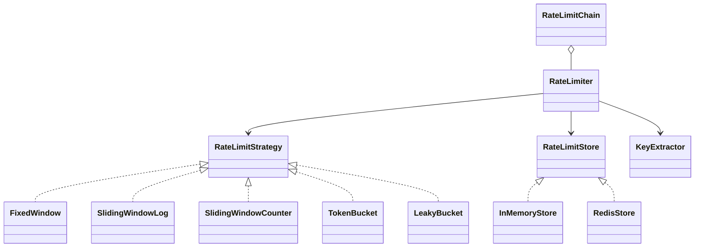

# 47 — Rate Limiter (LLD Interview Walkthrough)

> **Why this problem?** It's the most **algorithm-heavy** problem in Phase 7. The headline isn't the class diagram — it's the five algorithms (Fixed Window, Sliding Window Log, Sliding Window Counter, Token Bucket, Leaky Bucket) and the trade-off matrix among them. Master the algorithms first, then the design is straightforward: each algorithm is a `RateLimitStrategy`, scoping (per-user / per-IP / per-API-key) is a `KeyExtractor`, and the storage layer is an interface so in-memory swaps cleanly for Redis. This is the single most asked LLD library problem at infrastructure-heavy companies (Stripe, Cloudflare, AWS, Razorpay).

---

## 1. The Setup

> Interviewer: *"Design a rate limiter for our public API. We want to protect against abuse and ensure fair usage."*

The four interview-decisive moments:

1. **Know the algorithms by name and trade-off.** Most candidates know "fixed window" exists; senior candidates compare its **boundary burst** problem against sliding window's memory cost against token bucket's burst smoothing. *Saying "token bucket allows controlled bursts; leaky bucket smooths to a constant rate; sliding window has the best fairness — they're not interchangeable"* is what the interviewer is listening for.

2. **Atomicity.** A naive read-then-write on a counter has a race condition under concurrent requests — two requests both read `current=99`, both increment, both write `100`. The senior answer says "Redis `INCR` is atomic" or "we wrap the check-and-decrement in a Lua script".

3. **The scoping abstraction.** Per-user, per-IP, per-API-key, per-(user × endpoint) — these are the same algorithm with a different *key*. Don't write five rate limiters; write one with a `KeyExtractor`.

4. **Hierarchical limits.** Real systems enforce multiple limits at once: *"100 req/s per user AND 10,000 req/s per API key AND 1M req/day total"*. The cleanest design is a *list of limiters*, all consulted; if **any** rejects, the request is denied.

---

## 2. Requirements Clarification (Phase 1 — ~8 min)

### 2.1 Functional questions

| # | Question | Why it matters |
|---|---|---|
| Q1 | What scope — per-user / per-IP / per-API-key / per-endpoint? | KeyExtractor strategy |
| Q2 | Hard limits or soft (warn but allow)? | Action on exceed |
| Q3 | Burst tolerance — strict per-second, or "100/min with bursts of 20"? | Algorithm choice |
| Q4 | Fairness window — fixed 1-minute windows or rolling? | Fixed vs sliding |
| Q5 | Single-server or distributed (many app instances behind a load balancer)? | Local Map vs Redis |
| Q6 | Response on rejection — `429 Too Many Requests` with `Retry-After`? | Response shape |
| Q7 | Whitelist / VIP override? | Bypass list |
| Q8 | Different tiers (free / paid / enterprise)? | Limits as config per tier |
| Q9 | Per-endpoint cost weights (search costs more than a healthcheck)? | "Take N tokens" not "take 1" |
| Q10 | Should we count rejected requests towards the limit? | (typically yes; we *did* receive them) |

### 2.2 Non-functional

- **Latency** — the rate-limit check is on the hot path of every request. <1ms budget.
- **Memory** — at 1M active users with sliding-window-log, you can't afford O(N) timestamps per user. The algorithm choice IS the memory story.
- **Correctness under concurrency** — atomic read-modify-write.
- **Distributed consistency** — when traffic hits 5 app servers, they must share a counter, otherwise the effective limit is `5×configured`.

### 2.3 The scope lock

> *"OK, scoping: per-user, per-IP, per-API-key — all selectable via a `KeyExtractor`. Tiers (FREE/PAID/ENTERPRISE) map to different limit configs. Hierarchical — multiple limits can apply simultaneously. Multiple algorithm options — I'll implement Fixed Window, Sliding Window Counter, Token Bucket, and Leaky Bucket. Storage is an interface; in-memory for single-server, Redis with Lua for distributed. Return `Decision { allowed, remaining, retryAfterMs }` — caller decides whether to 429 or queue."*

---

## 3. The Algorithms — The Whole Lesson In One Section

This is what the interviewer wants to hear about. Drill these.

### 3.1 Fixed Window Counter

```
For each (key, currentWindow):
  count = increment counter
  if count > limit: reject

windowStart = floor(now / windowSize) * windowSize
windowKey = `${userKey}:${windowStart}`
```

**Memory**: O(1) per active key. Just a counter per window.
**Performance**: O(1) per request.
**Burst problem**: **boundary burst** — a user can send `limit` requests at 12:59:59 and another `limit` at 13:00:00, effectively 2× the limit in a 2-second span. This is the most cited weakness in interviews.
**When to use**: When you don't care about that boundary case (rough caps), or for very large windows where the boundary is irrelevant.

### 3.2 Sliding Window Log

```
For each key:
  log = list of request timestamps
  on request:
    drop timestamps older than (now - windowSize)
    if log.length >= limit: reject
    else: append now; allow
```

**Memory**: O(R) per key where R = recent requests. **Bad** at high traffic — 1M users × 1000 reqs = 1B timestamps.
**Performance**: O(R) per request (drop expired).
**Burst problem**: None. Perfectly fair — counts the literal last N requests.
**When to use**: Low-traffic high-fairness scenarios, or for tracking small windows (e.g., 5 logins per minute).

### 3.3 Sliding Window Counter (Hybrid)

```
For each key, keep TWO counters: current and previous window.

now → currentWindow
elapsedInCurrent = now - currentWindow.start
weight = (windowSize - elapsedInCurrent) / windowSize   // fraction of previous to count

estimated = previousCount * weight + currentCount
if estimated >= limit: reject
```

**Memory**: O(1) — two counters per key.
**Performance**: O(1) per request.
**Burst problem**: Approximates a real sliding window. Tiny error (≤5%), zero practical impact.
**When to use**: **The default choice at scale.** Cloudflare uses this. Best balance of memory + fairness.

### 3.4 Token Bucket

```
For each key, keep:
  tokens: float (continuous)
  lastRefill: timestamp

on request:
  elapsed = now - lastRefill
  tokens += elapsed * refillRate          // capped at bucketSize
  lastRefill = now
  if tokens >= cost:
    tokens -= cost
    allow
  else:
    reject (return retryAfter = (cost - tokens) / refillRate)
```

**Memory**: O(1) per key.
**Performance**: O(1) per request.
**Burst characteristic**: **Allows bursts up to the bucket size**, then refills at `refillRate`. e.g., bucketSize=20, refillRate=1/sec → "20 requests immediately, then 1/sec forever after".
**When to use**: APIs that want to *allow* bursts (mobile clients syncing on wake-up, batch uploads). AWS uses token bucket for API throttling. Stripe uses it. The **most popular algorithm** in production.

### 3.5 Leaky Bucket (Queue model)

```
For each key, keep a FIFO queue of pending requests (or just a count + lastLeak).
Requests "leak out" at a constant rate.

on request:
  leak elapsed * leakRate from the bucket
  if bucket has room (count < capacity): enqueue, allow
  else: reject
```

**Memory**: O(1) per key (count-based version) or O(Q) (queue-based version).
**Performance**: O(1) per request.
**Burst characteristic**: **Smooths to a constant outflow** — the opposite of token bucket. Requests pile in fast and drain steady.
**When to use**: When you need an **outflow guarantee** (e.g., "we will not call this third-party API more than 10×/sec, ever"). Telcos use it. ISPs use it for traffic shaping.

### 3.6 Trade-off matrix (memorize this)

| Algorithm | Memory | Burst Tolerance | Fairness | Best For |
|---|---|---|---|---|
| Fixed Window | O(1) | None (but boundary burst) | Poor | Rough caps, large windows |
| Sliding Window Log | O(R) | None | Perfect | Low traffic, security-critical |
| Sliding Window Counter | O(1) | None (≈5% slack) | Near-perfect | **Default at scale (Cloudflare)** |
| Token Bucket | O(1) | Yes (bucket size) | Average | **API throttling (AWS/Stripe)** |
| Leaky Bucket | O(1) or O(Q) | None | Average | Outflow smoothing, ISPs |

---

## 4. Entity Modeling + UML

### Entities

| Entity | Role |
|---|---|
| `RateLimiter` | Public entry: `check(key, cost) → Decision` |
| `RateLimitStrategy` (abstract) | Algorithm interface — each algorithm is one impl |
| `KeyExtractor` | `(request) → key` (per-user, per-IP, per-(user×endpoint)) |
| `LimitConfig` | `{ limit, windowMs, bucketSize, refillRate }` |
| `RateLimitStore` | Storage interface — InMemory / Redis |
| `RateLimitDecision` | `{ allowed, remaining, retryAfterMs }` |
| `RateLimitChain` | Hierarchical (per-user AND per-API-key) — all must allow |
| `Tier` | FREE / PAID / ENTERPRISE — config lookup by tier |

### UML

```
┌────────────────────────┐
│      RateLimiter       │     ◀── public façade
│  - strategy            │
│  - store               │
│  - keyExtractor        │
│  - config              │
│  + check(req, cost):   │
│       Decision         │
└──────────┬─────────────┘
           │ uses
           ▼
┌────────────────────────┐
│ «interface»            │
│  RateLimitStrategy     │     ◀── one of: Fixed / Sliding Log /
│  + tryAcquire(key, cost│       Sliding Counter / Token Bucket /
│       , store) →       │       Leaky Bucket
│       Decision         │
└──────────▲─────────────┘
           │
   ┌───────┼────────────┬────────────────┬──────────────┐
   │       │            │                │              │
FixedWindow SlidingLog SlidingCounter TokenBucket  LeakyBucket

┌────────────────────────┐    ┌────────────────────────┐
│ «interface»            │    │  RateLimitDecision     │
│  RateLimitStore        │    │  - allowed: bool       │
│  + read/write atomic   │    │  - remaining: number   │
└──────────▲─────────────┘    │  - retryAfterMs        │
           │                  └────────────────────────┘
    ┌──────┴─────────┐
    │                │
 InMemoryStore   RedisStore (Lua scripts for atomicity)

┌────────────────────────┐
│  RateLimitChain        │  hierarchical (all must allow)
│  - limiters[]          │
│  + check(req): Decision│
└────────────────────────┘
```



---

## 5. Design Patterns

| Pattern | Where | Why |
|---|---|---|
| **Strategy** | `RateLimitStrategy` (5 algorithms) | The interview's whole point — algorithm pluggability |
| **Strategy** | `KeyExtractor` (per-user / per-IP / composite) | Scoping is a separate concern |
| **Strategy** | `RateLimitStore` (InMemory / Redis / DynamoDB) | Single-server vs distributed swap |
| **Composite** | `RateLimitChain` of limiters | Hierarchical limits (any one rejects → request denied) |
| **Singleton** | `RateLimiter` (per scope) | One coordinator per process |
| **Builder** *(optional)* | Fluent config | |

---

## 6. TypeScript Code

### 6.1 Core types

```typescript
export interface RateLimitDecision {
  allowed: boolean;
  remaining: number;
  retryAfterMs: number;
}

export interface LimitConfig {
  limit: number;              // requests per window OR bucket size for token bucket
  windowMs: number;           // window or refill period
  burst?: number;             // (token bucket) max bucket size
  refillRatePerMs?: number;   // (token bucket / leaky) tokens per ms
}

export interface RateLimitStrategy {
  tryAcquire(key: string, cost: number, store: RateLimitStore, cfg: LimitConfig, now: number): RateLimitDecision;
}
```

### 6.2 The Store — atomic read-modify-write

```typescript
// A single atomic op against state for one key.
// For in-memory: a JS function. For Redis: a Lua script.
export interface RateLimitStore {
  // Atomically: read current state, run mutation, write new state, return decision.
  withLock<T>(key: string, mutation: (state: any) => { newState: any; result: T }): T;
}

// Demo in-memory implementation — single-threaded JS so "lock" is just a function call.
export class InMemoryStore implements RateLimitStore {
  private state = new Map<string, any>();

  withLock<T>(key: string, mutation: (state: any) => { newState: any; result: T }): T {
    const cur = this.state.get(key);
    const { newState, result } = mutation(cur);
    if (newState === undefined) this.state.delete(key);
    else this.state.set(key, newState);
    return result;
  }
}
```

> **The `withLock` abstraction is the senior framing.** In real distributed code, the implementation is a Redis Lua script that reads, mutates, and writes a key atomically — never two round-trips. In single-process Node, the event loop already serializes — `withLock` is just a function call. The strategy code is identical either way.

### 6.3 Fixed Window

```typescript
export class FixedWindowStrategy implements RateLimitStrategy {
  tryAcquire(key: string, cost: number, store: RateLimitStore, cfg: LimitConfig, now: number): RateLimitDecision {
    const windowStart = Math.floor(now / cfg.windowMs) * cfg.windowMs;
    const windowKey = `${key}:${windowStart}`;

    return store.withLock(windowKey, (state: { count?: number } | undefined) => {
      const count = (state?.count ?? 0) + cost;
      if (count > cfg.limit) {
        return {
          newState: state ?? { count: 0 },
          result: {
            allowed: false,
            remaining: Math.max(0, cfg.limit - (state?.count ?? 0)),
            retryAfterMs: (windowStart + cfg.windowMs) - now,
          },
        };
      }
      return {
        newState: { count },
        result: { allowed: true, remaining: cfg.limit - count, retryAfterMs: 0 },
      };
    });
  }
}
```

### 6.4 Sliding Window Log

```typescript
export class SlidingWindowLogStrategy implements RateLimitStrategy {
  tryAcquire(key: string, cost: number, store: RateLimitStore, cfg: LimitConfig, now: number): RateLimitDecision {
    return store.withLock(key, (state: { log?: number[] } | undefined) => {
      // Drop expired
      const cutoff = now - cfg.windowMs;
      const kept = (state?.log ?? []).filter(t => t > cutoff);
      if (kept.length + cost > cfg.limit) {
        const oldest = kept[0] ?? now;
        return {
          newState: { log: kept },
          result: {
            allowed: false,
            remaining: Math.max(0, cfg.limit - kept.length),
            retryAfterMs: Math.max(0, (oldest + cfg.windowMs) - now),
          },
        };
      }
      // Append `cost` timestamps (each unit of cost = one logical request)
      const next = kept.slice();
      for (let i = 0; i < cost; i++) next.push(now);
      return {
        newState: { log: next },
        result: { allowed: true, remaining: cfg.limit - next.length, retryAfterMs: 0 },
      };
    });
  }
}
```

### 6.5 Sliding Window Counter — the production default

```typescript
export class SlidingWindowCounterStrategy implements RateLimitStrategy {
  tryAcquire(key: string, cost: number, store: RateLimitStore, cfg: LimitConfig, now: number): RateLimitDecision {
    const win = cfg.windowMs;
    const currentWindowStart = Math.floor(now / win) * win;
    const elapsed = now - currentWindowStart;
    const previousWeight = (win - elapsed) / win;

    return store.withLock(key, (state: { cur?: number; prev?: number; winStart?: number } | undefined) => {
      // If the saved currentWindow is stale, roll: previous = saved current
      let cur = state?.cur ?? 0;
      let prev = state?.prev ?? 0;
      let winStart = state?.winStart ?? currentWindowStart;

      if (winStart !== currentWindowStart) {
        // Shift
        prev = (currentWindowStart - winStart === win) ? cur : 0;
        cur = 0;
        winStart = currentWindowStart;
      }

      const estimated = prev * previousWeight + cur + cost;
      if (estimated > cfg.limit) {
        // Retry-after estimate: how long until a "slot" frees up — when the next ms passes,
        // the previous-window weight drops, freeing approx (limit) / win ms per allowed request.
        const slotMs = win / cfg.limit;
        return {
          newState: { cur, prev, winStart },
          result: {
            allowed: false,
            remaining: Math.max(0, Math.floor(cfg.limit - prev * previousWeight - cur)),
            retryAfterMs: Math.ceil(slotMs),
          },
        };
      }
      cur += cost;
      return {
        newState: { cur, prev, winStart },
        result: {
          allowed: true,
          remaining: Math.max(0, Math.floor(cfg.limit - prev * previousWeight - cur)),
          retryAfterMs: 0,
        },
      };
    });
  }
}
```

> **Why `prev * weight + cur`?** When you're 30% into a new window, the previous window's contribution should be 70%. Continuous approximation of a real sliding window with two integer counters. Error is bounded by the assumption that previous-window requests were uniformly distributed (they usually were, on average).

### 6.6 Token Bucket — the API-throttling favorite

```typescript
export class TokenBucketStrategy implements RateLimitStrategy {
  tryAcquire(key: string, cost: number, store: RateLimitStore, cfg: LimitConfig, now: number): RateLimitDecision {
    if (!cfg.refillRatePerMs || !cfg.burst) {
      throw new Error("TokenBucket requires refillRatePerMs and burst");
    }
    const cap = cfg.burst;
    const rate = cfg.refillRatePerMs;

    return store.withLock(key, (state: { tokens?: number; lastRefill?: number } | undefined) => {
      let tokens = state?.tokens ?? cap;
      const last = state?.lastRefill ?? now;
      tokens = Math.min(cap, tokens + (now - last) * rate);

      if (tokens >= cost) {
        tokens -= cost;
        return {
          newState: { tokens, lastRefill: now },
          result: { allowed: true, remaining: Math.floor(tokens), retryAfterMs: 0 },
        };
      }
      const shortage = cost - tokens;
      return {
        newState: { tokens, lastRefill: now },
        result: {
          allowed: false,
          remaining: Math.floor(tokens),
          retryAfterMs: Math.ceil(shortage / rate),
        },
      };
    });
  }
}
```

### 6.7 Leaky Bucket — outflow smoothing

```typescript
// Count-based version: "drops" leak at constant rate, requests fill up
export class LeakyBucketStrategy implements RateLimitStrategy {
  tryAcquire(key: string, cost: number, store: RateLimitStore, cfg: LimitConfig, now: number): RateLimitDecision {
    if (!cfg.refillRatePerMs) throw new Error("LeakyBucket requires refillRatePerMs (leak rate)");
    const cap = cfg.limit;
    const leak = cfg.refillRatePerMs;

    return store.withLock(key, (state: { level?: number; lastLeak?: number } | undefined) => {
      let level = state?.level ?? 0;
      const last = state?.lastLeak ?? now;
      level = Math.max(0, level - (now - last) * leak);

      if (level + cost <= cap) {
        level += cost;
        return {
          newState: { level, lastLeak: now },
          result: { allowed: true, remaining: Math.floor(cap - level), retryAfterMs: 0 },
        };
      }
      const overflow = (level + cost) - cap;
      return {
        newState: { level, lastLeak: now },
        result: {
          allowed: false,
          remaining: 0,
          retryAfterMs: Math.ceil(overflow / leak),
        },
      };
    });
  }
}
```

### 6.8 KeyExtractor

```typescript
export interface RequestLike {
  userId?: string;
  apiKey?: string;
  ip: string;
  path: string;
}

export interface KeyExtractor {
  key(req: RequestLike): string;
}

export class UserKey   implements KeyExtractor { key(r: RequestLike) { return `u:${r.userId ?? "anon"}`; } }
export class IpKey     implements KeyExtractor { key(r: RequestLike) { return `ip:${r.ip}`; } }
export class ApiKey    implements KeyExtractor { key(r: RequestLike) { return `k:${r.apiKey ?? "none"}`; } }
export class UserEndpointKey implements KeyExtractor {
  key(r: RequestLike) { return `ue:${r.userId ?? "anon"}:${r.path}`; }
}
```

### 6.9 The façade

```typescript
export class RateLimiter {
  constructor(
    private strategy: RateLimitStrategy,
    private store: RateLimitStore,
    private extractor: KeyExtractor,
    private config: LimitConfig,
  ) {}

  check(req: RequestLike, cost: number = 1, now: number = Date.now()): RateLimitDecision {
    return this.strategy.tryAcquire(this.extractor.key(req), cost, this.store, this.config, now);
  }
}
```

### 6.10 Hierarchical limits — Composite

```typescript
export class RateLimitChain {
  constructor(private limiters: RateLimiter[]) {}

  check(req: RequestLike, cost: number = 1, now: number = Date.now()): RateLimitDecision {
    let worst: RateLimitDecision | null = null;
    for (const lim of this.limiters) {
      const d = lim.check(req, cost, now);
      if (!d.allowed) {
        // Return the *most restrictive* failure (longest retry-after)
        if (!worst || d.retryAfterMs > worst.retryAfterMs) worst = d;
      }
    }
    if (worst) return worst;
    return { allowed: true, remaining: Number.MAX_SAFE_INTEGER, retryAfterMs: 0 };
  }
}
```

> **Subtle but important:** when multiple limiters reject, return the **longest retry-after** so the client doesn't retry only to be rejected again by a different limit. Same logic as the *most restrictive* error in HTTP middleware.

### 6.11 Driver

```typescript
const store = new InMemoryStore();

// 100 req/min per user, sliding window
const userLimiter = new RateLimiter(
  new SlidingWindowCounterStrategy(),
  store,
  new UserKey(),
  { limit: 100, windowMs: 60_000 },
);

// 10 req/sec per IP, token bucket (allow brief bursts)
const ipLimiter = new RateLimiter(
  new TokenBucketStrategy(),
  store,
  new IpKey(),
  { limit: 10, windowMs: 1000, burst: 20, refillRatePerMs: 10 / 1000 },
);

// Hierarchical: ANY limit can reject
const chain = new RateLimitChain([userLimiter, ipLimiter]);

// In an HTTP middleware
const req: RequestLike = { userId: "u-1", ip: "10.0.0.7", path: "/api/search" };
const decision = chain.check(req);
if (!decision.allowed) {
  // 429 Too Many Requests
  console.log(`Rejected. Retry after ${decision.retryAfterMs}ms`);
} else {
  console.log(`Allowed. ${decision.remaining} left.`);
}
```

### 6.12 Distributed version — Redis Lua

The senior part of the answer. Show this as pseudo-code or describe it:

```lua
-- KEYS[1] = key, ARGV = { now, limit, windowMs, cost }
local now      = tonumber(ARGV[1])
local limit    = tonumber(ARGV[2])
local windowMs = tonumber(ARGV[3])
local cost     = tonumber(ARGV[4])

local windowStart = math.floor(now / windowMs) * windowMs
local windowKey   = KEYS[1] .. ":" .. windowStart

local current = tonumber(redis.call("GET", windowKey)) or 0
if current + cost > limit then
  return { 0, limit - current, (windowStart + windowMs) - now }   -- {allowed, remaining, retryAfter}
end

redis.call("INCRBY", windowKey, cost)
redis.call("PEXPIRE", windowKey, windowMs)                         -- TTL = window length
return { 1, limit - current - cost, 0 }
```

```typescript
export class RedisStore implements RateLimitStore {
  constructor(private redis: any /* ioredis */, private luaScript: string) {}

  withLock<T>(key: string, _mutation: (state: any) => { newState: any; result: T }): T {
    // In real code: this.redis.eval(this.luaScript, 1, key, now, limit, windowMs, cost)
    // Returns [allowed, remaining, retryAfter] — same shape regardless of strategy.
    // The strategy code "moves into" the Lua script because Redis needs atomicity.
    throw new Error("Pseudo — see lua script");
  }
}
```

> **Important caveat for interviews:** when you go distributed, the *strategy's algorithm* effectively moves into the Lua script. The TypeScript `Strategy` class becomes a *configuration / shape* — what params to send to the script, what the response means. This is fine: the abstraction at the *API level* still holds (caller just calls `limiter.check(req)`), and the test code can swap `InMemoryStore` for `RedisStore` without changing call sites. **Mention this**. It's the moment senior candidates explain how the abstraction survives the distributed pivot.

---

## 7. Extension Follow-Ups

### 7.1 "Tiered limits — FREE users get 100/min, PAID 1000/min, ENTERPRISE 10000/min."
Add a `TierResolver` that returns the right `LimitConfig` per user. The limiter becomes config-driven; the strategy doesn't change. Cache the tier lookup. New tier = new config entry, no code change.

### 7.2 "Weighted requests — search costs 5 tokens, healthcheck costs 0."
We already pass `cost` to `check(req, cost)`. The endpoint middleware sets the cost based on a route map (`{"/search": 5, "/healthz": 0}`). The strategy handles `cost > 1` naturally — token bucket deducts more, sliding window counts more.

### 7.3 "Whitelist / VIP override."
A `WhitelistFilter` runs *before* the rate-limiter chain — if the request matches an allowlist, return `{allowed: true, remaining: ∞}`. Same Chain of Responsibility idea as the notification pipeline.

### 7.4 "Burst-friendly + global cap."
Compose limiters: token bucket per-user (allows bursts) **and** sliding window counter per-API-key globally (smooths). Both must allow. This is how Stripe's API limits work — per-key bursts allowed within a global ceiling.

### 7.5 "Abuse detection — IP making 10× more requests than typical."
Beyond rate limiting — add an `AnomalyDetector` (z-score, EMA-based) that tags suspicious IPs. The limiter can read the tag and apply a *stricter* config dynamically. Same `KeyExtractor` mechanism; new `TierResolver` impl that returns "ABUSIVE" tier for flagged IPs.

### 7.6 "What if Redis goes down?"
**Fail open** or **fail closed** — both are valid; pick deliberately.
- *Fail open* (allow all on Redis error): the user-facing service stays up at the risk of brief overuse. Most B2C apps choose this.
- *Fail closed* (reject all): safety-first for billing systems. Most B2B/enterprise APIs choose this.
Either way: wrap the store call in a circuit breaker; alert ops; auto-fallback to in-memory if isolated to one app instance.

---

## 8. Real-World Production Notes

- **AWS API Gateway** uses Token Bucket with per-key burst configuration. Their throttling docs list "burst limit" and "rate limit" as two separate parameters — that's exactly the token-bucket model.
- **Stripe** uses a combination of per-key sliding window (for billing fairness) and per-IP token bucket (for abuse prevention). Their `Retry-After` header is honored by their official client libraries with exponential backoff.
- **Cloudflare** uses Sliding Window Counter at edge nodes. Their published research (~2015 blog post) is the canonical reference for the algorithm.
- **GitHub** uses per-user fixed window + per-IP sliding window, with the per-IP being stricter. They expose remaining/reset in headers (`X-RateLimit-Remaining`, `X-RateLimit-Reset`).
- **Common bug** — using `now()` from app server clock when servers are behind a load balancer and have skewed clocks. Use Redis's `TIME` command or NTP-sync the fleet. In a distributed setting, *the source of "now" is shared state*, not local.

---

## 9. Interview Questions (with answers)

**Q1. Walk through the boundary-burst problem in Fixed Window and how Sliding Window Counter fixes it.**
Fixed Window: windows are `[0,60s)`, `[60s,120s)`, etc. A user can send 100 requests in the last second of one window and another 100 in the first second of the next — 200 requests in 2 seconds, double the rate. Sliding Window Counter avoids this by counting `prev * weight + cur`: when you're 1% into the new window, the previous window contributes 99%, so the user effectively still has ~99 of the previous window's 100 counted against them. The smoothing window slides continuously, killing the boundary burst.

**Q2. Why is Token Bucket so popular for APIs, and when should you NOT use it?**
Popular because it cleanly expresses **"normal sustained rate + headroom for bursts"** — exactly what real API clients want (a mobile app catching up on background sync, a batch job uploading a chunk of files). Two knobs (burst, refillRate) cover most real-world traffic patterns. Don't use it when you need **outflow guarantees** — calling a third-party API with a 10/sec hard ceiling, for example. Token bucket allows 20/sec for brief moments; you need Leaky Bucket for true smoothing. Also avoid token bucket if your downstream rejects bursts harshly — you'll just be passing the burst through.

**Q3. The naive Fixed Window code is `if (counter >= limit) reject; counter++;`. What's wrong, and what's the fix in single-server vs distributed?**
The two operations (`read` and `write`) aren't atomic — two concurrent requests both read `99`, both check `99 < 100`, both increment, both write `100`. Effective limit becomes 101. Single-server fix: hold a lock for the read-modify-write (in JS, the event loop serializes — no real fix needed; in Java, `AtomicLong.incrementAndGet`). Distributed fix: Redis `INCR` is atomic; combined with `EXPIRE` in a Lua script, both ops execute as one. The `withLock` abstraction in our code is exactly this — a function call in-process, a Lua script in Redis. The strategy code stays oblivious.

**Q4. The chain returns the longest retry-after when multiple limiters reject. Why?**
Because returning the shortest would cause the client to retry, get rejected by a different limit, retry again, etc. — chasing a moving target. The *binding* constraint is the longest one; tell the client to wait that long and they get through on the first retry. This is the same principle as HTTP layered middleware: the response is the *most restrictive* signal, not the first one. Real systems also include the *most restrictive* error reason in the response body so the client knows *why*.

**Q5. (Senior framing) When you move from InMemoryStore to RedisStore, the strategy's algorithm "moves into" the Lua script. What does that mean for the abstraction we built?**
The Strategy interface still serves a purpose — but a different one. In single-server, the Strategy *owns the algorithm*. In distributed, the Strategy *owns the params and the response shape* — the algorithm itself lives in a Lua script Redis runs atomically. The trade-off: you can't add a new strategy without writing a new Lua script. The boundary moves. **What survives is the *caller's* abstraction**: `limiter.check(req)` returns `Decision`. Routes, middleware, business code see no difference. This is what's meant by "design for the seam": the abstraction at the right layer survives implementation pivots, even when the layer below changes radically.

**Q6. (Trap) Should the rate limiter count *rejected* requests towards the limit?**
Yes, typically. The point of the limit is to protect downstream resources, and a *rejected* request still consumes server CPU, network, RAM. Spammers shouldn't get unlimited retries against the rejection path. Token Bucket naturally does this (the token is deducted even on rejection — wait, actually no, the canonical token bucket only deducts on *success*; we need to be careful). The trick: most production systems count failed requests towards a *separate* "abuse" counter with stricter limits — so legitimate users who get a momentary 429 aren't penalized further, but a client retrying every 10ms gets rate-limited harder. This is a *layered* limit: normal + abuse, each with different policies.

---

## 10. The Cheat-Sheet

```
Big idea:  5 algorithms, different trade-offs on memory, burst, fairness.
           Strategy abstracts the algorithm.
           KeyExtractor abstracts the scope.
           Store abstracts in-memory vs Redis.
           Chain composes multiple limits (any one rejects).

Algorithms (memorize):
  Fixed Window         O(1) mem. Boundary burst. Rough caps.
  Sliding Window Log   O(R) mem. Perfect fairness. Low traffic.
  Sliding Window Count O(1) mem. Near-perfect.    Cloudflare default.
  Token Bucket         O(1) mem. Allows bursts.   AWS / Stripe.
  Leaky Bucket         O(1) mem. Smooths outflow. Telcos / ISPs.

Patterns:
  Strategy → RateLimitStrategy (5 algorithms)
  Strategy → KeyExtractor (User / IP / ApiKey / UserEndpoint)
  Strategy → RateLimitStore (InMemory / Redis-Lua)
  Composite → RateLimitChain (hierarchical: any reject → request denied)

Decision shape:
  { allowed, remaining, retryAfterMs }
  On chain reject: return the LONGEST retryAfterMs (most restrictive).

Atomicity:
  Read-modify-write must be atomic.
  In-process JS:  event loop serializes. withLock is a function call.
  Distributed:    Redis Lua script. INCR + EXPIRE in one round trip.
  Watch out for clock skew across app servers (use Redis TIME).

Failure modes:
  Redis down? Pick FAIL OPEN (B2C) or FAIL CLOSED (billing). Document.
  Circuit-breaker around the store. Alert on rejection-rate spikes.

Production examples:
  AWS API Gateway   — Token Bucket (burst + refill knobs)
  Stripe            — Sliding window per-key + Token Bucket per-IP
  Cloudflare        — Sliding Window Counter at the edge
  GitHub            — Fixed Window per-user + Sliding per-IP

Traps:
  - Knowing only Fixed Window (must compare 5)
  - Read-then-write without atomicity (concurrency bug)
  - One rate limiter per scope (use ONE limiter with KeyExtractor)
  - Returning shortest retry-after on chain reject (it's wrong)
  - Setting `now()` from app server (use Redis TIME under load balancer)
  - Forgetting EXPIRE on the Redis key (memory leak across windows)

Generalizes to: anywhere you'd say "no more than X per Y" — feature flags
                with rollout caps, queue-consumer throughput, batch-job
                concurrency, scraper politeness, ML model quota systems.
```

One problem left in Phase 7 — **48 Cache System**. Pure algorithm + data-structure: LRU via doubly-linked list + HashMap, LFU, TTL eviction, multi-tier (memory → SSD → DB), and write-through vs write-back. Same library-design shape as this one. Then Phase 7 is complete.
